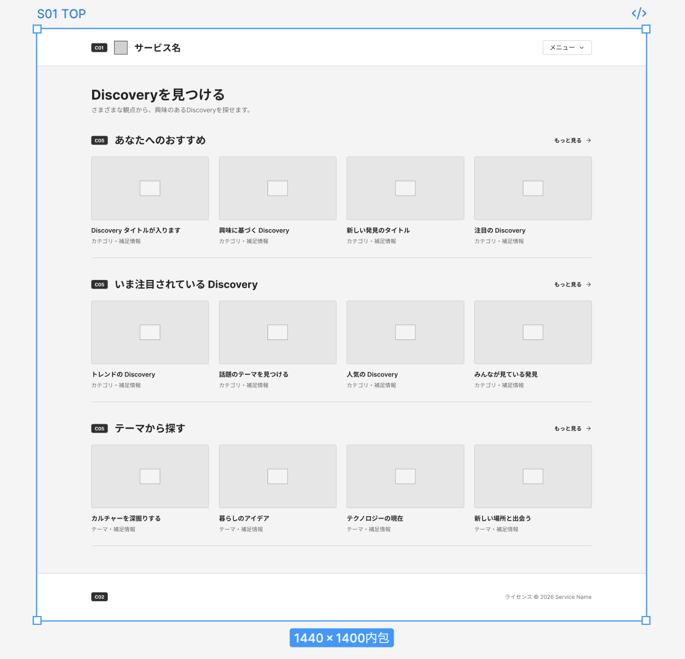

# S01 TOP ワイヤーフレーム生成

## 目的
S01 TOP画面定義からPC版ワイヤーフレームを生成できるか検証する。

## 使用ツール
Figma AI

## 入力
- [S01: TOP画面定義](../../ui/screens/S01-top.md)
- [C01: 共通ヘッダー](../../ui/components/C01-header.md)
- [C02: 共通フッター](../../ui/components/C02-footer.md)
- [C05: discovery-section](../../ui/components/C05-discovery-section.md)

## Prompt
ワイヤーフレームを作りたいんだけど、添付のファフィルから作れるかな？

## 結果
- PC版ワイヤーフレームを生成できた
- Component IDも画面へ反映された
- 「あなたへのおすすめ」
- 「いま注目されているDiscovery」
- 「テーマから探す」
  など、定義から具体的なUIが提案された

## スクリーンショット

## 得られた課題・気づき
- 無料版の場合、1画面の生成で1日分のAIクレジットを消費
- AIプランのアップグレードを検討
- 「おすすめ」の定義が不足
- 「いま注目」の判定基準が必要
- Sectionの構成について追加検討が必要

## 判断
- PC版ワイヤーフレーム生成としては成功
- AIが補完した仕様をそのまま採用せず、要求・機能定義へフィードバックする