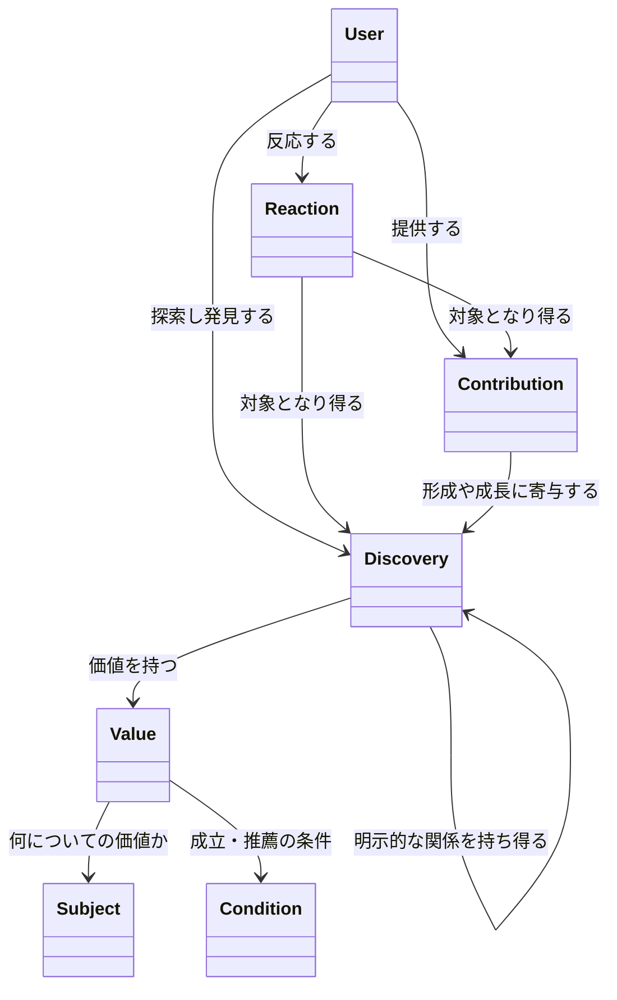
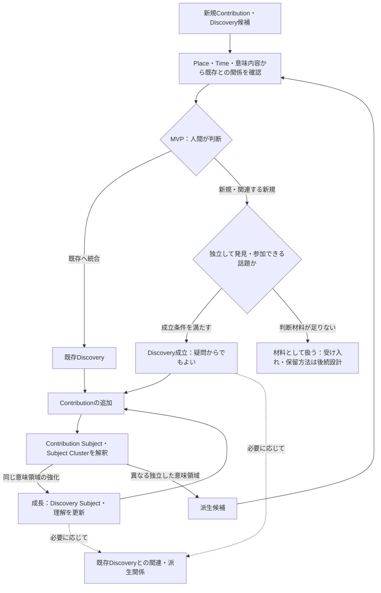
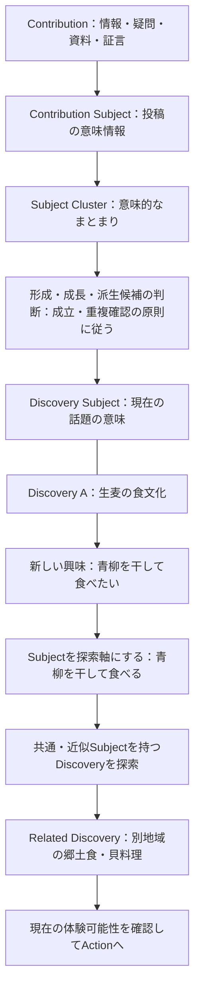
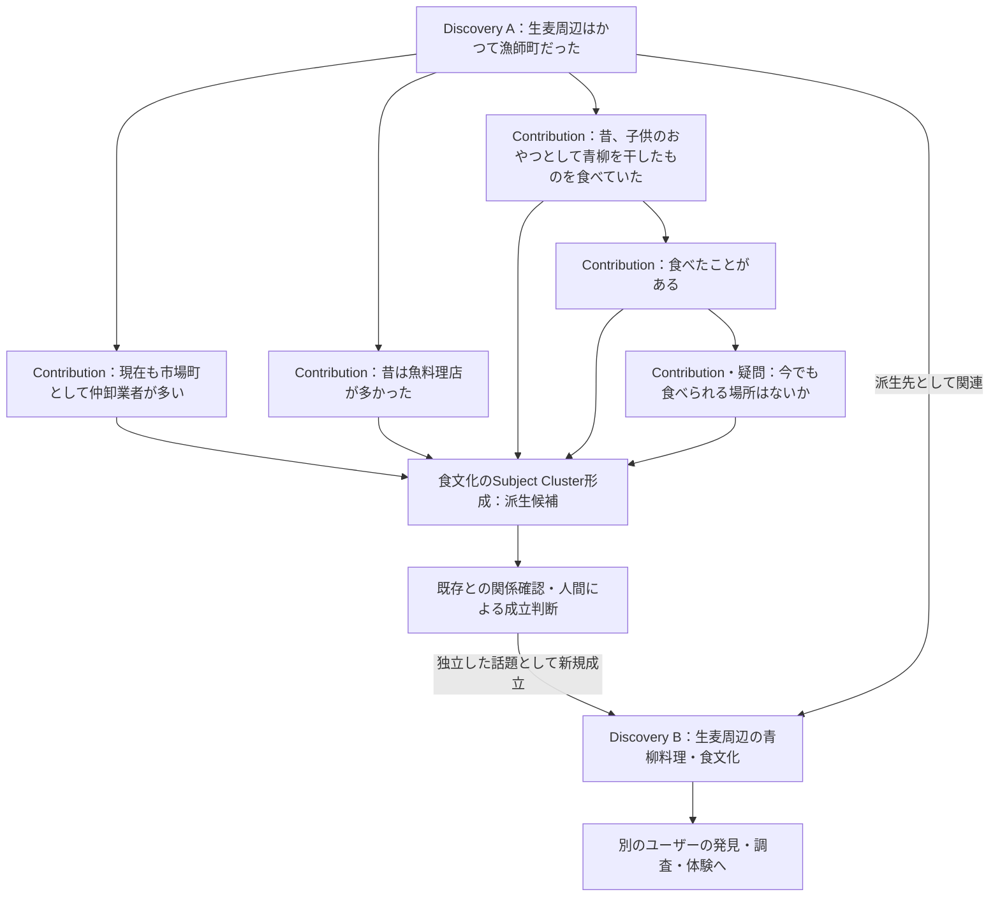
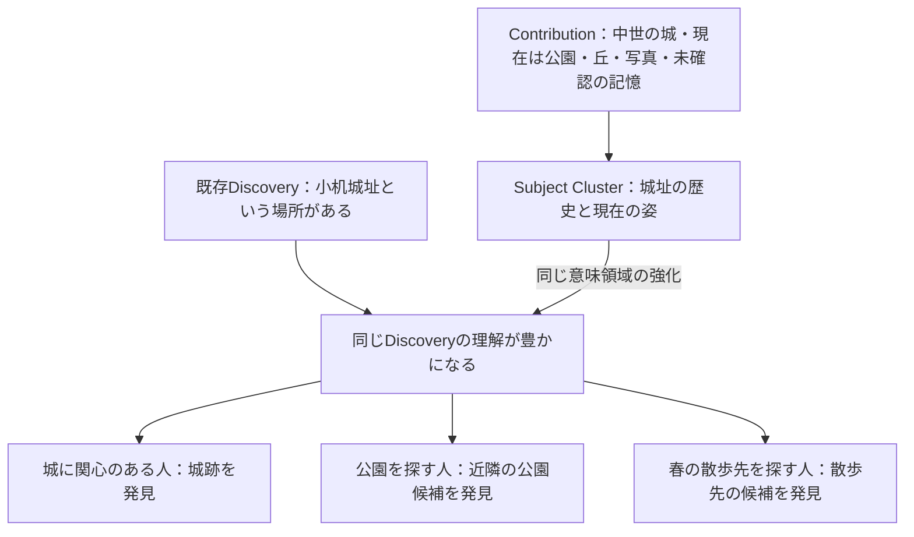
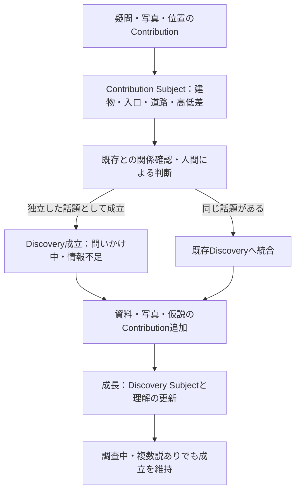

# ex-day ドメイン論理設計書 v0.5

- 作成日：2026-09-13（v0.5改訂：2026-09-15、最終追補：2026-09-20）
- 状態：v0.5追補版。成立・成長・派生の原則を維持し、UserInterest、Theme／Subject、Place／Time、判断・出所・根拠・通報、およびContributionから複数DiscoveryへのValue提供関係を論理Entity設計と整合させた。仮定義・要検討事項を併記する。
- 用途：複数AIおよび設計者が、同じ概念・責務・境界を前提に後続設計を行うための共通インプット
## 1. 根拠と本書の位置付け

### 1.1 根拠資料

**[R] `ex-day_requirements.md`（本文タイトル：ex-day 要求仕様 v0.3）**を、v0.3で参照した要求の一次資料として引き継ぐ。既存の要求参照番号は維持する。

**[D] `ex-day_domain_model_v0.4.md`**を改訂元とする。中核四概念、Contextの区別、品質評価を主目的とした投稿・反応の除外等の既存方針を維持する。

**[U] 今回の改訂依頼**を、論理Entity設計の検討からDomainへフィードバックする設計指示とする。Subjectの二つの役割、Discoveryを不用意に細分化しない原則、明示的Discovery RelationとSubjectを介した意味的関連の区別を採用する。既存版から引き継ぐ[U]参照は、成立条件・重複抑制・成長・派生等の従来の設計指示を含む。

**[C] 参照会話「設計作業の進め方確認」**を、検討経緯と例の参照とする。会話内のAI提案だけでは確定事項とせず、今回の依頼で明示された合意を採用する。会話中の数値例は仕様として採用しない。

生麦の形成・派生は、[R] 第6・7・13・14節を背景に、[U]の指定として扱う。本改訂は要求仕様やMVPスコープ自体の改訂を意味しない。

### 1.2 確定度の読み方

- **確定（要求）**：[R]に明記された要求。ただし、将来目標・検討事項として書かれたものを実装確定へ変更しない。
- **確定（今回の設計方針）**：[U]で明示された概念と関係。
- **仮定義**：共通理解のために置く暫定的な言葉・境界。後続設計で変更し得る。
- **検討中**：要求・今回の指示だけでは結論が出ない事項。
  本書の確定事項はサービスの概念に関するものであり、すべてをMVPで実装するという意味ではない。DB物理設計、項目一覧、データ型、キー、API、画面配置、アルゴリズムは対象外とする。

## 2. ドメイン全体の考え方

ex-dayは、場所・時間・興味・状況から、ユーザーが存在を知らず検索しようとも思っていなかったものと出会い、興味や行動につながるサービスである。[R: 第1〜3・8・9節]

全体の価値の流れは **Context → Discovery → Action** である。発見から新しい興味が生まれる場合は、**Context → Discovery → 新しい興味 → Related Discovery → Action** と連鎖し得る。Related Discoveryは関連する別のDiscoveryを指し、新たな中核ドメインではない。これらはサービス体験の概念モデルであり、同名の保存対象を作るという指示ではない。

本書では **User / Discovery / Contribution / Reaction** を中核ドメインとする。[U]

Discoveryは発見・体験できる意味の単位、Contributionはその意味を形成・成長させる材料、Reactionはそれらに対するUserの反応である。発見後の調査や体験からContributionが戻り、既存Discoveryの成長や別Discoveryの形成へつながる。

要求仕様の「Discovery」はユーザーが発見する体験も表す。本書のドメイン名Discoveryは、その体験の対象となる意味のあるまとまりを指す。個々のユーザーの発見履歴を表す概念とは区別する。発見履歴を独立して扱うかは検討中である。

## 3. 中核ドメインの定義と責務

### 3.1 User

**定義：確定（今回の設計方針）**。発見し、情報・疑問・資料・証言を持ち寄り、反応する参加者。

**責務**：Discoveryを探索・閲覧し、Contributionを提供し、DiscoveryまたはContributionへReactionを行う。同じ人が質問、回答、資料提供、体験共有などへ参加できる。[R: 第10節]

質問者・回答者・投稿者を固定された別種のUserに分けない。関心地域やテーマ等は任意で表現でき、既知の興味がないことを探索不能の理由にしない。[R: 第9〜11節]

**検討中**：未登録閲覧者と登録Userの関係、個人以外の主体とUserの関係、代理投稿や編集権限。ログイン前にも価値を理解できることは要求だが、匿名投稿まで確定しているわけではない。[R: 第12・26節]

### 3.1A UserInterest

**定義：確定（今回の設計方針）**。Userと、Theme・Subject・Place・Time等の興味対象との関係。本人が申告した興味と、利用からシステムが推定した興味を区別して保持し、ユーザー本人にも見える形で返す。

UserInterestは単なる推薦用の内部プロファイルではない。「歴史が好き」という自己認識から、「城跡」「地形」「廃線跡」等の具体的な興味が見つかる過程自体をex-dayのDiscovery体験の一部とする。Subjectは全ユーザーに共通する統制された意味概念であり、UserInterestが特定Userとの関係を表す。したがって、ユーザーが興味を外したり否定したりしてもSubject自体を削除しない。

ユーザーは自由文を含む具体的な興味を申告できるが、その入力を無条件に新しいSubjectとして登録しない。既存Subjectへ対応付け、対応できないものはSubject候補として扱う。Subject候補の確定主体・運用・独立Entity化は**要検討**とする。

**明示意思の優先：確定（今回の設計方針）**。本人の明示的な「興味がある」「興味がない」または訂正を、システム推定より優先する。特に明示的な興味なしは、その後の行動から同じ興味を安易に再推定しないための抑止情報として保持できる。抑止の期限・解除・近似Subjectへの波及範囲は**要検討**とする。

**行動データの原則：確定（今回の設計方針）**。検索・閲覧・Reaction・Contribution等を興味推定の入力に利用し得るが、個々の行動履歴を長期保存することを前提にしない。長期的に利用する意味のある結果はUserInterestとして保持し、推定理由をユーザーへ説明できることを目指す。一時ログの保持期間、推定方法、推定理由の粒度、法務・プライバシー上の具体要件は**要検討**とする。

UserInterestが結び付け得る対象はTheme・Subject・Place・Time等である。対象種別を一つの汎用参照で実装するか、種別ごとの関連に分けるかは物理設計事項であり、本書では確定しない。強さ・確信度・由来・有効状態・本人確認状態等は論理属性として扱えるが、尺度と更新規則は**要検討**とする。

### 3.2 Discovery

**定義：確定（今回の設計方針）**。ユーザーが発見・体験できる「意味のある話題・事象」の単位。場所、歴史、食文化、疑問そのものや疑問から見えてきた知識などを、発見対象として捉えられるまとまり。

**責務**：発見対象の意味を表し、Contributionによって内容を豊かにし、場所・時間・テーマ等との関係を通じて探索可能にする。また、別のDiscoveryへ関連・派生し、次の発見につながる。[R: 第6〜8・13・14節、U]

場所そのものや完成記事に限定しない。「小机城址という場所がある」という小さな発見から始まってよく、情報が不完全でも成立し得る。Contributionの集合や表示ページと完全に同義にはしない。画面上の要約や見せ方もDiscoveryの定義そのものではない。

同じ対象地域でも「漁師町だったこと」と「青柳料理・食文化」は異なる意味を持つDiscoveryとして扱える。一方、見る人の興味が違うだけで必ず別Discoveryを作るわけではない。SubjectはDiscoveryを不用意に細分化するためのものではない。「生麦の食文化」というDiscoveryは、その中に「青柳を干して食べる」等のSubjectを持ったまま存在できる。Subjectの存在・追加や複数地域での共有だけで、分割・派生・独立Discovery化を必須としない。粒度は以下の成立条件に従って判断する。[U]

**成立条件：確定（今回の設計方針）**。既存Discoveryとの関係を確認したうえで、他ユーザーが独立して発見・参加できる意味のある話題として扱えると判断された時に成立する。知識の提示だけでなく疑問からでも成立でき、答えや事実の確定を待つ必要はない。Discoveryは一つ以上のContributionを起点として成立する。最初のContributionだけから成立する場合もあるが、Contributionの登録が自動的にDiscoveryの成立を意味するわけではない。[U]

**成立と事実確定の分離：確定（今回の設計方針）**。成立は話題の単位としての判断であり、内容の正しさの認定ではない。成立後も「問いかけ中」「調査中」「情報不足」「複数説あり」等を取り得る。これらは知識の状況を説明する例であり、排他的な状態一覧や一方向の遷移順序ではない。反証や新資料によって理解を見直すことも成長に含む。

答えが未確定であることだけを理由に、成立した疑問を他者の探索・参加対象から外さない。成立と、公開・積極的な推薦に関する運用判断は区別する。

**検討中**：作成・編集の権限、公開や推薦の判断、形成の起点となったContributionが非公開・削除・関連取消となった場合の扱い、形成後の要約方法。成立と重複抑制の原則は4.4節、具体的な判定方法・運用は9.1節に分ける。

**表示・Recommendation判断に必要な状態：確定（今回の設計方針）**。Discoveryの知識状態、公開・推薦上の状態、および現在性に関する導出情報を、表示とValueのCondition評価に利用できるようにする。これらを総称してDiscovery Statusと呼ぶ場合も、単一の列挙型や一方向の状態遷移を意味しない。具体的な種類・遷移、保持・導出の分担は**要検討**とする。Valueに依存する現在状態をそのValueのCondition評価にも使う場合の評価順序は未確定とする。

#### 3.2.1 Value

**定義：確定（今回の設計方針）**。Valueは、一つのDiscoveryで知る・見る・体験することのできる価値や魅力を表す、再利用可能なドメイン概念である。Discoveryは複数のValueを持ち得る。論理Entity設計では、DiscoveryはValueを1件以上持つ。異なるValueがあるだけでDiscoveryを分割しない。Valueは画面上の表示単位やContributionの別名ではなく、Discoveryに蓄積される比較的安定した知識・価値である。Valueの論理的な保持と物理的な永続化方式は区別する。

**疑問起点のValue：確定（今回の設計方針）**。疑問から成立するDiscoveryも、場所・Subject・内容等から「何を知る・見る・一緒に考える価値があるか」を定義する。例えば建物入口と道路の高低差についての疑問では、「身近な高低差に気付き、その理由を一緒に考える」というValueを持てる。答えや原因が確定した価値としては扱わない。DiscoveryがValueを持つ原則と、Contribution登録時に新しいValueの成立を必須としないことは両立する。

**Subjectとの関係：確定（意味上の役割）**。各ValueはSubjectによって「何についての価値か」を意味付けされる。例えば同じDiscovery「小机城址」に、「中世の城郭跡を見る」と「公園を歩く」という異なるValueを置ける。SubjectはValueに結び付けて読む。一方、既存のDiscovery Subjectは「そのDiscovery全体が現在何についての話題か」を示し、Contribution Subjectは投稿の意味を示す（5.3A〜5.5節）。これらを同じSubject概念の異なる役割として扱い、Discovery Subjectを各ValueのSubjectと同一視しない。ValueとSubjectの対応を論理Entity上でどう保持し、Discovery Subjectとの関係をどう導出・更新するかは**要検討**とし、既存のDiscovery／ContributionとSubjectの関連をこの節だけで置き換えない。

**Contributionとの関係：確定（今回の設計方針）**。Contributionは疑問・知識・体験・観測等の情報であり、それ自体をValueとはしない。Contributionの蓄積、既存情報、根拠等からValueが形成・更新・補強され得るが、単一Contributionの登録だけで新しいValueを必ず成立させない。一つのContributionは複数のDiscoveryに関連し、それぞれのDiscoveryで異なるValueの形成・向上に利用され得る。このとき「どのContributionが、どのDiscoveryに、どのValueを提供したか」を対応付けて辿れるようにする。Valueが未成立・未特定の形成材料やDiscovery全体への寄与も許容し、対象Valueがないことを、そのDiscoveryのすべてのValueへの寄与とは解釈しない。例えば「夕焼けが綺麗だった」という一件はまず観測・体験である。複数のContributionや根拠を踏まえて「夕焼けを楽しめる」というValueが成立・補強され、夕方というConditionが付く可能性がある。形成・更新の判断方法、信頼性の評価方法は**要検討**とする。Valueの成立と、Discoveryの成立・事実確定・積極推薦も区別する。

#### 3.2.2 Condition

**定義：確定（今回の設計方針）**。ConditionはValueごとに0件以上持ち得る、その価値が成立する・利用できる・推薦価値が高まる条件である。場所・時間・季節・Subject・Discovery状態等が条件の軸になり得るが、軸の網羅的な一覧ではない。Time／Season等をDiscovery全体に一律に付けるのではなく、基本的に該当ValueのConditionとして扱う。条件の軸や組み合わせ、成立条件と推薦上の条件の詳細な区分は論理Entity設計でも**要検討**であり、ここで新たな分類を確定しない。Seasonの一致は例年の旬等を示し得るが、今年・今日の実状を保証しない。

ある軸のConditionがないことは、そのValueがその軸に依存しないという意味であり、「いつでも成立する」という積極的な主張とは異なる。「通年」はValueの種別ではなく、時間的な成立条件が常時成立することを表す。他の軸の条件まで常に成立することや、営業・在庫等の実状を保証する意味ではない。条件なし・不明・通年の意味を混同せず、`ALL_YEAR`等の明示値や条件なしの物理表現の採否は**要検討**とする。「中世」のような歴史的時代は話題やSubject／contentの意味を説明する時間であり、現在いつ推薦するかというConditionのTime／Seasonとは区別する（5.10節）。

### 3.3 Contribution

**定義：確定（今回の設計方針）**。Discoveryを形成・成長させる情報、疑問、資料、証言、体験等の貢献。論理名は「知識・疑問」とする。

**責務**：完成した知識だけでなく、分からないこと、記憶、写真、伝聞、調査結果などを持ち寄れるようにし、既存の話題に情報を加える、疑問を深める、または新しい話題を形成する材料となる。[R: 第13〜16節、U]

疑問もContributionに含む。質問への回答だけでなく、情報追加、資料追加、一緒に調べることにつながる情報の提供を扱う。会話では複数のContributionが互いの内容を受けて展開する。

**Valueとの関係：確定（今回の設計方針）**。Contributionは疑問・体験・観測・知識等としてDiscoveryに関連付けられ、Valueを成立・成長させる材料となり得る。一つのContributionは複数のDiscoveryに関連し、それぞれのDiscoveryで異なるValueの形成・向上に利用され得る。このとき「どのContributionが、どのDiscoveryに、どのValueを提供したか」を対応付けて辿れるようにする。登録時点でValueが成立する必要はなく、Valueが未成立・未特定の形成材料やDiscovery全体への寄与も許容する。対象Valueがないことを、そのDiscoveryのすべてのValueへの寄与とは解釈しない。Discoveryの状態と既存・追加Contributionとの関係を評価した結果、疑問・観測としての蓄積、既存Valueの根拠、信頼性向上、修正、新しいValueの成立等につながり得る。自然文ContributionからValueへの自動変換は前提としない。

**仮定義**：知識・疑問・写真・資料・証言・体験はContributionの内容を説明する分類例であり、確定した排他的な種別や継承クラスではない。一つの投稿に写真と疑問が含まれる場合の単位は検討中である。

出所や不確実性を認識できることを重視する。伝聞や曖昧な記憶が集まったことをもって、確定した史実や現在の営業情報とみなさない。[R: 第24節]

**確定（今回の設計方針）**：品質評価そのものを主目的とした投稿（星評価、ランキング、店舗比較、優劣判定、口コミサイト的な評価機能）はContributionの対象としない。ただし、「美味しい／まずい」等の主観的な感想が内容に含まれること自体は妨げない。体験、記憶、資料、証言、疑問、関心等を対象とし、例えば「昔食べた青柳は美味しかった」のように、体験・証言・記憶の一部として主観的な感想が含まれる内容はContributionとして許容する。単純な同意・共感の表現とContributionの境界については3.4節を参照。[U]

**検討中**：自然文ContributionからValueを抽出・生成・更新する方法、直接Value化できないContributionの扱い、返信関係の表現、Discovery未形成時のContributionの置き場所、Value成立前の関係を成立後にどう対応付けるか、関係の取消・履歴、編集・訂正・出典の管理。外部情報をすべてUser投稿のContributionへ変換するかも未確定である。[R: 第18〜21節]

### 3.4 Reaction

**定義：確定（今回の設計方針）**。UserからDiscoveryまたはContributionへの反応。[U]

**責務**：対象へのユーザーの反応を表す。反応は、次の発見や地域側への価値につながり得るが、推薦への利用方法や集計方法は未確定である。[R: 第23節・Scenario 06]

**仮定義**：新しい説明内容を提供するContributionに対し、Reactionは対象への関心・感想等を簡潔に示す概念として区別する。具体的な反応種別は確定しない。

**確定（今回の設計方針）**：Reactionも品質評価そのものを主目的とした反応（星評価、ランキング、店舗比較、優劣判定、口コミサイト的な評価機能）を対象としない。主観的な感想が含まれること自体は妨げないが、関心・共感・次の行動意欲を示す反応を中心とし、単純な好悪の表明や品質ランキングを目的としない。[U]

**仮定義**：反応の方向性を示す例として「興味がある」「行ってみたい」等が挙げられるが、これらは方向性を示す仮の例であり、反応種別の確定した一覧やUI表現ではない。

「食べたことがある」は、本書の生麦例では体験証言を加えるContributionとして扱う。単純な同意・共感の反応と同じような表現を使う可能性はあるが、文言だけでReactionと判定しない。「今でも食べられる場所はないか」は疑問のContributionである。

**検討中**：反応種別、取消・変更・重複の扱い、保存や訪問をReactionに含めるか、自由文とContributionの境界。Reaction数による信頼性判定やDiscoveryの自動形成は確定しない。

## 4. 中核概念の関係

### 4.1 Mermaid classDiagram

次の図は概念間の関係を表す。属性・操作・物理的な保持方法を表さない。ValueとSubjectの線は意味上の関係であり、既存のDiscovery Subjectを置き換える関連の保存形を指定しない。多重度は図に指定しない。矢印は関係の読み方向であり、処理順序や所有関係ではない。

Reactionの二本の対象線は、DiscoveryとContributionの両方への同時反応を必須とするものではない。いずれも対象になり得ることを示す。一回の反応の対象単位は後続設計で明確にする。

UserとContributionの関係はユーザー参加を示す。外部データ由来の情報に、架空の投稿Userを必須とする意味ではない。

### 4.2 形成・成長の関係

**確定（今回の設計方針）**：Contributionは既存Discoveryを豊かにし得る。また、Contribution・疑問・会話の蓄積から新しいDiscoveryが形成され得る。[U]

「形成に寄与する」は材料と発見の意味的な関係であり、Contribution自体が消えてDiscoveryへ置換される、という意味ではない。形成後に材料をどう参照・表示・保持するかは検討中である。

### 4.3 Discovery同士の関係

**確定（今回の設計方針）**：Discovery同士は関連・派生し得る。[R: 第7節、U]

**確定（今回の設計方針）**：「関連」は共通する場所・時間・意味内容等から別の発見へつながること。「派生」はあるDiscoveryを起点に蓄積したContributionから、元のDiscovery Subjectとは異なる独立したSubject Clusterが形成され、成立条件を満たした別Discoveryが生まれること。Cluster形成だけでは派生の確定ではなく、派生候補となる（5.6節）。

**確定（今回の設計方針）**。Discovery同士の関連には、少なくとも次の性質の異なるものがある。[U]

- **明示的Discovery Relation**：派生元／派生先など、Discovery間に直接意味のある関係があるもの。例えば「生麦周辺はかつて漁師町だった」を起点に「生麦の食文化」が成立したという関係は、形成の経緯を表す。
- **Subjectを介した意味的関連**：共通または近似Subjectを持つことで、結果として関連Discoveryとして導出できるもの。例えば「生麦の食文化」と「別地域の郷土食」が「青柳を干して食べる」を介してつながる場合であり、一方から他方が派生したことを意味しない。

Subjectによる関連は必ずしもDiscovery間の直接Relationとして保持する必要はない。保持方法は後続の論理Entity／実装設計事項とする。4.1節の直接関係の線は、Subjectを介した関連もすべて直接保持するという意味ではない。両者は併存し得るが、共通Subjectだけから派生の経緯を推定しない。

関連があるだけでは生成元・生成先の関係とは限らない。派生例ではAを起点にBが形成される方向を説明できるが、単一の親を必須とする木構造は確定しない。

**検討中**：上記の性質の区別を前提とした具体的な関係の種類、方向・対称性、多重度、複数起点からの形成、関係を付与する主体。関連・派生を独立した中核ドメインとして追加するかは未決定である。

### 4.4 成立判断と重複抑制

**確定（今回の設計方針）**。ex-dayでは類似Discoveryの乱立を、Contributionが分散し一件あたりの知識が薄まる情報品質の低下と捉える。新規ContributionやDiscovery候補について、Place・Time・意味内容等から既存Discoveryとの類似候補を抽出し、関係を確認する。[U]

比較では次の観点を扱う。

- **Place**：同一点だけでなく、地域と特定建物の包含、範囲の重なり、近接を考慮する。近い場所であることだけで同一とはしない。
- **Time**：年代・期間の重なりや、過去から現在への変化という関係を考慮する。時代が違うだけで別Discoveryとはしない。不明は不一致と同義ではない。
- **意味内容**：Contribution SubjectとDiscovery Subject等を手掛かりに、同じ話題として受け止められる意味的互換性を確認する。語句の完全一致や共通語の有無だけでは判断しない。

例えば「ビル／建物」「低い／高低差」という表現差や、一方に「道路」の記述がない情報量の差だけで分けない。一方、同じ道路に言及していても「特定建物の入口が低い理由」と「地域全体の道路面の歴史的変化」は関連する別の話題になり得る。互換性とは説明内容への賛同ではなく、同じ話題として扱えることを指す。相反する説も同じDiscoveryの材料となり得る。

**MVPの判断：確定（今回の設計方針）**。抽出された候補を踏まえ、人間が「既存へ統合／新規／関連」を判断する。

- **既存へ統合**：同じ話題の材料として既存Discoveryへまとめる。投稿原文や異説を消して同一の主張に書き換えることではない。
- **新規**：既存への統合が適切でなく、独立した発見・参加対象として成立するDiscoveryを作る。
- **関連**：話題としては区別しつつ既存Discoveryとつなぐ。新しいDiscoveryを伴う場合は、その成立条件も満たす。関連付けだけで新規成立とはしない。

新規の成立も既存への統合も判断できない材料を、機械的にDiscoveryへ昇格させない。その受け入れ・保留の扱いは後続設計で定める。Place・Time等の全情報が揃うことを、Contributionの受け入れ条件にはしない。

将来のAI支援・自動化は可能とするが、MVPでの最終判断は人間が行う。担当者が投稿者か運営か、判断のタイミングや権限、抽出・比較の数値基準は後続設計事項とする。

### 4.5 Discoveryライフサイクル

**確定（今回の設計方針）**。基本の流れは「成立 → 成長 → 派生（必要に応じて関連）」である。すべてのDiscoveryが派生する必要はなく、関連は成立時や成長中にも生じる。派生元は引き続き成長でき、派生先も成立後に成長する。

図は概念上の流れであり、処理順序や承認画面を指定しない。派生候補も重複確認と成立判断を経る。同じ話題が既に存在する場合は既存への統合・関連を検討する。成立前の答えの確定や、成長後の事実確定を必須段階には置かない。

## 5. Contextと対象側の説明概念

### 5.1 ユーザー検索時のContext

**区別と非永続性は確定（今回の設計方針）、名称SearchContextは仮定義**。

ユーザーが「今、何を発見したい／できるか」を考えるための場所・時間・興味・状況。ここでの検索には、明確な検索語のない探索も含む。

- 場所：現在地、訪問予定地、周辺、移動経路など。
- 時間：現在、予定日時、空き時間、帰宅期限、関心のある過去年代など。
- 興味：歴史や食等。未指定・本人も不明な状態を許容する。
- 状況：出張帰り、散歩先を探しているなどの利用文脈。
  通常は「今・ここ」から開始でき、条件を変更できることが要求である。[R: 第3・9節] 永続的なUserInterestと、一回の探索で使う条件を同一視しない。両者の組み合わせ方や優先度は検討中である。

SearchContextは一回の検索・探索要求を組み立てる一時モデル／Value Objectであり、永続Entityとはしない。監査・分析・障害調査等のために検索イベントを別途記録する可能性は否定しないが、それはSearchContextをドメイン上の永続Entityへ変更することを意味しない。行動ログの保持方針は3.1A節に従う。

**ValueとRecommendationの責務分離：確定（今回の設計方針）**。ValueはDiscoveryに蓄積・保持する価値である。Recommendationは永続Entityではなく、Valueの成立条件と一回のDiscovery Context（現在地、現在時刻、季節、興味、明示検索条件等）を、必要なDiscovery状態も参照して評価し、現在成立するValueについて都度生成する推薦結果であり、Domain上の保存対象としない。ここでのDiscovery Contextは探索時の文脈を指し、本節のSearchContextを含む。成立条件の評価と推薦の適合度・順位の評価を区別する。現在成立すると評価されたValueをRecommendationの対象とし、現在成立しないValueもDiscoveryの価値として保持する。評価に必要な情報が不足する場合を、成立または不成立へ推測で振り分けない。ConditionとContextの一致は、成立評価とは別に推薦の適合度や順位にも使える。明示的な検索条件は別途filter／hard conditionとして絞り込みに使い得るが、Conditionがない軸だけを理由にValueを候補から除外しない。明示条件の厳密な意味、候補抽出、順位付けは**要検討**とし、論理Entity設計7.3節の方針に従う。

### 5.2 Discovery／Contribution側のPlace・Time・Theme等

**区別は確定（今回の設計方針）、各概念の構造は仮定義・検討中**。

これらは「その話題や情報が何についてのものか」を説明し、探索や関連付けを可能にする概念である。

- **Place（仮定義）**：話題や資料が関わる場所・範囲。基本形としてPoint（地点）とArea（地域・範囲）を区別する。複数地点・経路の表現は要検討とする。[R: 第4節]
- **Time（仮定義）**：話題や資料が関わる時間。歴史的な時点・期間と、季節・旬・曜日・時間帯等の反復時間を区別する。推定や不明も含める。[R: 第5・16節]
- **Theme（確定）**：ユーザーが理解・選択しやすい粗い興味の入口。「歴史」「食文化」「鉄道・交通」等を想定する。自己申告UserInterestと初期探索に用い、Subjectを置き換える精密な意味体系や排他的なサービス区分にはしない。Discoveryへ直接関連付けるかは要検討とする（5.7節）。[R: 第6節、U]
  人物・出来事・資料・活動等の関連も要求にあるが、この段階で独立した中核ドメインへ昇格させない。[R: 第7節]

例えば、小机城址の「中世」は対象側の歴史的なTimeであり、ユーザーの「今日、2時間空いている」という検索条件とは異なる。歴史的な時代と現在の訪問可能時間も別の意味であり、年代情報だけでは今日訪問できると判断できない。

写真そのものはContributionの材料、写真の撮影場所や推定年代はその材料を説明するPlace・Timeに相当する。投稿したユーザーの現在地を、その写真の撮影場所とみなしてはならない。

### 5.3 両者の接続と未決定事項

検索時のContextと、対象側の説明を照らし合わせ、Discoveryとの出会いにつなげる。ただし一致だけを必須とせず、未知の興味へ広がる余地を残す。[R: 第9節]

以下は**検討中**である。

- PlaceはPoint／Areaを区別する共通参照概念、Themeは粗い興味分類として論理Entity設計へ置く。Timeの永続形、対象との関連Entityの要否、Place／Themeの具体的管理構造は要検討とする。
- 対象側をDiscoveryContextと総称するか。現段階ではContext一語へ統合しない。
- DiscoveryとContributionそれぞれへの関連付け方、および情報の集約・矛盾・推定の表現。
- 検索条件と対象側で共通利用できる概念の範囲、適合性の判断方法。
- 場所・年代不明の資料を探索へ接続する方法。すべての情報が揃うことを受け入れ条件にはしない。[R: 第16節]
### 5.3A Subjectの定義と二つの役割

**定義：確定（今回の設計方針）**。Subjectは、ContributionやDiscoveryが何について語っているかを捉え、ユーザー・Discovery・Contribution・探索を横断して同じ意味を指し示すための、統制された共通意味概念である。自由入力タグの集合や固定カテゴリだけには限定せず、次の役割を持つ。[U]

1. **意味形成のための情報**：ContributionからDiscoveryの意味を形成・成長させ、派生候補を判断する。Contribution Subject、Subject Cluster、Discovery Subjectの関係として説明する（5.4〜5.6節）。
2. **横断探索の軸**：形成済みDiscovery同士を、共通または近似する意味によって探索・関連付ける。Discovery内で生まれた興味を手掛かりに、別のDiscoveryへつなぐ（5.8節）。
3. **UserInterestの具体化と可視化**：自己申告や行動から見つかった具体的な興味を共通Subjectへ対応付け、本人が確認・訂正・否定し、そのSubjectから別のDiscoveryを探索できるようにする（3.1A節）。

この意味でSubjectは、「Contribution → Discovery形成」「Discovery → 別Discovery探索」「User → 自身の興味の理解」を支える中核的な意味接続ノードとなる。SubjectおよびUserInterestに採用されたSubjectはユーザーへ可視化できることを原則とし、内部だけの説明不能な分類情報にはしない。「ノード」は概念上の役割を表し、保存構造を確定する言葉ではない。Contribution SubjectとDiscovery Subjectは、同じSubjectを異なる対象へ関連付ける役割として区別する。

表記揺れ・同義・上位下位・近似の管理、Subjectの新設・統合・廃止、候補から確定への運用は**要検討**である。入力は自由でもSubjectとしての確定は統制し、同義Subjectの乱立を避ける。

### 5.4 Contribution Subject

**定義：確定（今回の設計方針）**。個々のContributionのユーザー入力（テキスト、写真、位置等）から推定される「この投稿が何について語っているか」という意味情報。[U]

ユーザーにSubject入力を必須にせず、AI等による推定を想定する。推定は投稿の解釈であり、ユーザー発言そのものや事実を改変しない。内容から読み取れる対象・現象と、推定者が加えた原因の仮説を混同しない。

例えば浜松町の「このビルの入口が道路より低いのはなぜ？」からは「建物・入口・道路・高低差」が候補になる。「道路嵩上げが原因」という未投稿の説明を、ユーザーの発言や確認済み事実として追加しない。

Subjectは単一の固定カテゴリに限定しない。主対象・部位・関係対象・現象等で意味を捉えることができるが、これらを必須の構成項目として固定しない。推定の訂正方法や表現方法は後続設計で扱う。

### 5.5 Discovery Subject

**定義：確定（今回の設計方針）**。Contribution群から形成される「このDiscoveryが現在何についての発見と考えられているか」という意味情報。Contribution Subjectの単純コピーや件数集計ではなく、複数Contributionの内容と関係を解釈して形成する。[U]

Discovery SubjectはDiscovery全体の話題の意味を表す。各Valueが何についての価値かを示すSubjectとの対応は3.2.1節のとおり区別し、既存のDiscovery Subjectの役割は維持する。

成立時には最初のContributionを手掛かりとした候補でもよく、複数Contributionが揃うまで成立を待つという意味ではない。その後、Contributionの蓄積や見直しに伴い、Subjectの構成・確からしさが変化し得る。確からしさが必ず単調に増すとは限らない。

問いかけ中は「何についての疑問か」、調査中は「集まった情報から見えてきた主題」、理解が深まれば「根拠を踏まえた現在の主題」を表す。ただし、Subjectの変化だけでDiscoveryを別のものとするわけではない。

**Discoveryの粒度との関係：確定（今回の設計方針）**。「生麦の食文化」というDiscoveryは、Discovery Subjectとして「漁師町」「魚介料理」「青柳」「青柳を干して食べる」「子供のおやつ」等を持ち得る。これらは一つの話題を説明する意味の構成例であり、それぞれを独立Discoveryへ分割する指示ではない。その一部を横断探索の軸にしても、元のDiscoveryは意味のある話題として維持できる。[U]

**確定（今回の設計方針）**。次の二つを区別する。

- **Subjectである確信度**：その投稿・Discoveryがその主題について語っていると考えられる程度。
- **内容が事実である信頼度**：主張や説明が事実としてどの程度裏付けられているか。

「道路嵩上げについて議論している」ことへの確信が強くても、「実際に道路嵩上げが原因である」ことの裏付けは弱い場合がある。Subjectの確信度、Contribution数、Contributor数、Reaction数を事実の正しさへ置き換えない。具体的な尺度や表現は本書では固定しない。

### 5.6 Subject Clusterと成長・派生

**定義：確定（今回の設計方針）**。Subject ClusterはContribution Subject群の意味的なまとまりである。Contribution Subject → Subject Cluster → Discovery Subjectという意味形成を説明し、成長・派生候補の判断に用いる。中核四概念を置き換える新たな中核ドメインではない。[U]

- **成長型**：既存Discovery Subjectと同じ意味領域のClusterが強まり、既存Discoveryの理解が豊かになる。
- **派生型**：既存Discovery Subjectと異なる、独立した意味領域のClusterが形成され、別Discoveryの候補となる。4.4節の確認・判断を経て成立した時に派生として扱う。

新しい語が一つ加わることと、独立した話題が形成されることは同じではない。また、成長によるSubject構成の変化をすべて派生とみなさない。「生麦の食文化」が成立した後、「青柳を干して食べる」がその内容を豊かにする場合は、同じDiscoveryの成長として扱える。

「青柳を干して食べる文化」というSubjectが複数地域で共有されても、それ自体を必ず独立Discoveryとして成立させるわけではない。Subject Clusterは意味形成と派生候補の判断を説明する概念であり、横断探索のたびにClusterから新Discoveryを形成する必要もない。独立Discovery化を検討する場合は、Subjectの存在だけで粒度を決めず、独立してユーザーが発見・参加する意味のある話題として成立するかを3.2・4.4節に従って判断する。[U]

生麦の「漁師町・漁業・地域史」に対して、青柳・干物・料理屋・おやつ等がまとまり、「食文化」という独立した意味領域が見えてくることが派生候補のポイントとなる。「食文化」はあらかじめ必須カテゴリとして割り当てるのではなく、Contribution群から形成されたまとまりを表す。

**判定要素の候補・後続設計事項**：意味的一貫性、Contribution数、Contributor数（情報を持ち寄ったUser数）、元Discovery Subjectからの独立性、Place・Timeの整合性等を考慮できる。いずれか一つの数や条件だけで派生を確定しない。異なる時代の情報でも、過去から現在への変化として整合し得る。

具体的な数値、重み、閾値、アルゴリズム、Clusterの表現・更新方法はDomain資料ではFIXしない。要素をすべて必須とすることや、一定人数・件数を成立の最低条件とすることも確定しない。

### 5.7 Themeとの境界

**役割分担は確定、対応関係は要検討**。Themeはユーザーが自己申告・選択しやすい粗い興味の入口、SubjectはContribution／Discoveryが実際に何について語るか、またUserInterestを具体化する統制された共通意味概念とする。

例えば生麦の青柳では、Themeは「食・歴史」、Discovery Subjectは「青柳・郷土食・漁師町由来の食文化」、Contribution Subjectは「干物・子供のおやつ・昔食べた」等として説明できる。同じ語が現れても役割は同一とは限らない。

ThemeとSubjectを固定の一対多ツリーにはしない。一つのSubjectが複数Themeに関わる場合があり、Themeから関連Subjectを導出・対応付ける方式、重なり、分類体系の管理は要検討とする。Subject Clusterを既存Themeへの固定分類として扱わない。ThemeをDiscoveryへ直接付与するか、Subjectとの関係から探索時に導出するかも要検討とする。

### 5.8 Subjectを介したDiscovery横断探索

**確定（今回の設計方針）**。ユーザーがDiscoveryの一部に興味を持ったとき、その意味に対応するSubjectを探索軸として、同じ／近いSubjectを持つ形成済みの別Discoveryを関連候補として提示できる。新規Discoveryの形成や元Discoveryの分割を前提としない。[U]

例えば「生麦の食文化」を発見した後、「青柳を干して食べる」に興味が移れば、探索は生麦というPlaceに閉じず、別地域の郷土食・貝料理等へ広がり得る。各Discoveryの地域固有の文脈は残り、Subjectの共有は地域やDiscovery全体の同一性を意味しない。語句の一致だけで同じ文化と断定せず、近似する場合は何が共通し、どこが異なるかを捉える。近似性の具体的な判定方法は後続設計事項とする。

Subjectによる関連は意味のつながりを示すものであり、史実の裏付けや現在の体験可能性を保証しない。「そこで今も食べられる」と案内するには、現在の提供状況を裏付ける情報が必要となる（3.3・6節）。

図の上半分は意味形成、下半分は形成済みDiscoveryを横断する探索を表す。探索軸のSubjectとDiscovery Subjectは別種の固定概念を追加する意味ではない。線は概念上のつながりであり、処理手順・保持方法を指定しない。

### 5.9 DiscoveryDecisionと関連Entity

論理Entity設計では、Discoveryの成立・統合・関連・保留に関する人の判断を **DiscoveryDecision** として記録する。これは新たな中核ドメインではなく、4.4節のMVP運用を追跡可能にする補助Entityである。

- **DiscoveryDecision（確定）**：ContributionまたはDiscovery候補について、既存へ統合、新規成立、関連する新規、保留等の判断と理由を残す。判断者、判断時点、対象候補、比較した既存Discovery、結果、理由を論理属性として持ち得る。
- **ContributionDiscovery（確定）**：ContributionとDiscoveryの多対多の関係を表し、「形成材料」「成長への寄与」「根拠・反証」「関連資料」等、どのように寄与したかを辿れるようにする。対象Valueを任意で持ち、一つのContributionが複数DiscoveryでそれぞれどのValueの形成・向上に利用されたかを対応付ける。対象Valueを持つ場合、そのValueは同じ関係が指すDiscoveryに属する。同じDiscoveryの複数Valueへ利用される場合はValueごとの関係として表現する。Value未成立・未特定またはDiscovery全体への寄与では対象Valueを持たなくてよい。関係種別の確定一覧、複数指定、取消・履歴は要検討とする。
- **DiscoveryRelation（確定）**：派生元／派生先等、Discovery間に明示的に保持すべき関係を表す。Subjectを介して都度導出できる意味的関連を、すべて保存するためのEntityではない。関係種別、方向・対称性、複数起点、付与・取消権限は要検討とする。
- **ContributionOrigin（仮定義）**：Contributionがどこから生じたかを表す。Userによる直接提供、別Contributionへの応答、外部Sourceの参照、Discoveryからの派生検討等を説明できる。ただし、ContributionOriginをContribution自身への自己参照関係として独立保持する範囲、ContributionDiscoveryやSourceとの重複の整理は要検討とする。

### 5.10 PlaceとTimeの論理的な区別

**Placeの基本区分は確定、詳細構造は要検討**。Pointは特定地点を、Areaは地域・範囲を表す。同じ実在対象を指す名称マスタと、Contribution／Discoveryとの関係上の役割・確からしさは区別できるようにする。Areaの包含・重なり、PointのAreaへの包含を扱えることを目指す。複数地点、経路、境界の時間変化、曖昧な場所、架空・旧地名の表現は要検討とする。

**Timeの二系統の区別は確定、統一表現は要検討**。

- **歴史的時間**：時点、期間、年代、時代、推定期間、不明等。小机城址の中世、生麦の漁師町だった時期、浜松町の道路変化等を説明する。
- **季節・反復時間**：季節、旬、曜日、毎年の開催期、時間帯等。暦上繰り返す「いつ体験できるか」を説明する。

両方が一つのDiscoveryまたはContributionに併存し得る。歴史的時間から現在の営業・訪問可能性を推定せず、反復時間には適用期間や例外があり得る。単一のTime Entity、複数のValue Object、または関係属性として実装するかは要検討とする。

### 5.11 Media・Source・Evidence・ContentReport

次の整理は、出所・信頼性・安全性を同じ概念に押し込めないための**現時点の仮定義**である。属性・関係の最終形は要検討とする。

- **Media**：画像、文書、音声等のデジタル資産と、その表示・管理に必要な情報。Contributionの添付物になり得る。Media自体を主張や根拠と同一視せず、提供者・権利・説明・撮影／作成時点等を辿れるようにする。外部URLのみの資料をMediaとして保持するかは要検討。
- **Source**：書籍、Webページ、公文書、聞き取り、所蔵資料等、情報が由来する参照元。ContributionやEvidenceから参照し得る。外部情報を必ず架空UserのContributionに変換しない。書誌・版・取得日・原資料とデジタル複製の区別は要検討。
- **Evidence**：特定のContribution内の主張またはDiscovery上の説明を、Media・Source・別Contribution等で支持または反証する関係。事実の信頼度をReaction数やSubject確信度から切り離す。主張単位を独立Entity化するか、支持／反証／不明の区分、評価主体は要検討。
- **ContentReport**：UserがDiscovery、Contribution、Reaction、Media等の問題を運営へ通報する記録。通報理由、説明、状態、対応記録を持ち得る。通報対象の範囲、匿名通報、状態遷移、モデレーション権限は要検討。

Mediaはファイル、Sourceは情報の由来、Evidenceは主張との根拠関係、ContentReportは安全・運用上の申告であり、互いに代用しない。削除・非公開時にも出所や判断履歴をどこまで残すかは、保持方針・法的要件と合わせて要検討とする。

## 6. 代表シナリオA：生麦の青柳料理・食文化への派生型

**位置付け**：[R] 第6節の「鶴見→漁師町→青柳→干して食べる文化→現在の体験」と、第13・14節の知識形成の循環を、[U]の具体例でドメインへ対応付ける。

以下の地域情報や証言は設計シナリオの入力例であり、本書が史実や現在の提供状況を確認したことを意味しない。

### ① ユーザー

生麦周辺の暮らしを知る人、食文化に関心を持つ人、食べた経験を持つ人、現在の体験を探す人。同じUserが情報提供者にも質問者にもなる。

### ② きっかけ

Discovery A **「生麦周辺はかつて漁師町だった」**を発見し、地域の暮らしや食に関する会話が始まる。

### ③ Context

ユーザー検索時は、生麦周辺、現在の探索、地域史や食への興味など。対象側は、生麦周辺というPlace、過去の暮らしから現在というTime、歴史・食というTheme（仮定義）、漁師町・漁業・地域史というDiscovery Subject等で説明できる。これらは同一のContextではない。

### ④ Input

Aを起点として、次のContributionが蓄積する。

1. 「現在も市場町として仲卸業者が多い」――地域の現在に関する情報。
2. 「昔は魚料理店が多かった」――過去の暮らしに関する情報・記憶。
3. 「昔、子供のおやつとして青柳を干したものを食べていた」――食文化に関する証言・伝聞。
4. 「食べたことがある」――体験の証言（優劣の評価を伴わない）。
5. 「今でも食べられる場所はないか」――現在の体験につながる疑問。
### ⑤ ex-dayでの体験

Contributionが会話としてつながり、個々のContribution Subjectに現れる青柳・干物・料理屋・おやつ等が「食文化」のSubject Clusterを形成する。元の「漁師町・漁業・地域史」とは異なる意味領域として、「青柳をどう食べていたか」「今も体験できるか」という独立して探索できる話題が見えてくる。

### ⑥ Discovery

Discovery B **「生麦周辺の青柳料理・食文化」**が新たに形成され、Aから派生したDiscoveryとして関連する。Aの漁師町・市場という意味を残しつつ、Bは青柳の食文化という別の発見の入口になる。

この例では、食文化のClusterを派生候補とし、既存Discoveryとの類似候補を確認したうえで、MVPでは人間が独立した話題としてBの新規成立を判断する。既に同じ話題がある場合は、そのDiscoveryへの統合・関連を検討する。担当者や具体的な判断時点、元のContributionの参照・関連付け方法は後続設計事項である。

Bは「生麦の食文化」というまとまりとして存在し、そのDiscovery Subjectに「青柳を干して食べる」等を持てる。この例でのAからBへの派生は、食文化が独立した話題として成立したためであり、Bの各Subjectをさらに独立Discoveryへ派生させる意味ではない。

### ⑦ Action

食べ方や当時の暮らしを調べる、資料・証言を追加する、現在提供する場所を探す。場所が見つかり実際に体験できた場合は、その体験がさらにContributionとして戻る。

### ⑧ 派生する発見

Bは、ほかのユーザーが生麦周辺の食や歴史を探索するときの発見候補になる。「現在、青柳料理を体験できる場所」という別Discoveryへの展開も考えられるが、「今も体験できるか」という疑問のままでも成立条件を満たせばDiscoveryになり得る。ただし、現在体験可能と案内するには存在・提供状況の確認が必要であり、成立をもって提供中と断定しない。

この図のContribution間の矢印は会話の展開例であり、返信階層の仕様ではない。形成は情報の単純な件数増加や自動変換を意味しない。

### ⑨ Subjectから別地域へ広がる探索

以下も設計例であり、別地域での食文化の存在や提供状況を確認済みとするものではない。

1. **Context**：生麦にいるユーザーが、周辺で面白いものを探す。
2. **Discovery**：「生麦の食文化」を発見する。このDiscoveryは「漁師町」「魚介料理」「青柳」「青柳を干して食べる」「子供のおやつ」等のDiscovery Subjectを持ち得る。
3. **新しい興味**：内容に触れ、「青柳を干して食べること」に興味を持つ。
4. **Related Discovery**：「青柳を干して食べる」を軸に、同じ／近いSubjectを持つ別地域の「郷土食」「貝料理」等のDiscoveryがあれば、関連Discoveryとして提示できる。
5. **Action**：そこで現在体験できる場所が確認できれば、訪問や食べる行動へつながる。体験後の情報はContributionとして戻り得る。

これは **Context → Discovery → 新しい興味 → Related Discovery → Action** の連鎖である。生麦の食文化と別地域の食文化はそれぞれの話題として存在し、共通Subjectによってつながる。この探索のために「青柳を干して食べる文化」を独立Discoveryへ昇格させたり、両Discoveryの間に派生関係を設定したりする必要はない。

## 7. 代表シナリオB：小机城址の成長型

**位置付け**：[R] 第1・5・7節の小机城の例と、[C]のユーザー提示例を、[U]の指定に従って成長型として整理する。個々の情報は検証済みの史実・現況として扱わない。

### ① ユーザー

城や中世に興味のあるAさん、近所の公園を探すBさん、春先の散歩先を探すCさん、および情報を持ち寄る人。

### ② きっかけ

「小机城址という場所がある」というContributionを起点とする。既存Discoveryとの関係を確認し、独立した発見対象と判断できれば、この段階でDiscoveryが成立する。同じ話題が既にあれば既存へ統合する。

### ③ Context

Aさんは歴史・城への興味、Bさんは近隣で過ごす場所、Cさんは春の散歩という検索時のContextを持つ。対象側の地域・年代・地形・現在の用途等とは区別する。

### ④ Input

「中世の城だった」「現在は公園」「丘の上にある」「横浜線のトンネルと関係があるかもしれない」といった情報・疑問、過去や現在の写真等がContributionとして加わる。曖昧な記憶はその不確かさを残す。

### ⑤ ex-dayでの体験

Contribution Subjectの「中世の城・現在は公園・丘」等を、小机城址の歴史と現在の姿を説明する意味領域として解釈し、Clusterが強まることでDiscovery Subjectと理解が豊かになる。過去と現在というTimeの違いやSubjectの追加だけでは派生としない。

### ⑥ Discovery

同じDiscoveryが、Aさんには城跡の発見、Bさんには公園の候補、Cさんには散歩先の候補として意味を持つ。この補助例では、関心の違いだけを理由に三つのDiscoveryへ分割しない。

### ⑦ Action

調べる、写真や資料を追加する、現地を訪れるなどにつながる。現在の利用可否や散歩への適性は、それを裏付ける情報に基づいて判断する。

### ⑧ 派生する発見

周辺の城郭や「都市に残る城跡」等へ関心が広がり得る。[R: 第7節] ただし、この例の中心は新規Discoveryの形成ではなく、既存Discoveryの成長である。

## 7A. 代表シナリオC：浜松町の疑問からの成立と成長

**位置付け**：[U・C]の疑問の例を、成立と事実確定の分離、および意味的互換性の確認に用いる。原因や地域史は検証済みの事実として扱わない。既存節番号を維持するため本シナリオを7A節とする。

### ① ユーザー

建物を見かけた人、地域の歴史を知る人、写真や資料を持つ人。

### ② きっかけ

「この古いビルの入口が道路より低いのはなぜ？」という疑問が生まれる。

### ③ Context

検索時は浜松町周辺での探索。対象側は特定建物と周辺道路というPlace、現在の観察と過去との変化に関わるTimeである。投稿時点だけで原因の時期を確定しない。

### ④ Input

疑問のテキスト、写真、位置等をContributionとして提供する。Contribution Subjectは「建物・入口・道路・高低差」等と推定できる。

### ⑤ ex-dayでの体験

地域と建物の包含・近接、Time、意味内容を基に既存Discovery候補を確認する。同じ建物について「入口が低いのはなぜ？」という話題があれば、表現や情報量の差だけで新規にせず、人間が既存への統合を判断する。

### ⑥ Discovery

既存への統合が適切でなく独立した発見・参加対象と判断された場合、**「浜松町のこの建物の入口が道路より低いのはなぜ？」**が成立する。状態は問いかけ中・情報不足でもよい。Discovery Subjectは「建物入口と道路の高低差」という候補から始まる。

その後、古い写真、過去の道路面についての資料、「道路の嵩上げではないか」という仮説等がContributionとして加われば、「道路面の変化と入口の高低差」へ主題が変化し得る。同じ問いの理解が深まる成長であり、必ず別Discoveryを作るわけではない。原因は調査中・複数説ありのままでもよい。

### ⑦ Action

詳しい人が参加し、資料を調べ、現地を観察する。新しい情報がContributionとして戻り、仮説の支持だけでなく見直しにもつながる。

### ⑧ 派生する発見

地域全体の道路面の歴史的変化が独立したClusterになれば派生候補となる。同じ話題の既存Discoveryがあれば関連付けを検討する。「道路」という共通語だけで同一視せず、派生かどうかは起点と意味形成の経緯も踏まえる。

## 8. 後続設計で維持する確定事項

1. 中核はUser / Discovery / Contribution / Reactionであり、追加概念は確定度を示す。[U]
2. Discoveryを場所や完成記事だけに限定しない。発見・体験できる意味のある話題・事象を単位とする。[U]
3. Contributionには疑問、資料、伝聞、体験等を含め、既存Discoveryの成長と新規Discoveryの形成を説明できるようにする。[R: 第13〜16節、U]
4. Reactionの対象はDiscoveryまたはContributionである。[U]
5. Discovery同士の関連・派生を扱い、記事やスポットの孤立で終わらせない。[R: 第7節、U]
6. 検索時のContextと、対象側のPlace・Time・Theme等を区別する。[U]
7. 不明・推定・異説・調査中等を確定情報と混同しない。[R: 第16・24節]
8. 固定された質問者・回答者ロールや、既知の興味を必須とする前提を置かない。[R: 第9・10節]
9. 投稿可能であることと積極的な推薦対象であることを同一視しない。[R: 第25節]
10. 品質評価そのものを主目的とした投稿・反応（星評価、ランキング、店舗比較、優劣判定、口コミサイト的な評価機能）は、Contribution・Reactionいずれの対象ともしない。主観的な感想が含まれること自体は妨げず、Contributionでは体験・証言・記憶の一部として許容する。Reactionは関心・共感・行動意欲等を中心とし、単純な好悪や品質ランキングを目的としない。[U]
11. Discoveryは既存との関係確認と独立した話題としての判断を経て成立し、疑問からも成立可能とする。成立と事実確定を分離する。[U]
12. 類似Discoveryの乱立を抑え、Place・Time・意味内容等から候補を抽出する。MVPは人間が既存へ統合／新規／関連を判断する。[U]
13. Contribution SubjectとDiscovery Subjectを区別し、推定によって投稿原文や事実を改変しない。Subjectの確信度と事実の信頼度を分ける。[U]
14. 同じ意味領域の強化を成長、異なる独立したSubject Clusterの形成を派生候補とする。派生候補にも成立・重複確認を適用する。[U]

15. SubjectはContributionからの意味形成・成長・派生判断の情報であると同時に、形成済みDiscovery間の横断探索の軸となる。[U]
16. Subjectの存在・追加・複数地域での共有だけでDiscoveryを分割・派生・独立化しない。Discoveryの粒度は独立した発見・参加対象としての成立条件に従う。[U]
17. 明示的Discovery RelationとSubjectを介して導出する意味的関連を区別する。後者を必ず直接Relationとして保持する必要はなく、保持方法は後続設計事項とする。[U]
18. Themeは自己申告しやすい粗い興味の入口、Subjectは統制された共通意味概念として役割を分ける。SubjectはUserInterestを含めユーザーへ可視化する。[U]
19. UserInterestはTheme・Subject・Place・Time等への興味を表し、自己申告とシステム推定を区別する。本人の明示意思、とりわけ興味なしを推定より優先する。[U]
20. 行動履歴の長期保存を前提とせず、継続利用する推定結果をUserInterestとして保持する。SearchContextは一回の探索の一時モデルであり永続Entityではない。[U]
21. PlaceはPoint／Areaを、Timeは歴史的時間／季節・反復時間を区別する。詳細表現は要検討とする。[U]
22. DiscoveryDecision、ContributionDiscovery、DiscoveryRelationにより人の判断・形成材料・明示的関係を追跡可能にする。ContributionOriginおよび関係種別の詳細は要検討とする。[U]
23. Media、Source、Evidence、ContentReportを、資産・由来・根拠関係・通報という別責務として整理する。最終構造は要検討とする。[U]
24. ValueはDiscoveryに蓄積される個々の価値で、Subjectがその意味を示し、Conditionが成立・推薦条件を表す。ContributionはValueの材料であり、RecommendationはValueと一回のContextから都度生成する結果として保存対象にしない。Value／Subjectの関連の保持方法とConditionの詳細表現は要検討とする。[U]
25. 一つのContributionは複数Discoveryに対し、それぞれ異なるValueの形成・向上に利用され得る。ContributionDiscoveryによりContribution・Discovery・Valueの対応を追跡し、Value未成立・未特定の関係も保持する。[U]

## 9. 優先して検討する事項

### 9.1 意味の単位と形成の判断

成立・成長・派生・重複抑制の原則は3.2節・4.4節・5.6節で確定した。後続では、MVPの人間の判断を誰が担うか、いつ判断するか、修正や判断保留をどう扱うかを定める。類似候補の抽出方法、意味的互換性やClusterの独立性の評価、数値・閾値・アルゴリズム、既存Discovery同士の統合・分割の具体的運用は未確定とする。将来のAI支援・自動化の範囲も別途検討する。

### 9.2 Contributionと会話の構造

Discoveryがまだない疑問や資料をどこから受け入れるか。一つのContributionの単位をどう区切るか。返信・引用・根拠の関係をどう扱うか。形成前後の材料とDiscoveryのつながりをどう保つか。

Contribution・Discovery・Valueの対応はContributionDiscoveryで保持する。後続では、Value成立前の関係を成立後に対応付ける運用、同一Contributionが同一Discoveryの複数Valueへ利用される場合の関係種別、取消・履歴を定める。S05／C17ではDiscoveryごとのValue利用を確認可能にするが、Value Card等の具体的なUI表現は画面・コンポーネント設計で決定する。

Valueの信頼性は関連Contribution等の根拠を踏まえて検討し得るが、尺度・属性・算出方式は確定しない。投稿数、写真、公式情報、複数Userの一致、鮮度、反証等をどう評価するかは今後の実装設計で扱う。

### 9.3 関連と文脈

明示的Discovery RelationとSubjectを介した意味的関連の区別、および横断探索の役割は4.3・5.8節で確定した。共通／近似Subjectの識別・訂正、関連候補の選定・提示、関連の保持方法は後続の論理Entity／実装設計で検討する。

Discovery間の関係をどの範囲まで分類するか。Placeの詳細構造、Timeの永続形、ThemeとSubjectの対応、Subject Clusterの保存要否をどう定めるか。ThemeとSubjectの役割分担は確定したが、重なりや対応体系は引き続き検証する。対象側の不明情報や相反する説明を、検索条件と照合するときにどう扱うか。

### 9.4 Reactionと情報の信頼性

反応種別とContributionの境界をどう決めるか。出所・推定・異説の認識をどう実現するか。Subjectの確信度と事実の信頼度をどう表現・更新するか。人気や反応を事実の正しさと混同しないための具体的な表現は検討中である。

### 9.5 中核外の概念とMVP範囲

Actionは現地訪問・食事に加えて調査や疑問投稿等も含むサービス上の概念であるが、独立した中核ドメインとするかは未決定。[R: 第2節]

団体・事業者、イベント、外部情報源、公式情報提供者等は要求上の関係者・対象であるが、中核四概念への対応は検討中である。Community、Question、Discussion、Experience等を独立したドメインとして追加することも確定していない。

本書だけで自動推薦、通知、外部情報収集、事業者管理等をMVP実装へ追加しない。要求仕様の将来目標と今回の中核整理を踏まえ、別途スコープを決定する。

## 10. 複数AIへの引き継ぎと整合性確認

本書と要求仕様を共通インプットとし、後続の提案では「確定事項に基づく設計」と「新たな提案」を明示して分ける。仮定義や検討中事項を、無断で確定済みの項目・機能・制約に変換しない。

後続成果物は次を説明できること。

- 生麦のAにContributionが蓄積し、食文化のSubject Clusterが派生候補となり、既存との関係確認と成立判断を経てBへ派生する流れ。
- 「生麦の食文化」が複数のSubjectを持つ一つのDiscoveryとして維持され、「青柳を干して食べる」を軸に別地域のDiscoveryへ探索が広がること。
- Subjectの地域横断的な共有だけで独立Discovery化せず、明示的な派生関係とSubjectを介した意味的関連を区別できること。
- Subjectが意味形成と横断探索の双方を支え、Cluster形成を横断探索の必須条件にしないこと。
- 小机城址の同じDiscoveryが成長し、異なるContextの人へ異なる発見の意味を持つ流れ。
- 浜松町の疑問が回答前に成立し、資料の追加によって成長しても原因を確定扱いしないこと。
- 同じ建物について表現の異なる疑問は統合候補に、地域全体の道路面の変化は関連候補になり得ること。
- Subjectの推定・意味形成と事実の裏付けを区別し、Themeとの境界や具体的な判定閾値を確定済みにしないこと。
- 疑問や体験証言をContributionとして扱い、Reactionとの違いを説明できること。
- 一つのContributionが複数Discoveryに利用された場合、Discoveryごとに異なるValueの形成・向上への利用を対応付けて辿れること。Value未成立・未特定の関係を、全Valueへの寄与と誤認しないこと。
- 検索する人の場所・時間と、資料や話題が示す場所・時代を混同しないこと。
- 未確認の伝聞や「今食べられるか」という疑問を、史実や提供中の体験へ自動的に読み替えないこと。
- 図の関連線から、未決定の所有関係、多重度、削除連鎖、返信構造、AIによる自動形成を推測して確定しないこと。
- 品質評価そのものを主目的とした投稿・反応や機能（星評価、ランキング、店舗比較、優劣判定、口コミサイト的な評価機能）を、Contribution・Reactionいずれの提案にも含めないこと。ただし、「昔食べた青柳は美味しかった」等、体験・証言・記憶の一部として主観的な感想を含むContributionを排除しないこと。Reactionは関心・共感・行動意欲等を中心とし、単純な好悪や品質ランキングを目的としないこと。
  設計上の判断が必要になった場合は、対象となる検討事項と根拠を併記して提案し、本書の確定事項との差分を追えるようにする。

## 11. 改訂履歴

### Contributionから複数DiscoveryへのValue提供関係（2026-09-20）

- 一つのContributionが複数Discoveryに対し、それぞれ異なるValueの形成・向上に利用され得ることを明記した。
- 新規Entityを追加せず、既存のContributionDiscoveryに任意の対象Valueを持たせてContribution・Discovery・Valueの対応を表現した。
- Value未成立・未特定またはDiscovery全体への寄与を保持し、対象Valueなしを全Valueへの寄与と解釈しない制約を追加した。
- S05／C17へ、DiscoveryごとのValue利用を確認可能にする要件を引き継いだ。具体的なUI形式は確定していない。

### Value概念の明文化（2026-09-19）

- Valueの定義とDiscovery・Subject・Condition・Contributionとの関係を3.2節に明記した。
- Valueを保持する概念とRecommendationを都度生成する結果として区別し、検索Contextとの接続を5.1節に追記した。
- Value／Subjectの関連の保持方法、Conditionの詳細な意味区分、Value形成・根拠評価の方法は未決のまま残した。

### v0.5追補（2026-09-15）

- Themeを粗い自己申告の入口、Subjectを統制された共通意味概念として整理し、Subjectのユーザー可視化を追加した。
- UserInterest、明示意思の優先、行動履歴を長期保存せず推定結果を保持する原則を追加した。
- SearchContextの非永続性、PlaceのPoint／Area、Timeの歴史的時間／反復時間を明記した。
- DiscoveryDecision、ContributionOrigin、ContributionDiscovery、DiscoveryRelationと、Media／Source／Evidence／ContentReportの現時点の境界を追加した。
- 未確定の関係種別、運用、保持期間、評価尺度、物理構造は要検討のまま維持した。

### v0.5（2026-09-15）

- v0.4を改訂元とし、成立条件・重複抑制・中核四概念・品質評価の境界を維持した。
- Discoveryの粒度をSubjectの存在だけで決めない原則を明記した（3.2・5.5・5.6節）。
- Subjectの意味形成と横断探索の二つの役割を追加した（5.3A・5.8節）。
- 明示的Discovery RelationとSubjectを介した意味的関連を区別し、直接Relationとしての保持を必須としないことを明記した（4.1・4.3節）。
- 生麦の既存派生例と整合させ、Subjectから別地域のDiscovery・現在の体験へ進む例と概念図を追加した（2・5.8・6節）。
- 確定事項・後続検討事項・引き継ぎ観点へ反映した（8〜10節）。具体的な保存構造やAPIは定義していない。

### v0.4（2026-09-15）

- v0.3を基に中核四概念と設計思想、品質評価の境界を維持した。
- Discovery成立条件と事実確定の分離、重複抑制とMVPの人間判断を追加した（3.2・4.4節）。
- ライフサイクルとMermaidを追加し、派生候補も成立・重複確認へ戻る流れを明示した（4.5節）。
- Contribution Subject／Discovery Subject／Subject Clusterを定義し、Themeとの仮の境界を整理した（5.4〜5.7節）。
- 生麦の派生型、小机城址の成長型を更新し、浜松町の疑問からの成立例を追加した（6・7・7A節）。
- 従来の成立条件等の未決定記述を更新し、数値・アルゴリズム・具体的運用を後続事項へ整理した（8〜10節）。

### S03 Heroレビュー反映（2026-09-19）

- Contribution起点の成立、疑問起点のValue、表示・推薦に必要なDiscovery状態を明記した。
- Conditionの軸の例と通年の意味を補足し、成立評価と推薦順位を区別した。
- 既存の複数Value、Condition 0件以上、Recommendationの非永続性を維持する。Statusの種類・遷移、Conditionの詳細構造、評価不能時の扱いは確定しない。
