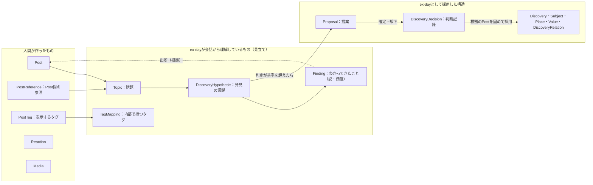
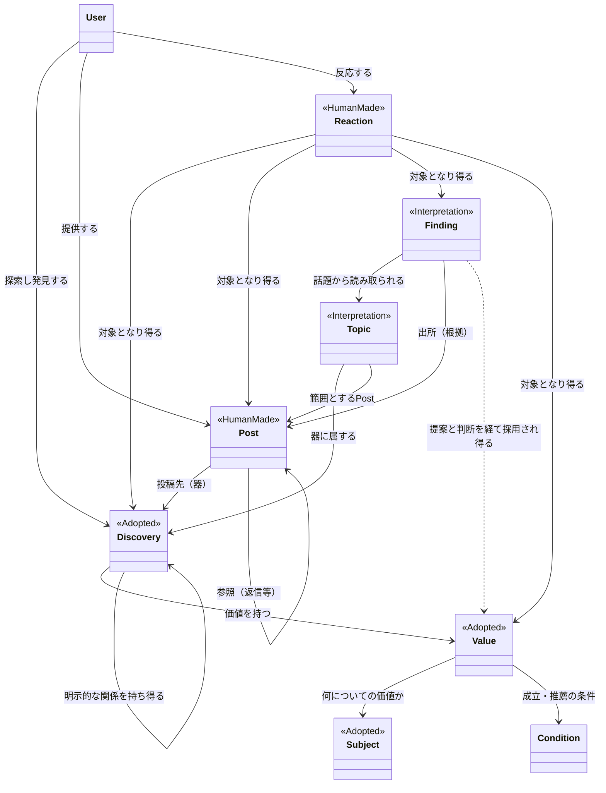
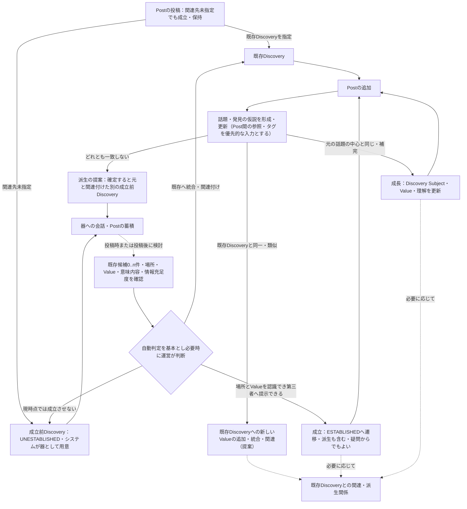
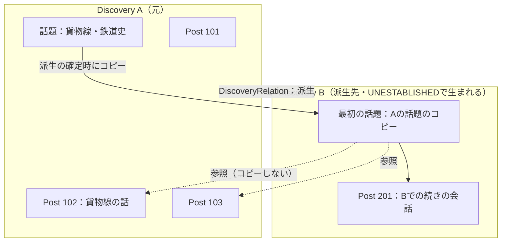
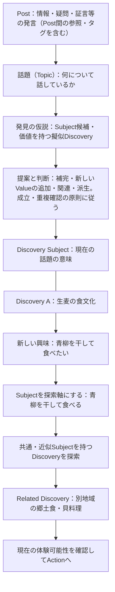
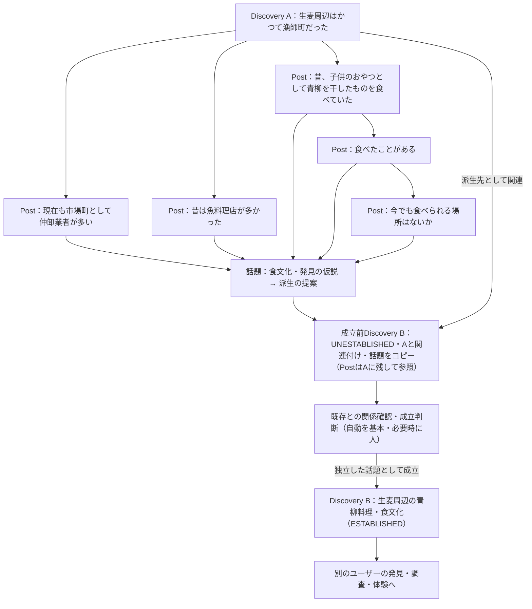
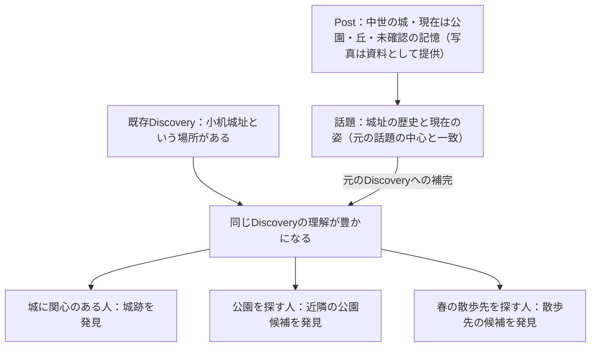
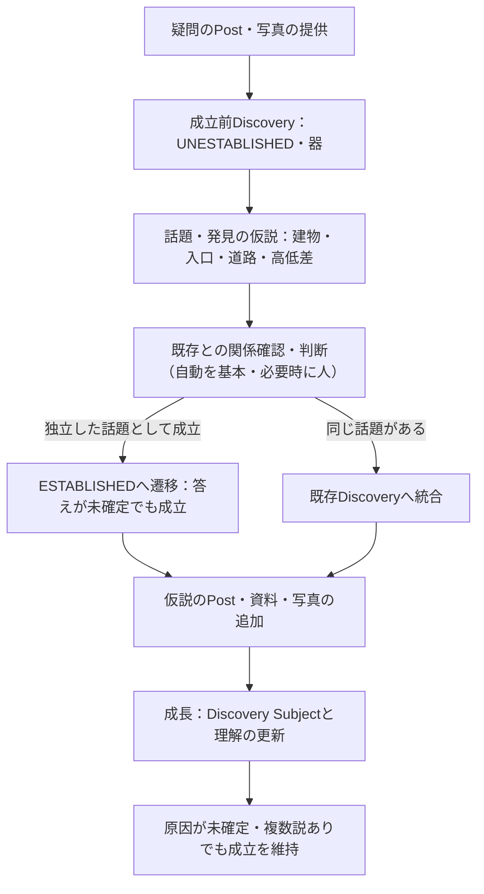

# ex-day ドメイン論理設計書 v0.5

- 作成日：2026-09-13（v0.5改訂：2026-09-15、最終追補：2026-09-25）
- 状態：v0.5追補版。成立・成長・派生の原則を維持し、UserInterest、Theme／Subject、Place／Time、判断・出所・根拠・通報、およびPostから複数DiscoveryへのValue提供関係を論理Entity設計と整合させた。DEC-0004と2026-09-22の設計方針に基づくPostの独立性・Discovery成立判断、およびDEC-0006に基づくDiscoveryの成立状態（成立前から会話の器として存在し、成立は状態の遷移とする）と周辺状態の責務分離、DEC-0005に基づく発言としての位置付けと構造化情報・資料のDiscoveryへの帰属、DEC-0008に基づくContributionからPostへの改称、DEC-0007に基づく補完・派生の判断単位（話題）と原則、DEC-0009に基づく会話の理解の3つの層・話題・発見の仮説・わかってきたこと・提案・タグ、DEC-0010に基づく会話の重複の扱いを反映し、仮定義・要検討事項を併記する。
- 用途：複数AIおよび設計者が、同じ概念・責務・境界を前提に後続設計を行うための共通インプット
## 1. 根拠と本書の位置付け

### 1.1 根拠資料

**[R] `ex-day_requirements.md`（本文タイトル：ex-day 要求仕様 v0.3）**を、v0.3で参照した要求の一次資料として引き継ぐ。既存の要求参照番号は維持する。

**[D] `ex-day_domain_model_v0.4.md`**を改訂元とする。中核四概念、Contextの区別、品質評価を主目的とした投稿・反応の除外等の既存方針を維持する。

**[U] 今回の改訂依頼**を、論理Entity設計の検討からDomainへフィードバックする設計指示とする。Subjectの二つの役割、Discoveryを不用意に細分化しない原則、明示的Discovery RelationとSubjectを介した意味的関連の区別を採用する。既存版から引き継ぐ[U]参照は、成立条件・重複抑制・成長・派生等の従来の設計指示を含む。

**[C] 参照会話「設計作業の進め方確認」**を、検討経緯と例の参照とする。会話内のAI提案だけでは確定事項とせず、今回の依頼で明示された合意を採用する。会話中の数値例は仕様として採用しない。

生麦の形成・派生は、[R] 第6・7・13・14節を背景に、[U]の指定として扱う。今回の追補では要求仕様・論理Entity設計も同じ方針へ整合する。MVPスコープの具体的な実装範囲は本書だけでは変更しない。

**[DEC-0004](decisions/DEC-0004-contribution-as-first-class-content.md)**をPostの独立した成立・保持と関連付け任意の根拠とする。2026-09-22の改訂依頼[U]により、Discoveryの成立原則、派生を新規成立の一種とする位置付け、自動判定を基本として必要時に人の判断を組み合わせる方針を追加する。自動判定の方針はDEC-0004単独から導いたものではなく、従来の「MVPでは人間が最終判断」を更新する今回の設計判断である。具体的な判定条件・実装範囲は後続設計とする。

**[DEC-0006](decisions/DEC-0006-discovery-state-responsibilities.md)**を、Discoveryを成立前から会話の器として扱うこと、Discovery自身の成立状態（`UNESTABLISHED`／`ESTABLISHED`）と公開状態の分離、および確認・安全性・知識状態・推薦・活発度等をDiscoveryの状態に集約しない責務分担の根拠とする。DEC-0004の「関連先未指定でも投稿できる」は維持し、その意味を「ユーザーが関連先を指定しなくても、システムが成立前のDiscoveryを器として用意する」と具体化する。

**[DEC-0005](decisions/DEC-0005-contribution-thread-and-comment.md)**を、Postを発言としての参加に位置づけ、「疑問／知識」等を固定的な型として定めないこと、場所・時期・分類・Valueといった構造化されうる情報と写真・資料の提供をPostの属性ではなくDiscovery（成立前を含む）に帰属させること、および発言からの語句・手がかりの抽出を投稿後に複数の発言にまたがって行うことの根拠とする。

**[DEC-0008](decisions/DEC-0008-rename-contribution-to-post.md)**により、ユーザーが会話の中で行う発言の最小単位をドメイン上「Post」と呼び、日本語の説明では「発言」を用いる。新しい話題を始める発言も返信も同じPostとして対等に扱う。DEC-0001〜DEC-0007の本文中の「Contribution」は書き換えず、Postと読み替える。Contributionを含んでいたEntity・関連名は、DEC-0009に基づき次のとおり整理した（5.4・5.9節）。Postはドメイン上の名前であり、ユーザー向けの表示名は画面設計で決める。

- 旧Contribution Subject（PostとSubjectの直接の関係）：廃止した。
- 旧ContributionDiscovery：Postの投稿先（器としての所属。1つ）と、参照（話題への所属、わかってきたことの出所）に分けた。
- 旧ContributionOrigin：Post間の参照（PostReference）に統合した。

**[DEC-0007](decisions/DEC-0007-discovery-growth-and-derivation-by-context.md)**を、補完・派生をPost単体ではなく会話の話題（DEC-0007の「文脈のまとまり」。DEC-0009で「話題」と呼び替えた）を単位として判断すること、単一の観点の変化だけでは派生としないこと、新しい話題の中心の4通りの行き先と派生前に既存Discoveryを探す原則、Discoveryの同一性を発見・価値の一致で判断すること、Spatial Type（`Point`／`Area`／`Route`）、Subjectの対象と観点の区別、Post間の参照を文脈推定の優先的な入力とすること、会話が元の話題から離れることを逸脱ではなく発見の可能性として扱うことの根拠とする。

**[DEC-0009](decisions/DEC-0009-conversation-understanding-and-tags.md)**を、「人間が作ったもの」「ex-dayが会話から理解しているもの（見立て）」「ex-dayとして採用した構造」の3つの層と、判断時点で根拠のPostを固めるルール、話題（Topic）・発見の仮説（DiscoveryHypothesis）・わかってきたこと（Finding）、提案（Proposal）と候補にする判断材料、派生が確定したときの流れ、Reactionの対象の拡張、タグ（表示するタグ・内部で持つタグ）、PostとSubjectの直接の関係を持たないこと、ドメインに「寄与」の概念を置かないことの根拠とする。英語の名前（Topic等）は、DEC-0009 Decision 11の仮称を本書で用いたものであり、最終的な名前は[Issue #65](https://github.com/ex-day/platform/issues/65)のPRで人間が確認する。

**[DEC-0010](decisions/DEC-0010-duplicate-conversations-and-posting-auth.md)**を、会話の重複を歓迎しDiscoveryの乱立を避けること（投稿前に止めず、投稿直後に似たDiscoveryとわかってきたことを示し、投稿後に提案と判断を経て統合する）、同じ問いの繰り返しを関心の強さ・季節性の手がかりとして扱うこと、および投稿確定時に認証を求めることの根拠とする。DEC-0005 決定3のうち投稿時点での重複の案内は、DEC-0010で投稿直後の案内と投稿後の統合に置き換えられた。

### 1.2 確定度の読み方

- **確定（要求）**：[R]に明記された要求。ただし、将来目標・検討事項として書かれたものを実装確定へ変更しない。
- **確定（今回の設計方針）**：[U]で明示された概念と関係。
- **仮定義**：共通理解のために置く暫定的な言葉・境界。後続設計で変更し得る。
- **検討中**：要求・今回の指示だけでは結論が出ない事項。
  本書の確定事項はサービスの概念に関するものであり、すべてをMVPで実装するという意味ではない。DB物理設計、項目一覧、データ型、キー、API、画面配置、アルゴリズムは対象外とする。

## 2. ドメイン全体の考え方

ex-dayは、場所・時間・興味・状況から、ユーザーが存在を知らず検索しようとも思っていなかったものと出会い、興味や行動につながるサービスである。[R: 第1〜3・8・9節]

全体の価値の流れは **Context → Discovery → Action** である。発見から新しい興味が生まれる場合は、**Context → Discovery → 新しい興味 → Related Discovery → Action** と連鎖し得る。Related Discoveryは関連する別のDiscoveryを指し、新たな中核ドメインではない。これらはサービス体験の概念モデルであり、同名の保存対象を作るという指示ではない。

本書では **User / Discovery / Post / Reaction** を中核ドメインとする。[U]

Discoveryは発見・体験できる意味の単位、Postは会話の中の発言であり、単独でも成立し価値を持つコンテンツとして、Discoveryの意味を形成・成長させる材料にもなり得る。Reactionはそれらに対するUserの反応である。発見後の調査や体験からPostが戻り、既存Discoveryの成長や別Discoveryの形成へつながる。

要求仕様の「Discovery」はユーザーが発見する体験も表す。本書のドメイン名Discoveryは、その体験の対象となる意味のあるまとまりを指す。個々のユーザーの発見履歴を表す概念とは区別する。発見履歴を独立して扱うかは検討中である。

### 2.1 会話の理解の3つの層

**確定（DEC-0009）**。会話に関わる概念を、次の3つの層に分ける。[DEC-0009 決定1]

| 層 | 含むもの | 性質 |
|---|---|---|
| 人間が作ったもの | Post、Reaction、Media、Post間の参照（PostReference。返信等）、表示するタグ（PostTag） | AIの解釈で書き換えない |
| ex-dayが会話から理解しているもの（見立て） | 話題（Topic）、発見の仮説（DiscoveryHypothesis）、わかってきたこと（Finding）、内部で持つタグ（TagMapping） | ex-dayの見立て。新しいPostや再解析で更新・分割・統合・失効してよい |
| ex-dayとして採用した構造 | Discovery、Subject、Place、Value、DiscoveryRelation、判断記録（DiscoveryDecision）、提案（Proposal） | 「確定」は真実の保証ではなく、ex-dayのドメインモデルとして採用したことを意味する |

話題・発見の仮説・わかってきたことは見立ての層の概念であり、中核ドメイン（User／Discovery／Post／Reaction）や採用した構造とは区別する（3.5節）。見立ては後のPostで意味が変わり得るため、形成・更新・分岐・再構成してよく、組み直しの記録は要らない。

**層をつなぐルール：確定（DEC-0009）**。判断（提案の確定・却下、派生等）の時点で、根拠となったPost（と、それを支えたわかってきたこと）を判断記録の側に写し取って固める。見立ての層のIDを参照するだけにはしない。これにより、見立てが後で組み直されても判断の理由は失われない（5.9節）。

User・UserInterest・Theme・Source・Evidence・ContentReport等、上表にない概念の層の位置付けはDEC-0009の対象外であり、本書では定めない。

図は層と概念の読み方を表し、処理順序・保持方法を指定しない。

## 3. 中核ドメインの定義と責務

### 3.1 User

**定義：確定（今回の設計方針）**。発見し、情報・疑問・資料・証言を持ち寄り、反応する参加者。

**責務**：Discoveryを探索・閲覧し、Postを提供し、DiscoveryまたはPostへReactionを行う。同じ人が質問、回答、資料提供、体験共有などへ参加できる。[R: 第10節]

質問者・回答者・投稿者を固定された別種のUserに分けない。関心地域やテーマ等は任意で表現でき、既知の興味がないことを探索不能の理由にしない。[R: 第9〜11節]

**表示名と識別：確定（DEC-0010、[Issue #74](https://github.com/ex-day/platform/issues/74)、[Issue #75](https://github.com/ex-day/platform/issues/75)）**。投稿の確定時に認証を求め、匿名での投稿（アカウントを持たない投稿）は認めない（DEC-0010 決定2）。画面上の表示名はUserが自分で決めたニックネームだけとし、認証プロバイダから受け取る名前・顔写真は使わない。ニックネームは必須で、重複を許し、変更回数を制限しない。ユーザー名（重複不可の識別用の名前）は持たず、内部の識別子（連番）は画面・URLに出さない。Postの表示名は表示のたびにUserの今のニックネームを引き、投稿時の名前をPostに保存しない。監査はアカウント（User）単位で行い、ニックネームの変更履歴をUserに対して保持する（運営のみ閲覧）。Userが持つ情報は、プロフィール（ニックネーム、興味のある地域、興味。ニックネーム以外は他の人に表示しない）と、ログイン方法・状態に分けて扱う（論理Entity設計ではUser・UserIdentity・UserProfile）。住んでいる地域・生活圏、年代、性別は持たない（[Issue #76](https://github.com/ex-day/platform/issues/76)。論理Entity設計4.1節）。

**検討中**：未登録閲覧者と登録Userの関係、個人以外の主体とUserの関係、代理投稿や編集権限、退会時の投稿済みPostの扱い。ログイン前にも価値を理解できることは要求である（閲覧・入力の開始はログインなしで行える）。[R: 第12・26節]

### 3.1A UserInterest

**定義：確定（今回の設計方針）**。Userと、Theme・Subject・Place・Time等の興味対象との関係。本人が申告した興味と、利用からシステムが推定した興味を区別して保持し、ユーザー本人にも見える形で返す。

UserInterestは単なる推薦用の内部プロファイルではない。「歴史が好き」という自己認識から、「城跡」「地形」「廃線跡」等の具体的な興味が見つかる過程自体をex-dayのDiscovery体験の一部とする。Subjectは全ユーザーに共通する統制された意味概念であり、UserInterestが特定Userとの関係を表す。したがって、ユーザーが興味を外したり否定したりしてもSubject自体を削除しない。

ユーザーは自由文を含む具体的な興味を申告できるが、その入力を無条件に新しいSubjectとして登録しない。既存Subjectへ対応付け、対応できないものはSubject候補として扱う。Subject候補の確定主体・運用・独立Entity化は**要検討**とする。

**明示意思の優先：確定（今回の設計方針）**。本人の明示的な「興味がある」「興味がない」または訂正を、システム推定より優先する。特に明示的な興味なしは、その後の行動から同じ興味を安易に再推定しないための抑止情報として保持できる。抑止の期限・解除・近似Subjectへの波及範囲は**要検討**とする。

**行動データの原則：確定（今回の設計方針）**。検索・閲覧・Reaction・Post等を興味推定の入力に利用し得るが、個々の行動履歴を長期保存することを前提にしない。長期的に利用する意味のある結果はUserInterestとして保持し、推定理由をユーザーへ説明できることを目指す。一時ログの保持期間、推定方法、推定理由の粒度、法務・プライバシー上の具体要件は**要検討**とする。

UserInterestが結び付け得る対象はTheme・Subject・Place・Time等である。対象種別を一つの汎用参照で実装するか、種別ごとの関連に分けるかは物理設計事項であり、本書では確定しない。強さ・確信度・由来・有効状態・本人確認状態等は論理属性として扱えるが、尺度と更新規則は**要検討**とする。

### 3.2 Discovery

**定義：確定（今回の設計方針）**。ユーザーが発見・体験できる「意味のある話題・事象」の単位。場所、歴史、食文化、疑問そのものや疑問から見えてきた知識などを、発見対象として捉えられるまとまり。

**責務**：発見対象の意味を表し、Postによって内容を豊かにし、場所・時間・テーマ等との関係を通じて探索可能にする。また、別のDiscoveryへ関連・派生し、次の発見につながる。[R: 第6〜8・13・14節、U]

場所そのものや完成記事に限定しない。「小机城址という場所がある」という小さな発見から始まってよく、情報が不完全でも成立し得る。Postの集合や表示ページと完全に同義にはしない。画面上の要約や見せ方もDiscoveryの定義そのものではない。

同じ対象地域でも「漁師町だったこと」と「青柳料理・食文化」は異なる意味を持つDiscoveryとして扱える。一方、見る人の興味が違うだけで必ず別Discoveryを作るわけではない。SubjectはDiscoveryを不用意に細分化するためのものではない。「生麦の食文化」というDiscoveryは、その中に「青柳を干して食べる」等のSubjectを持ったまま存在できる。Subjectの存在・追加や複数地域での共有だけで、分割・派生・独立Discovery化を必須としない。粒度は以下の成立条件に従って判断する。[U]

**会話の器としての存在：確定（DEC-0006）**。ユーザーはDiscoveryを直接作成せず、Postとして投稿・会話する。Postを蓄積するため、Discoveryは成立前から会話の器として存在できる。ユーザーが関連先を指定せずに投稿した場合も、システムが成立前のDiscoveryを器として用意する。Thread等の別Entityは設けない。ドメイン上Discoveryが存在することと、View上でユーザーに「Discovery」として提示することは一致させなくてよく、成立前は「新しい投稿」「この辺の話」等として表示し得る。具体的なView表現は画面設計で扱う。[DEC-0006]

**成立状態：確定（DEC-0006）**。Discovery自身が保持する成立状態は、原則として`UNESTABLISHED`（未成立）と`ESTABLISHED`（成立）の2状態とする。Discoveryの「成立」はDiscoveryの生成ではなく、`UNESTABLISHED`から`ESTABLISHED`への遷移である。`UNESTABLISHED`は、会話やPostは存在するが、第三者へ発見として提示できるValueや、それを意味付ける場所・Subject等がまだ十分に特定できていない状態を表す。成立済みDiscoveryに新しい議論が発生したことを理由として`UNESTABLISHED`へ戻さない。新しい議論から別の発見が育つ場合も、元のDiscoveryを戻すのではなく、元のDiscoveryと関連付けた別のDiscoveryとして成立前の段階から扱う（派生の判定条件はIssue #46）。成立の取消・統合・再審等による状態の表し方はIssue #37・#46で定める。[DEC-0006]

**成立条件：確定（今回の設計方針・DEC-0006）**。会話やPostから、場所とValue（必要に応じて時間・季節等の条件）を認識でき、他ユーザーが発見・参加できる独立した体験・発見価値を持つ話題として第三者へ提示できると判断された時に成立する。時間等の条件がないことは、そのValueが時間に依存しないことを意味し、成立を妨げない。成立の判断では既存Discoveryとの関係も確認する。知識の提示だけでなく疑問からでも成立でき（3.2.1節の疑問起点のValue）、答えや事実の確定を待つ必要はない。成立の材料は器に蓄積された一つ以上のPostであり、最初のPostだけから成立する場合もあるが、Postの登録や器の用意が自動的に成立を意味するわけではない。投稿者は新しい話題であることを示せるが、その指定だけでは成立を保証しない。既存Discoveryの不在は成立の十分条件ではなく、既存との関連があっても独立した価値があれば成立し得る。派生Discoveryも同じ成立の原則に従うDiscoveryとし、既存との関係・形成経緯はDiscoveryRelation等で表現する。[U、DEC-0006]

**成立の判断主体：確定（DEC-0006）**。成立は、ルールに基づくシステムの自動判定または運営が判断し、ユーザーに成立判断の責任を負わせない。ユーザーの投稿・コメント・Reactionは判断材料であり、判断そのものではない。成立判断は判断主体・理由・根拠・結果をDiscoveryDecision等に記録する（4.4・5.9節）。

場所・時間との結び付きはDiscoveryの成立対象に関する原則であり、Postへの不明情報の入力要求ではない。成立に必要な情報の充足度、場所・時間の結び付きの具体的な評価基準は4.4節・9.1節の後続設計で定める。この原則は実装方式だけでなく、将来の投稿ガイドライン・利用規約にも関係し得るサービス上の原則として扱う。

**成立と事実確定の分離：確定（今回の設計方針・DEC-0006）**。成立は話題・価値の単位としての判断であり、内容の正しさの認定やValueの完全な証明ではない。成立後もPost・Reaction・資料等によってValueの確からしさや条件、関連する知識は成長し続ける。答えが出ていない、調査が続いている、情報が足りない、複数の説がある等の知識の状況は、Discoveryの固定的な状態（知識状態）として持たず、Post・Value・Evidence等から解析・要約される情報として扱う。反証や新資料によって理解を見直すことも成長に含む。

答えが未確定であることだけを理由に、成立した疑問を他者の探索・参加対象から外さない。成立と、公開状態・推薦は区別する。

**検討中**：作成・編集の権限、形成の起点となったPostが非公開・削除・関連取消となった場合の扱い、成立前・成立後の要約方法。公開状態の具体的な状態名・追加状態・運用フロー、成立前Discoveryの露出方法、推薦の算出方法はDEC-0006の対象外であり後続設計で定める。成立と重複抑制の原則は4.4節、具体的な判定方法・運用は9.1節に分ける。

**Discovery自身の状態と周辺の責務：確定（DEC-0006）**。Discovery自身が永続状態として保持するのは、成立状態と公開状態に限る。周辺の情報は次のとおり分担し、単一のDiscovery Statusへ集約しない。

- **成立状態**：`UNESTABLISHED`／`ESTABLISHED`。遷移は判断記録を伴う。
- **公開状態**：成立状態から独立した永続的な公開制御であり、少なくとも`PUBLIC`／`HIDDEN`を区別する。成立前・成立後の両方に適用する。成立前のDiscoveryも、非公開とされない限り投稿・会話として閲覧・参加できる。新しい話題の暫定公開（Issue #36の案D）は専用の状態ではなく「`UNESTABLISHED`かつ`PUBLIC`」として表す。施設の閉園・閉店、季節外、現在体験できない等の情報は公開状態と区別する。
- **確認**：Discovery共通の確認状態は持たない。Valueの内容・根拠、Discovery間の関連・同一・派生、Post・Mediaの問題等は、それぞれValue・Evidence・Relation・Media等の判断対象側で管理する。要レビューは、未解決の判断対象の存在から導出する。
- **安全性**：Post・Media等の確認対象側で管理する（詳細はIssue #35）。Discovery全体を表示すべきでない場合は、その判断を公開状態へ反映する。
- **知識状態**：上記のとおり、解析・要約される情報として扱う。永続化する場合も成立状態とは分離する。
- **Value候補・解析処理**：Value候補はDiscoveryとは別の解析結果・候補とし、AI・類似検索等の解析結果は提案であって確定情報ではない。解析処理の実行状態もDiscoveryの状態に含めない。
- **推薦**：固定的な推薦状態は持たない。成立したDiscoveryのValueは原則として推薦候補となり、推薦はValueとCondition、一回のContext等から都度算出する結果とする（5.1節）。成立前Discoveryの露出は、価値として勧める推薦とは区別する。
- **活発度・新しさ・現在性**：Post・Reaction・投稿日時、該当ValueのSeason等から算出・導出する。

表示とValueのCondition評価では、成立状態・公開状態とこれらの導出・算出結果を組み合わせて参照する。ドメイン状態と画面上のカテゴリ・表示文言を一対一に対応させない。例えば同じ`UNESTABLISHED`でも「新しい投稿」「この近くの話」「話題になっている投稿」等として、同じ`ESTABLISHED`でもContextに応じて「Discovery」「今のおすすめ」等として表示され得る。Valueに依存する現在状態をそのValueのCondition評価にも使う場合の評価順序は未確定とする。[DEC-0006]

#### 3.2.1 Value

**定義：確定（今回の設計方針）**。Valueは、一つのDiscoveryで知る・見る・体験することのできる価値や魅力を表す、再利用可能なドメイン概念である。Discoveryは複数のValueを持ち得る。論理Entity設計では、成立済み（`ESTABLISHED`）のDiscoveryはValueを1件以上持つ。成立前（`UNESTABLISHED`）のDiscoveryは、第三者へ提示できるValueがまだ特定されていない状態であり、Valueを持たなくてよい。会話の途中で検出されるValue候補はValueではなく解析結果・候補として扱う。[DEC-0006]異なるValueがあるだけでDiscoveryを分割しない。Valueは画面上の表示単位やPostの別名ではなく、Discoveryに蓄積される比較的安定した知識・価値である。Valueの論理的な保持と物理的な永続化方式は区別する。

**疑問起点のValue：確定（今回の設計方針）**。疑問から成立するDiscoveryも、場所・Subject・内容等から「何を知る・見る・一緒に考える価値があるか」を定義する。例えば建物入口と道路の高低差についての疑問では、「身近な高低差に気付き、その理由を一緒に考える」というValueを持てる。答えや原因が確定した価値としては扱わない。DiscoveryがValueを持つ原則と、Post登録時に新しいValueの成立を必須としないことは両立する。

**Subjectとの関係：確定（意味上の役割）**。各ValueはSubjectによって「何についての価値か」を意味付けされる。例えば同じDiscovery「小机城址」に、「中世の城郭跡を見る」と「公園を歩く」という異なるValueを置ける。SubjectはValueに結び付けて読む。一方、既存のDiscovery Subjectは「そのDiscovery全体が現在何についての話題か」を示す（5.3A・5.5節）。PostにはSubjectを直接持たせない（5.4節、DEC-0009）。これらを同じSubject概念の異なる役割として扱い、Discovery Subjectを各ValueのSubjectと同一視しない。ValueとSubjectの対応を論理Entity上でどう保持し、Discovery Subjectとの関係をどう導出・更新するかは**要検討**とし、既存のDiscovery／PostとSubjectの関連をこの節だけで置き換えない。

**Postとの関係：確定（今回の設計方針・DEC-0005）**。Postは問い・知識・体験・観測等を含み得る発言であり、それ自体をValueとはしない。Postの蓄積、既存情報、根拠等からValueが形成・更新・補強され得るが、単一Postの登録だけで新しいValueを必ず成立させない。Valueは、会話から読み取られたわかってきたこと（Finding）のうち種類が価値のものが、提案（Proposal）と判断を経て採用されたものである（3.5・4.4節、DEC-0009）。一つのPostは、話題への所属やわかってきたことの出所を通じて複数のDiscoveryから参照され、それぞれのDiscoveryで異なるValueの根拠になり得る。「どのPostが、どのDiscoveryの、どのValueの根拠になったか」は、Valueを採用した判断記録に固めた根拠のPostと、わかってきたことの出所から辿れるようにする。個々のPostの「寄与」を割り振る概念は置かない（DEC-0009 決定6）。Valueとして採用される前のわかってきたことや、Valueに対応付かない会話も出所・話題として保持し、対応するValueがないことを、そのDiscoveryのすべてのValueの根拠とは解釈しない。例えば「夕焼けが綺麗だった」という一件はまず観測・体験を伝える発言である。複数のPostや根拠を踏まえて「夕焼けを楽しめる」というValueが成立・補強され、夕方というConditionが付く可能性がある。形成・更新の判断方法、信頼性の評価方法は**要検討**とする。Valueの成立と、Discoveryの成立・事実確定・積極推薦も区別する。

#### 3.2.2 Condition

**定義：確定（今回の設計方針）**。ConditionはValueごとに0件以上持ち得る、その価値が成立する・利用できる・推薦価値が高まる条件である。場所・時間・季節・Subject・Discovery状態等が条件の軸になり得るが、軸の網羅的な一覧ではない。Time／Season等をDiscovery全体に一律に付けるのではなく、基本的に該当ValueのConditionとして扱う。条件の軸や組み合わせ、成立条件と推薦上の条件の詳細な区分は論理Entity設計でも**要検討**であり、ここで新たな分類を確定しない。Seasonの一致は例年の旬等を示し得るが、今年・今日の実状を保証しない。

ある軸のConditionがないことは、そのValueがその軸に依存しないという意味であり、「いつでも成立する」という積極的な主張とは異なる。「通年」はValueの種別ではなく、時間的な成立条件が常時成立することを表す。他の軸の条件まで常に成立することや、営業・在庫等の実状を保証する意味ではない。条件なし・不明・通年の意味を混同せず、`ALL_YEAR`等の明示値や条件なしの物理表現の採否は**要検討**とする。「中世」のような歴史的時代は話題やSubject／contentの意味を説明する時間であり、現在いつ推薦するかというConditionのTime／Seasonとは区別する（5.10節）。

### 3.3 Post

**定義：確定（今回の設計方針・DEC-0005・DEC-0008）**。ユーザーが会話の中で行う発言（Post）としての参加。新しい話題を始める発言も返信も、同じPostとして対等に扱う。問い・情報・体験・記憶・証言等を持ち寄る単位であり、単独でも成立し価値を持つ。既存Discoveryの補完・更新や新しいDiscoveryの成立の材料となり得る。「疑問／知識」「コメント／スレッド」等を固定的・排他的な型として定めず、同じ発言が問いと情報を含むことや、やり取りの中で役割や関連先が変わることを妨げない。従来の論理名「知識・疑問」は用いない（DEC-0008）。[DEC-0005 決定1・8]

**独立した成立・保持：確定（DEC-0004・DEC-0006）**。Discoveryの成立・更新・既存Discoveryへの関連付けはPostの投稿成立条件ではない。ユーザーは関連先となる既存Discoveryを指定せずに投稿・保持でき、類似候補が存在しても関連付けずに投稿できる。この場合、システムが成立前（`UNESTABLISHED`）のDiscoveryを会話の器として用意する（3.2節）。したがって「関連先未指定」は、Postがどの器にも属さないことではなく、ユーザーが既存Discoveryを指定しなかったことを指す。投稿後に既存Discoveryとの関係を追加し、還元を再検討できる。成立前Discoveryを器とすることを、下書き・投稿不成立・Discoveryの承認待ちと同一視しない。

**投稿先（器）と参照：確定（DEC-0009）**。Postが属する器は、投稿された場所（投稿先Discovery）の1つだけとする。他のDiscoveryとは、話題への所属、わかってきたことの出所（根拠）、判断記録に固めた根拠といった参照でつながる。派生や統合の際もPostを複製・移動せず、元の場所に残して参照する（4.6節）。[DEC-0009 決定8]

**Post間の参照：確定（DEC-0007・DEC-0009）**。返信・メンション・引用のように、Postが別のPostを受けて書かれたことを表す参照（PostReference）を、人間が作ったものとしてドメインで保持する。この参照はユーザーが自然に与える強い文脈情報であり、話題の推定で優先して利用する。複数のPostへの参照も将来あり得る。ただし、ユーザーが参照機能を使わない場合でも判断が成り立つようにし、参照の存在を判断の前提にはしない。Viewで返信・メンション等としてどう見せるかは画面設計で扱う。[DEC-0007 決定8、DEC-0009 決定2]

**タグ：確定（DEC-0009）**。ユーザーはPostにタグを付けられる。タグはユーザーが書いたままの表示するタグ（人間が作ったもの）と、表記の揺れを吸収しSubjectに対応付けた内部で持つタグ（見立て）に分ける（3.5.4節）。タグは必須にしない。[DEC-0009 決定10]

**構造化情報と資料の帰属：確定（DEC-0005）**。場所・時期・分類・Valueといった構造化されうる情報は、Postの属性として持たず、一貫してDiscovery（成立前を含む）に帰属させる。発言に含まれる語句・手がかりは投稿後の解析で抽出し、単一の発言を確定情報へ変換するのではなく、複数の発言にまたがって蓄積・組み合わせることで、Discoveryの場所・時期・分類・Valueを形成していく。矛盾する語句や複数の解釈は候補として共存してよい。写真・資料等の提供も、Postの属性ではなく、Discoveryに対して直接行う行為として扱う。資料の出典・提供者情報は資料自体に紐づけて保持し、どのPostとともに提供されたかを辿れるようにする（5.11節）。[DEC-0005 決定7〜9]

したがって、場所・時期・関連先等の不明な情報の入力や候補選択を投稿成立条件にはしない。関連Discoveryの指定と、Discoveryに帰属する構造化情報の形成は別の事柄として扱う。投稿画面の具体的な入力項目は画面設計で定める。AIが不足情報を推測・創作してDiscovery成立へ寄せることはせず、提供された情報と推定候補を区別する。抽出された語句・候補をいつ・誰が（あるいはどの基準で）Discoveryの確定した情報として扱うかは検討中である（DEC-0005 Deferred）。

**責務**：完成した知識だけでなく、分からないこと、記憶、伝聞、調査結果などを発言として持ち寄れるようにし、既存の話題に情報を加える、問いを深める、または新しい話題を形成する材料となる。写真・資料は発言とともに、または発言とは別に、Discoveryへ提供される。[R: 第13〜16節、U、DEC-0005]

Discoveryへの還元の有無、器となるDiscoveryの成立の有無にかかわらず、発言の原文を独立したコンテンツとして保持する。発言とともに提供された資料は、提供先のDiscoveryと出典・提供者を保ったまま保持する。S05・S09等では、ユーザーが関連先を指定しなかったPost（成立前Discoveryを器とするもの）もその内容と現在状態を確認できる対象とする。第三者への公開は器となるDiscoveryの公開状態に従い、成立前でも非公開とされない限り閲覧・参加できる（3.2節、DEC-0006）。成立前Discoveryの露出方法・検索範囲は表示・推薦設計で定める。

問いも情報もPostとして同じように扱う。質問への回答だけでなく、情報追加、資料の提供に添えた説明、一緒に調べることにつながる発言を扱う。会話では複数のPostが互いの内容を受けて展開する。

**Valueとの関係：確定（今回の設計方針・DEC-0009）**。Postが単独で価値を持つことと、Discoveryに属するドメイン概念のValueであることは別であり、両者を同一視しない。Postは疑問・体験・観測・知識等を含む発言として話題に属し、わかってきたことの出所となることで、Valueを成立・成長させる根拠となり得る。一つのPostは複数のDiscoveryの話題から参照され、それぞれのDiscoveryで異なるValueの根拠になり得る。「どのPostが、どのDiscoveryの、どのValueの根拠になったか」は、わかってきたことの出所と、Valueを採用した判断記録に固めた根拠のPostから辿れるようにする（3.2.1・5.9節）。登録時点でValueが成立する必要はなく、Valueに対応付かない発言も話題・出所として保持する。対応するValueがないことを、そのDiscoveryのすべてのValueの根拠とは解釈しない。Postと会話から読み取られたものの関係は「寄与」ではなく「出所（根拠）」とする（DEC-0009 決定6）。Discoveryの状態と既存・追加Postとの関係を評価した結果、疑問・観測としての蓄積、既存Valueの根拠、信頼性向上、修正、新しいValueの成立等につながり得る。自然文PostからValueへの自動変換は前提としない。

**確定（DEC-0005）**：知識・疑問・証言・体験等は発言の内容を説明する言葉であり、Postの種別・継承クラス・入力時の分類項目ではない。発言の内容を分類した結果を持たせる場合も、それはDiscoveryの形成に用いる解析結果・手がかりとして扱い、Postの固定的な型にはしない。写真・資料はDiscoveryへの提供として扱い、Postの内容の分類には含めない。

出所や不確実性を認識できることを重視する。伝聞や曖昧な記憶が集まったことをもって、確定した史実や現在の営業情報とみなさない。[R: 第24節]

**確定（今回の設計方針）**：品質評価そのものを主目的とした投稿（星評価、ランキング、店舗比較、優劣判定、口コミサイト的な評価機能）はPostの対象としない。ただし、「美味しい／まずい」等の主観的な感想が内容に含まれること自体は妨げない。体験、記憶、資料、証言、疑問、関心等を対象とし、例えば「昔食べた青柳は美味しかった」のように、体験・証言・記憶の一部として主観的な感想が含まれる内容はPostとして許容する。単純な同意・共感の表現とPostの境界については3.4節を参照。[U]

**検討中**：自然文PostからValueを抽出・生成・更新する方法（複数の発言にまたがる語句・手がかりの抽出・蓄積と、その確定の扱いを含む。DEC-0005 決定9・Deferred）、単独での成立・保持を前提としたDiscovery／Valueへの還元方法、Post間の参照（PostReference）の種類と物理モデル（DEC-0007 Deferred）、成立前Discoveryを器とするPostの露出方法・検索範囲（公開の可否はDiscoveryの公開状態に従う）、投稿後に既存Discoveryへ関連付ける主体・権限・手順・通知方法、Value成立前の関係を成立後にどう対応付けるか、関係の取消・履歴、編集・訂正の管理、発言とともに提供された資料との対応の表現。外部情報をすべてUser投稿のPostへ変換するかも未確定である。[R: 第18〜21節]

### 3.4 Reaction

**定義：確定（今回の設計方針・DEC-0009）**。UserからDiscovery・Post・わかってきたこと（価値・説）・Valueへの反応。[U、DEC-0009 決定9]

**責務**：対象へのユーザーの反応を表す。反応は、次の発見や地域側への価値につながり得るが、推薦への利用方法や集計方法は未確定である。[R: 第23節・Scenario 06]

**仮定義**：新しい説明内容を提供するPostに対し、Reactionは対象への関心・感想等を簡潔に示す概念として区別する。具体的な反応種別は確定しない。

**確定（今回の設計方針）**：Reactionも品質評価そのものを主目的とした反応（星評価、ランキング、店舗比較、優劣判定、口コミサイト的な評価機能）を対象としない。主観的な感想が含まれること自体は妨げないが、関心・共感・次の行動意欲を示す反応を中心とし、単純な好悪の表明や品質ランキングを目的としない。[U]

**仮定義**：反応の方向性を示す例として「興味がある」「行ってみたい」等が挙げられるが、これらは方向性を示す仮の例であり、反応種別の確定した一覧やUI表現ではない。

「食べたことがある」は、本書の生麦例では体験証言を加えるPostとして扱う。単純な同意・共感の反応と同じような表現を使う可能性はあるが、文言だけでReactionと判定しない。「今でも食べられる場所はないか」は問いを含むPostである。

**対象と意味：確定（DEC-0009）**。Reactionの意味は対象によって異なる。[DEC-0009 決定9]

| 対象 | Reactionの意味 | 注意 |
|---|---|---|
| Post | 発言への共感 | ― |
| 価値（わかってきたこと・候補・採用後のValue） | 「わかる」「行ってみたい」 | 確からしさ・推薦の材料 |
| 説（裏付けのないもの） | 「そうかも」 | 正しさの証拠にはしない。票の多い説を正解のように見せない |
| 説（裏付けのある知識） | 付けない | 確からしさは資料・出典で決まる |
| Subject・Condition単独 | 付けない | 意味をなさない |

問いへの「自分も気になる」は、問いを投げたPost（またはDiscovery）に付ける。表中の反応の言葉は意味の方向を示す例であり、反応種別の確定した一覧やUI表現ではない。

**「Reactionの数を事実の正しさに置き換えない」原則との関係：確定（DEC-0009）**。わかってきたことの説へのReactionは、関心・共感や「そうかもしれない」という受け止めを示すものであり、事実の信頼度にはしない（5.5節、8節）。説の確からしさは資料・出典（Media・Source・Evidence）で決まるため、裏付けのある知識にはReactionを付けない。価値へのReactionは、価値への共感として確からしさ・推薦の材料になり得るが、これも事実の正しさの保証ではない。

わかってきたことへのReactionは、そのわかってきたことのどの版に付けられたかを保持し、同一性のルールに従って更新・統合・分割の際に引き継ぐ（3.5.3節）。

**検討中**：反応種別、取消・変更・重複の扱い、保存や訪問をReactionに含めるか、自由文とPostの境界。Reaction数による信頼性判定やDiscoveryの自動形成は確定しない。関係の提案へのユーザーのフィードバック（「関連ない」「一緒では？」。DEC-0007 決定10）を、Reactionの対象の拡張で表すか別の概念で表すかは要検討とする。

### 3.5 会話の理解（見立ての層）

**確定（DEC-0009）**。以下は「ex-dayが会話から理解しているもの」の層（2.1節）の概念である。中核ドメインではなく、Discovery等の採用した構造でもない。新しいPostや再解析で更新・分割・統合・失効してよい。

#### 3.5.1 話題（Topic）

**定義：確定（DEC-0007・DEC-0009）**。「どのPostの範囲で、何について話しているか」を表す、ex-dayの見立て。DEC-0007の「文脈のまとまり」を、DEC-0009で「話題」と呼び替えた。Postそのものではない。[DEC-0007 決定1、DEC-0009 決定2]

- 話題は、会話から同じことについて語られているPostの集まりとして捉える。連続したPostの範囲である必要はなく、話題が移ったあと元の話題へ戻った場合、戻った後のPostは元の話題に属し得る。
- 1つのPostは複数の話題に属してよい（例：「撤去されて氷川丸が見やすくなった」は、鉄道史の話題と景観の話題の両方に属し得る）。話題は会話を排他的に区切るものではない。
- 「そうなの？」「へー」のように単体では話題を持たないPostもある。Post一件ごとに補完か派生かを判定しない。
- 話題は、器としてのDiscoveryに属しつつ、複数のDiscoveryのPostを参照できる（4.6節）。
- ex-dayが話題とその要約を保存する（見立ての層として永続化する）。新しいPostの解析は「既存の話題の要約＋新しいPost」を主な入力とし、過去の全Postを毎回解析しない。
- 話題は後のPostで意味が変わる（「そうなの？」が後から鉄道史の話と分かる等）ため、形成・更新・分岐・再構成してよい。
- Post間の参照（返信等）は、話題の推定で優先して使う（3.3節）。

「話題」という日本語は、本書でDiscoveryの定義（意味のある話題・事象）や、並行する成立前Discovery（4.4節）の説明にも一般語として用いている。本節の概念を指す場合は「話題（Topic）」と表記して区別する。

#### 3.5.2 発見の仮説（DiscoveryHypothesis）

**定義：確定（DEC-0009）**。話題が持つ、Discoveryと同じ形（場所・Subject・価値）を持つ擬似的なDiscovery。[DEC-0009 決定3]

- 話題の中心（DEC-0007 決定2）を、少なくともPlace、Spatial Type（`Point`／`Area`／`Route`）、Subject（対象）、Subject（観点）、Time（話題が指す時期。ValueのConditionとしての時間とは区別する）、Value候補の観点から捉える。これらの具体的な保持方法は論理Entity設計・PoCで扱う。
- 1つの話題に、解釈の異なる複数の仮説があってよい（例：浜松町の会話から、水害に備えた街のつくりという仮説と、昔あった〇〇の名残という仮説）。DEC-0005 決定9（矛盾する解釈を無理に一つにまとめない）を構造にしたものである。
- 仮説の数は、確からしさの高いものから数個までに絞る。会話が進むと仮説は絞られ、支えを失った仮説は失効する。
- 仮説はDiscoveryと同じ形を持つため、「仮説とDiscovery」「仮説どうし」を同じ物差しで比べられる。補完・派生等の突き合わせの単位は仮説とする（4.4節）。
- Subjectの候補は仮説が持ち、採用されたらDiscoveryのSubjectになる（5.4節）。
- 仮説は見立ての層の概念であり、単独の中核Entityとはしない。

#### 3.5.3 わかってきたこと（Finding）

**定義：確定（DEC-0009）**。会話から「何がわかってきたか」を表す見立て。話題（何について話しているか）とは区別し、発見の仮説の中身として育つ。1つの話題から複数のわかってきたことが生まれ、1つのわかってきたことが複数の話題にまたがり得る。ユーザーに見せる（S03のC25「わかってきたこと」）。[DEC-0009 決定4]

- 種類は**説**と**価値**の2つとし、1つの概念の属性として持つ。
  - 説：「水害対策では」「汽車道は旧貨物線の一部だった」等。観察（「入口が一段高い」）を含む。資料（出典）の裏付けがあるものを知識として扱う。
  - 価値：「夕方、夕焼けが綺麗」「高低差の理由を一緒に考える」等。疑問起点の価値（「謎を一緒に考える」）も含む。
- 問いはわかってきたことに含めない。問いはPostであり、問いを起点とした成立前のDiscovery（器）の話題になる。まだわかっていないことは、話題の要約の一部として表す。
- 種類どうしの関係（この説はこの問いに答える等）は、最初は持たない。
- Postとの関係は「どの会話から分かったか」という**出所（根拠）**とする。会話全体の産物を個人の「寄与」として割り振らない。個人を特定できるのは資料の提供であり、資料（Media）自体が提供者・出典を持つ（DEC-0005 決定8）。[DEC-0009 決定6]
- わかってきたことから出る構造は、提案と判断を経て個別に採用・却下される（4.4節）。価値のわかってきたことは、Valueの候補となり、採用されるとValueになる。説を採用した構造の側でどう表すか、および採用（確定）の判断と運用は後続で検討する（DEC-0009 Deferred）。

**同一性のルール：確定（DEC-0009）**。再解析で表現が変わったとき、「すでに反応した人が、変わった後の文を見ても同じ反応をするか」で判断する。するなら同じものの更新（Reactionを引き継ぐ）、しないなら別の新しいものとする。

| 変化 | 扱い |
|---|---|
| 言い換え、詳しくなる、条件が絞られる | 更新（Reactionを引き継ぐ） |
| 主張が変わる、対立する説が出る | 別の新しいもの。元の説も残して並べる |
| 同じものだと分かる | 統合（Reactionを合算し、同じ人の重複は1つにまとめる） |
| 2つの主張が混ざっていた | 分割（元の方にReactionを残す） |
| 支えがなくなった | 失効（消さずに残す） |

版の履歴と、Reactionがどの版に付けられたかを保持する。

#### 3.5.4 タグ

**確定（DEC-0009）**。タグは、探すためのキーワードを低コストで本人の意図どおりに付ける手段であり、価値がまだない段階のDiscoveryの露出、話題の解析の手がかり、Subjectの候補の最も安い入口として用いる。[DEC-0009 決定10]

| | 表示するタグ（PostTag） | 内部で持つタグ（TagMapping） |
|---|---|---|
| 中身 | ユーザーが書いたまま | 表記の揺れを吸収し、Subjectに対応付けたもの |
| 層 | 人間が作ったもの（Postに付く） | ex-dayが会話から理解しているもの |

- タグはPostに付ける。Discoveryのタグは属するPostのタグを集めて求める。運営が登録するDiscovery（Issue #57）には、運営が付けたタグを直接持たせてよい。
- 必須にしない。判断ではなく、重み付けされた入力として扱う（DEC-0007 決定10）。
- タグで見せる単位はPostではなくDiscoveryとする（DEC-0008 決定4：SNS的な振る舞いを採らない）。
- 入力はPostと同じ欄で行い、専用の入力欄を設けない。モバイルでの入力の手間は画面設計で解消する。
- タグのMVPでの扱い（入力UIの範囲）は後続設計とする（DEC-0009 Deferred）。

## 4. 中核概念の関係

### 4.1 Mermaid classDiagram

次の図は中核ドメインとValue・Subject・Condition、および会話の理解の見立て（話題・わかってきたこと）との関係を表す。属性・操作・物理的な保持方法を表さない。ValueとSubjectの線は意味上の関係であり、既存のDiscovery Subjectを置き換える関連の保存形を指定しない。多重度は図に指定しない。矢印は関係の読み方向であり、処理順序や所有関係ではない。各概念の層（2.1節）を注記で示す。`<<HumanMade>>`は人間が作ったもの、`<<Interpretation>>`はex-dayが会話から理解しているもの（見立て）、`<<Adopted>>`はex-dayとして採用した構造を表す（Mermaidの注記に日本語を使えないため英語で表記する）。

Reactionの対象線は、複数の対象への同時反応を必須とするものではない。いずれも対象になり得ることを示す（対象ごとの意味は3.4節）。発見の仮説（DiscoveryHypothesis）、提案（Proposal）、タグは図を簡潔にするため省略した（2.1・3.5・5.9節）。

UserとPostの関係はユーザー参加を示す。外部データ由来の情報に、架空の投稿Userを必須とする意味ではない。

### 4.2 形成・成長の関係

**確定（今回の設計方針）**：Postは既存Discoveryを豊かにし得る。また、Post（問いを含む）・会話の蓄積から新しいDiscoveryが形成され得る。[U] この形成・成長は、Post単体ではなく、会話から捉えた話題（Topic）とその発見の仮説を単位として判断する（4.3・4.4節、DEC-0007 決定1）。 ここでの「形成」は、器として存在する成立前のDiscoveryに会話が蓄積し、成立判断を経て`ESTABLISHED`へ遷移することを含む。Discoveryが成立時点で新たに生成されることを意味しない。[DEC-0006]

Postが形成の材料・根拠となることは、Post自体が消えてDiscoveryへ置換される、という意味ではない。原文・資料・疑問を独立したコンテンツとして保持し、形成後も参照できるようにする。参照・表示の具体的方法や削除・非公開時の保持範囲は検討中である。

### 4.3 Discovery同士の関係

**確定（今回の設計方針）**：Discovery同士は関連・派生し得る。[R: 第7節、U]

**確定（今回の設計方針）**：「関連」は共通する場所・時間・意味内容等から別の発見へつながること。「派生」はあるDiscoveryを起点とした会話から、元とは別の話題の中心（話題の発見の仮説）が形成され、既存Discoveryのどれとも一致しないと判断されて、元のDiscoveryと関連付けた別のDiscoveryが生まれること。派生したDiscoveryは成立前（`UNESTABLISHED`）で生まれ、成立条件を満たすかは別に判断する。別の話題の中心が形成されただけでは派生の確定ではなく、派生の提案（Proposal）となる（4.4・5.6節、DEC-0007 決定1〜6）。

**確定（今回の設計方針）**。Discovery同士の関連には、少なくとも次の性質の異なるものがある。[U]

- **明示的Discovery Relation**：派生元／派生先など、Discovery間に直接意味のある関係があるもの。例えば「生麦周辺はかつて漁師町だった」を起点に「生麦の食文化」が成立したという関係は、形成の経緯を表す。
- **Subjectを介した意味的関連**：共通または近似Subjectを持つことで、結果として関連Discoveryとして導出できるもの。例えば「生麦の食文化」と「別地域の郷土食」が「青柳を干して食べる」を介してつながる場合であり、一方から他方が派生したことを意味しない。

Subjectによる関連は必ずしもDiscovery間の直接Relationとして保持する必要はない。保持方法は後続の論理Entity／実装設計事項とする。4.1節の直接関係の線は、Subjectを介した関連もすべて直接保持するという意味ではない。両者は併存し得るが、共通Subjectだけから派生の経緯を推定しない。

関連があるだけでは生成元・生成先の関係とは限らない。派生例ではAを起点にBが形成される方向を説明できるが、単一の親を必須とする木構造は確定しない。

**補完・派生の判断単位：確定（DEC-0007）**。補完・派生は、Post単体ではなく話題（3.5.1節）を単位として判断する。一つの会話から、元の話題への補完と、性質の異なる複数の派生の提案が並行して生まれてよい。[DEC-0007 決定1]

**単一の観点の変化だけでは派生としない：確定（DEC-0007）**。Place・Spatial Type・Subjectのいずれか一つが変わったことだけを理由に、派生とは判断しない。例えば散歩ルートのDiscoveryで「汽車道は昔貨物線だった」という話が出ても、直ちに別のDiscoveryとはせず、元のDiscoveryへの価値の補完（ルートの背景）として扱い得る。派生の兆候が強いのは、例えば次の場合である。これらは判断材料であり、単独で派生を確定させない。[DEC-0007 決定3]

- 複数の観点が同時に変わり、元とは別の話題の中心が形成されている
- Routeの構成要素だったPlaceが、会話の主対象に変わる（例：散歩ルートの一部だった氷川丸が話の中心になる）
- Spatial Typeが変わる（Route → Point、Route → Area、Point → Route等）
- 元のSubjectとの重なりが減り、新しいSubject群がまとまりを持って語られ始める

Subjectは変化した数ではなく、元のSubjectとの重なりが減り、新しいSubject群を中心とした独立した意味のまとまりが形成されたかで見る。

**新しい話題の中心の行き先：確定（DEC-0007・DEC-0009）**。新しい話題の中心が形成されたと判断された場合、その行き先は次のいずれかとなる。[DEC-0007 決定4、DEC-0009 決定7]

1. **元のDiscoveryへの補完**：元のDiscoveryのValueの補完・追加として扱う。
2. **既存Discoveryへの新しいValueの追加**：同じ対象の既存Discoveryに、新しいValueとして加える（例：既存の「氷川丸」Discoveryに、戦時中の病院船としての歴史の価値を加える）。
3. **既存Discoveryとの関連・根拠としての参照**：既存Discoveryと関連付け、話題のPostを、既存Discoveryのわかってきたこと・Valueの根拠として参照する。DEC-0007では「関連・寄与」としていたが、DEC-0009によりドメインに「寄与」の概念を置かないため、根拠としての参照とする。
4. **新しいDiscoveryの派生**：どの既存Discoveryにも当たらない場合に、元のDiscoveryと関連付けた新しいDiscoveryを生む（4.6節）。

2〜4の判断の前に、必ず既存Discoveryを探索し、該当があれば新しいDiscoveryを作るより2・3を優先する。

**同一性の判断：確定（DEC-0007）**。Discoveryの同一性は、場所・時期・Subjectの一致ではなく、発見・価値の一致で判断する。同じ場所・同じ対象でも、価値が異なれば同じDiscoveryの別のValueになり得る。場所の一致だけで同一とはしない。[DEC-0007 決定4]

**会話が元の話題から離れること：確定（DEC-0007）**。会話が元のDiscoveryの中心から離れても、「話題からの逸脱」として抑制・警告しない。別の価値や興味が生まれ、新しい発見につながる可能性として扱う。[DEC-0007 決定7]

**検討中**：上記の性質の区別を前提とした具体的な関係の種類、方向・対称性、多重度、複数起点からの形成、関係を付与する主体。関連・派生を独立した中核ドメインとして追加するかは未決定である。

### 4.4 成立判断と重複の扱い

**確定（今回の設計方針）**。ex-dayでは類似Discoveryの乱立を、Postが分散し一件あたりの知識が薄まる情報品質の低下と捉える。新規Postの内容や、成立前Discovery（器）に蓄積された場所・時期・意味内容等の手がかりから既存Discoveryとの類似候補を抽出し、関係を確認する。類似候補は`0..n`件とし、0件も正常とする。候補の有無にかかわらず、候補の選択・関連付けやDiscoveryへの還元をPostの投稿成立条件にはしない。[U、DEC-0004、DEC-0005]

**会話の重複は歓迎し、Discoveryの乱立は避ける：確定（DEC-0010）**。同じ会話（同じ問い・同じ話）が何度投稿されてもよい。ただし、Discoveryとしての乱立は避ける。コンテンツの量（会話の重複）と質（Discoveryの乱立の回避）を、投稿と、見せ方・統合という別の段階で扱う。[DEC-0010 決定1]

| 段階 | 扱い |
|---|---|
| 投稿する前 | 止めない。既に同じ問い・話があるかを確かめさせない |
| 投稿した直後 | 似た既存のDiscoveryと、そのわかってきたことを示し、既存の会話に加わる選択肢を示す。加わるかどうかはユーザーが選ぶ |
| その後 | 同一の提案として判断を経て統合する（本節の提案）。新しいPostは消さず、統合先から辿れるようにする（下記「探索過程の保持」） |
| 見せ方 | TOP・検索等では、まとまったDiscoveryを見せる。重複した成立前のDiscoveryを前に出さない |

- 同じ問い・話が繰り返し投稿されることは、その場所への関心の強さや、季節性の手がかりとして扱う（3.4節の問いへの「自分も気になる」と同じ性質）。
- 場所と時間を扱うex-dayでは、同じ問いでも時期によって答えが変わることがあり、新しい投稿者が新しい資料・視点を持ち込むこともある。そのため、同一かどうかは機械的に決めず、発見・価値の一致で判断する（4.3節）。
- ユーザーによる「同じ話だ」という紐付けは、内部では重なりの手がかりとして受け取り、提案と判断を経る（DEC-0006 決定3、DEC-0007 決定10）。

**類似と未知の可能性：確定（DEC-0005・DEC-0010）**。DEC-0005 決定3の「明白な単純重複は抑制し、既存の議論やDiscoveryへの参加を促す」のうち、投稿時点での案内は、DEC-0010により投稿直後の案内と投稿後の統合に置き換えた。「既存の議論への参加を促す」趣旨は維持する。類似Discoveryがあることだけでは同一とみなさない。撮影地点・角度、季節・天候等の違いはそれ自体が新たな資料の価値になり得るため、類似の存在のみを理由に投稿や探索を抑制しない。類似検索は、既知との比較を通じて差異や新しい発見を探るためにも用いる。[DEC-0005 決定3・6]

**関連度の継続的な再評価と並行する話題：確定（DEC-0005・DEC-0006）**。成立前Discoveryと既存Discoveryとの関連度は、投稿時点だけでなくPostが加わるたびに再評価され得る。関連度が一定の水準に達した場合も、特定の投稿者個人への通知ではなく、その話題自体の画面上に「類似しているかもしれないDiscoveryがあります」等の形で提示し、会話の継続を妨げない。会話が未成熟な段階では、視点の違いによって複数の話題（成立前Discovery）が並行して進むことを認め、どの話題で会話を続けるかは参加者に委ね、統合をあらかじめ強制しない。統合は、参加者が同一の対象を指していると気づいた段階を契機に行えばよい。[DEC-0005 決定4]

ここで参加者に委ねるのは、どの話題で会話を続けるかと、統合の契機となる気づきである。一方、DEC-0006は成立（`UNESTABLISHED`から`ESTABLISHED`への遷移）の判断責任をユーザーに負わせないとし、統合による状態の変更も判断記録を伴う操作として扱う（Decision 3）。両者は対象が異なる（会話の継続・統合の契機と、成立の判断）ため本書では矛盾として扱わないが、統合を確定させる判断主体・権限・手順・記録の方法はIssue #37・#46で定め、本書では確定しない。

**探索過程の保持：確定（DEC-0005）**。探索の結果、既存Discoveryと同一対象と判明して統合した場合も、Post、原文・資料、会話の文脈と同定に至る過程を統合先Discoveryの成長過程として保持し、統合先から元の会話を、元の会話から統合先を辿れるようにする。統合は成果の集約であり、元の探索を価値のない重複として消すことではない。同一対象であることを、Postや資料に新たな価値がない根拠にもしない。[DEC-0005 決定5・6]

比較では次の観点を扱う。

- **Place**：同一点だけでなく、地域と特定建物の包含、範囲の重なり、近接、経路（Route）とその構成要素の関係を考慮する。近い場所であることだけで同一とはしない。
- **Time**：年代・期間の重なりや、過去から現在への変化という関係を考慮する。時代が違うだけで別Discoveryとはしない。不明は不一致と同義ではない。
- **意味内容**：話題の発見の仮説が持つSubject候補・価値と、DiscoveryのSubject・Value等を手掛かりに、同じ話題として受け止められる意味的互換性を確認する。語句の完全一致や共通語の有無だけでは判断しない。

例えば「ビル／建物」「低い／高低差」という表現差や、一方に「道路」の記述がない情報量の差だけで分けない。一方、同じ道路に言及していても「特定建物の入口が低い理由」と「地域全体の道路面の歴史的変化」は関連する別の話題になり得る。互換性とは説明内容への賛同ではなく、同じ話題として扱えることを指す。相反する説も同じDiscoveryの材料となり得る。

**成立・関係の判断：確定（今回の設計方針・DEC-0006）**。既存Discoveryとの類似性、独立した体験・発見価値、必要な情報の充足度等を判断材料とし、成立前Discovery（器）やその会話について、例えば次の結果を取り得る。成立の判断はシステムの自動判定または運営が行い、ユーザーに判断の責任を負わせない（3.2節）。

- **既存Discoveryへの新しいValueの追加**：同じ対象の既存Discoveryに、話題から見えてきた別の価値を新しいValueとして加える（4.3節の行き先2、DEC-0007）。新しいDiscoveryを作らない。
- **既存へ統合**：同じ話題の材料として既存Discoveryへまとめる。投稿原文や異説を消して同一の主張に書き換えることではない。既存Discovery同士の統合操作とは対象単位を区別する。統合後の成立前Discoveryの状態の表し方はIssue #37・#46で定める。
- **成立**：器として存在する成立前Discoveryを、独立した体験・発見対象として`UNESTABLISHED`から`ESTABLISHED`へ遷移させる。Discoveryを新たに生成する操作ではない。既存との関連があっても成立し得る。既存候補が0件という理由だけでは成立させない。
- **派生としての成立**：既存Discoveryを起点とした議論から別の発見が育つ場合、元のDiscoveryを未成立へ戻さず、元と関連付けた別のDiscoveryを成立前の段階から扱い、成立判断を経て成立させる。DiscoveryRelation等で派生元との関係を表す。派生にも同じ成立・重複確認の原則を適用する（派生の判定条件はIssue #46）。
- **現時点では成立させない**：情報や判断材料の不足等により成立させない場合、Discoveryは`UNESTABLISHED`のまま器として保持され、会話の継続や後の再検討を妨げない。Post単独での成立・保持も妨げない。

成立・派生とは別に、既存Discoveryへの関連付けのみを行う場合もある。関連付けだけでは成立を意味しない。これらは判断の意味を説明する例であり、Discoveryの成立状態は`UNESTABLISHED`／`ESTABLISHED`の2状態とする（3.2節）。判断結果の種別一覧を確定するものではない。

**投稿との分離：確定（DEC-0004・DEC-0006）**。既存Discoveryへの関連付けやDiscoveryへの還元を促すが、Postの投稿はその判断完了を待つ必要がない。類似候補があっても関連付けずに投稿でき、その場合はシステムが成立前のDiscoveryを器として用意する。投稿後の蓄積・情報追加・調査等を経て関連や成立判断を再検討できる。Discoveryを成立させない判断と、Postの投稿可否・モデレーションを混同しない。

**判断方式：確定（今回の設計方針）**。運用コストがサービス規模に比例して過度に増加しないよう、自動判定を基本とし、必要な場合に人による判断を組み合わせられる設計とする。DiscoveryDecisionは判断主体・理由・根拠・結果を記録する概念であり、運営による全件手動承認を前提としない。成立条件に基づく自動判定と、Postの登録、器の用意、投稿者の新規指定だけで無条件に成立させることを区別する。AI・類似検索等の解析結果は提案であり、判断の確定情報とは分けて扱う。[DEC-0003、DEC-0006]

**提案：確定（DEC-0009）**。話題の発見の仮説に付く判定（補完・類似・同一・派生）は見立てであり、会話が進めば変わってよい。判定が基準を超えたら、採用した構造の層に**提案（Proposal）**を出す。提案は対象の側が状態（提案中→確定／却下／失効）を持つ（例：関係の提案はDiscovery AとBの組が持つ）。却下は組についての事実として残り、同じ提案を繰り返さない関門になる。DEC-0007 決定10の関係候補の状態（提案中／確定／却下／失効）は、この提案に含める。関連は確定の影響が小さいため自動で確定してよく、同一は統合・補完に進むため判断を経て確定する（DEC-0007 決定10）。[DEC-0009 決定7]

突き合わせの単位は発見の仮説であり、仮説はDiscoveryと同じ形を持つため、「仮説とDiscovery」「仮説どうし」を同じ物差しで比べられる。

| 突き合わせの結果 | 提案 |
|---|---|
| 元のDiscoveryと類似 | 元のDiscoveryへの補完 |
| 別の既存Discoveryと同一（価値の一致まで見る） | 統合、または新しいValueの追加 |
| 別の既存Discoveryと類似 | 関連 |
| どれとも一致しない | 派生 |

突き合わせのきっかけは、仮説の変化・他のDiscoveryの更新・定期的なまとめての突き合わせ（ベクター検索等）とする。

**候補にする判断材料：確定（DEC-0009）**。数値の閾値はIssue #61で決める。[DEC-0009 決定7]

- **2つの段階**：「わかってきたこととして見せる」（低い基準）と、「確定候補・派生候補として判断に回す」（高い基準）。
- **3つの軸**：中身の成熟（場所・価値の特定、同じ方向のわかってきたことの数）、人の支え（参加者の数、価値へのReaction、返信での参照、タグ）、時間の安定（再解析をまたいで残るか、話が続くか）。
- **候補にしない条件**：却下済みの組み合わせ、安全性の問題（Issue #35）、知識として扱う場合の未解決の対立する説。
- **1人の参加者の1つの発言だけからは、確定候補にも派生候補にもしない。** 現時点での例外は運営が登録するDiscovery（Issue #57）のみとする。将来の事業者によるDiscovery等に備え、例外は登録主体の種類と信頼性によって広げられる形にする（具体的なルールはIssue #46）。

これらは判断材料であり、ユーザーのReaction・タグ・フィードバックは判断そのものではなく、重み付けされた入力とする（DEC-0007 決定10）。提案の採用（確定）の判断・運用は後続で検討する（DEC-0009 Deferred）。

**一時的な値と永続する記録：確定（DEC-0007）**。「現在の議論との近さ」は、話題の活発度と類似度から都度求める一時的な値とする。確定した関係・却下の記録・関係形成のきっかけとなった話題の根拠は永続させる。判断を要する提案は失効を持ち、失効した提案は条件が再び満たされれば再提案できる。[DEC-0007 決定10]

**AIの役割：確定（DEC-0007）**。AIにPostを一件ずつ判定させるのではなく、人が与えた構造（Post間の参照、タグ）と意味解析を組み合わせ、「会話 → 話題の抽出 → 話題の中心（発見の仮説）の抽出 → 既存Discoveryの探索と行き先の提案 → システムの自動判定または運営による判断と記録」という流れを想定する。AIの出力は提案であり、確定情報ではない（DEC-0003、DEC-0006）。[DEC-0007 決定11]

具体的な成立・統合・派生条件、類似判定基準、閾値、投稿者の権限・信頼性を含む判定条件、自動判定方式、人による確認が必要な条件は9.1節の後続設計とする。解析のタイミング（投稿後に行い、入力中の自動対話をデフォルトにしない）と候補提示の責務はDEC-0003・DEC-0005に従い（投稿前の確認画面は廃止した。Issue #67）、この原則だけで画面上の自動確定処理やMVPの実装範囲を追加しない。

### 4.5 Discoveryライフサイクル

**確定（今回の設計方針・DEC-0006）**。基本の流れは「成立前（会話の器） → 成立 → 成長 → 派生（必要に応じて関連）」である。成立は`UNESTABLISHED`から`ESTABLISHED`への遷移であり、成立済みDiscoveryを新しい議論で未成立へ戻さない。すべてのDiscoveryが派生する必要はなく、関連は成立前・成立時・成長中にも生じる。派生元は引き続き成長でき、派生先も成立前の段階から会話が蓄積し、成立後に成長する。

図は概念上の流れであり、処理順序や承認画面を指定しない。Postの投稿とDiscovery成立判断は独立し、成立前Discoveryを器とすることは投稿不成立や全件の承認待ちを意味しない。成立判断の結果はDiscoveryDecision等に記録する。「現時点では成立させない」場合、Discoveryは`UNESTABLISHED`のまま器として会話を受け付け、後に再検討できる。成長中のDiscoveryに新しい議論が起きても`UNESTABLISHED`へ戻る線は置かない。話題・発見の仮説は見立てであり、図中の分岐は提案（4.4節）として出され、判断を経て確定する。派生の提案は、派生の前に既存Discoveryを探し、確定した時点で元と関連付けた別の成立前Discoveryとして生まれる（4.6節）。派生したDiscoveryも重複確認と成立判断を経る。候補にする判断材料は4.4節、数値の閾値はIssue #61、成立・派生の判定条件はIssue #46、採用（確定）の判断と運用は後続設計で定める。同じ話題が既に存在する場合は既存への統合・関連を検討する。成立前の答えの確定や、成長後の事実確定を必須段階には置かない。[DEC-0006]

### 4.6 派生が確定したときの流れと会話の扱い

**確定（DEC-0007・DEC-0009）**。会話は分割せず、発見を枝として生やす。新しい話題の中心が生まれても、元のDiscoveryの会話を分割・移動しない。派生が確定したときは、次の流れとする。[DEC-0007 決定5・6、DEC-0009 決定8]

1. 新しいDiscoveryが成立前（`UNESTABLISHED`）で生まれる。中身は派生と判定された発見の仮説から引き継ぐが、採用済みではなく候補のまま持つ。「Discoveryが生まれること」と「成立すること」は別の判断として扱い、生まれた時点で成立の条件を満たす場合も、成立は別の判断として記録する。
2. 元のDiscoveryとの間に派生の関係（DiscoveryRelation）を作る。
3. 判断記録に、確定時点の根拠のPostを固めて残す（2.1節の層をつなぐルール）。
4. **話題を派生先へコピーし、派生先の最初の話題にする。Postはコピーせず、元の場所に残して参照する。** 派生先の最初の話題が、成立の経緯（元の会話の参照）と続きの会話を一続きに持つ。コピー後、元の話題と派生先の話題は別々に育つ。

- 続きの会話は派生先で行うよう誘導するが、強制しない。誘導の見せ方（元の側の案内、返信時の提案、派生先の冒頭での経緯の表示等）は画面設計で扱う。
- 元の場所で同じ話の続きが投稿された場合、Postは元のDiscoveryに属したまま、派生先の話題にも参照として加える。これにより話は分散しない。
- Postが属する器は、投稿された場所の1つだけとする。他のDiscoveryとは参照（根拠・出所・話題への所属）でつながる（3.3節）。
- 既存Discoveryへの新しいValueの追加や関連・根拠としての参照（4.3節の行き先2・3）の場合も、発見に至った話題のPostを行き先のDiscoveryから参照で辿れるようにし、複製しない。

図の点線は参照を表し、PostはAに属したまま複製されない。Bの話題がAのPostを参照することで、Bを開くと成立の経緯（元の会話）が見える。ユーザーへ「引き継がれた会話」としてどう見せるかは画面設計で扱う。

## 5. Contextと対象側の説明概念

### 5.1 ユーザー検索時のContext

**区別と非永続性は確定（今回の設計方針）、名称SearchContextは仮定義**。

ユーザーが「今、何を発見したい／できるか」を考えるための場所・時間・興味・状況。ここでの検索には、明確な検索語のない探索も含む。

- 場所：現在地、訪問予定地、周辺、移動経路など。
- 時間：現在、予定日時、空き時間、帰宅期限、関心のある過去年代など。
- 興味：歴史や食等。未指定・本人も不明な状態を許容する。
- 状況：出張帰り、散歩先を探しているなどの利用文脈。
  通常は「今・ここ」から開始でき、条件を変更できることが要求である。[R: 第3・9節] 永続的なUserInterestと、一回の探索で使う条件を同一視しない。両者の組み合わせ方や優先度は検討中である。

SearchContextは一回の検索・探索要求を組み立てる一時モデル／Value Objectであり、永続Entityとはしない。監査・分析・障害調査等のために検索イベントを別途記録する可能性は否定しないが、それはSearchContextをドメイン上の永続Entityへ変更することを意味しない。行動ログの保持方針は3.1A節に従う。

**ValueとRecommendationの責務分離：確定（今回の設計方針）**。ValueはDiscoveryに蓄積・保持する価値である。Recommendationは永続Entityではなく、Valueの成立条件と一回のDiscovery Context（現在地、現在時刻、季節、興味、明示検索条件等）を、必要なDiscovery状態も参照して評価し、現在成立するValueについて都度生成する推薦結果であり、Domain上の保存対象としない。ここでのDiscovery Contextは探索時の文脈を指し、本節のSearchContextを含む。成立条件の評価と推薦の適合度・順位の評価を区別する。現在成立すると評価されたValueをRecommendationの対象とし、現在成立しないValueもDiscoveryの価値として保持する。評価に必要な情報が不足する場合を、成立または不成立へ推測で振り分けない。ConditionとContextの一致は、成立評価とは別に推薦の適合度や順位にも使える。明示的な検索条件は別途filter／hard conditionとして絞り込みに使い得るが、Conditionがない軸だけを理由にValueを候補から除外しない。明示条件の厳密な意味、候補抽出、順位付けは**要検討**とし、論理Entity設計7.3節の方針に従う。

### 5.2 Discovery側のPlace・Time・Theme等

**区別は確定（今回の設計方針）、各概念の構造は仮定義・検討中**。

これらは「その話題や資料が何についてのものか」を説明し、探索や関連付けを可能にする概念である。DEC-0005により、場所・時期等の構造化されうる情報はPostの属性として持たず、Discovery（成立前を含む）に帰属させる。発言から抽出された語句・手がかりは複数の発言にまたがって蓄積され、DiscoveryのPlace・Time、およびValueのCondition（3.2.2節）の形成に用いられる。[DEC-0005 決定8・9]

- **Place（仮定義）**：話題や資料が関わる場所・範囲。空間的な形（Spatial Type）として、少なくともPoint（地点）・Area（地域・範囲）・Route（経路）を区別する（DEC-0007 決定2）。複数地点の表現は要検討とする。[R: 第4節]
- **Time（仮定義）**：話題や資料が関わる時間。歴史的な時点・期間と、季節・旬・曜日・時間帯等の反復時間を区別する。推定や不明も含める。[R: 第5・16節]
- **Theme（確定）**：ユーザーが理解・選択しやすい粗い興味の入口。「歴史」「食文化」「鉄道・交通」等を想定する。自己申告UserInterestと初期探索に用い、Subjectを置き換える精密な意味体系や排他的なサービス区分にはしない。Discoveryへ直接関連付けるかは要検討とする（5.7節）。[R: 第6節、U]
  人物・出来事・資料・活動等の関連も要求にあるが、この段階で独立した中核ドメインへ昇格させない。[R: 第7節]

例えば、小机城址の「中世」は対象側の歴史的なTimeであり、ユーザーの「今日、2時間空いている」という検索条件とは異なる。歴史的な時代と現在の訪問可能時間も別の意味であり、年代情報だけでは今日訪問できると判断できない。

写真そのものはDiscoveryに対して提供される資料（Media）であり、写真の撮影場所や推定年代はその資料を説明する情報である。これらはDiscoveryのPlace・Timeの手がかりにもなり得るが、資料の撮影・作成時点と話題の対象年代、体験時期を混同しない。投稿したユーザーの現在地を、その写真の撮影場所とみなしてはならない。

### 5.3 両者の接続と未決定事項

検索時のContextと、対象側の説明を照らし合わせ、Discoveryとの出会いにつなげる。ただし一致だけを必須とせず、未知の興味へ広がる余地を残す。[R: 第9節]

以下は**検討中**である。

- PlaceはPoint／Area／Routeを区別する共通参照概念、Themeは粗い興味分類として論理Entity設計へ置く。Timeの永続形、対象との関連Entityの要否、Place／Themeの具体的管理構造は要検討とする。
- 対象側をDiscoveryContextと総称するか。現段階ではContext一語へ統合しない。
- 発言から抽出した語句・手がかりの保持方法と、それをDiscoveryのPlace・Time等へ関連付ける方法、および情報の集約・矛盾・推定の表現（DEC-0005 決定9・Deferred）。
- 検索条件と対象側で共通利用できる概念の範囲、適合性の判断方法。
- 場所・年代不明の資料を探索へ接続する方法。すべての情報が揃うことを受け入れ条件にはしない。[R: 第16節]
### 5.3A Subjectの定義と二つの役割

**定義：確定（今回の設計方針）**。Subjectは、PostやDiscoveryが何について語っているかを捉え、ユーザー・Discovery・Post・探索を横断して同じ意味を指し示すための、統制された共通意味概念である。自由入力タグの集合や固定カテゴリだけには限定せず、次の役割を持つ。[U]

1. **意味形成のための情報**：会話からDiscoveryの意味を形成・成長させ、派生の提案を判断する。話題の発見の仮説が持つSubject候補と、採用されたDiscovery Subjectの関係として説明する（5.4〜5.6節）。
2. **横断探索の軸**：形成済みDiscovery同士を、共通または近似する意味によって探索・関連付ける。Discovery内で生まれた興味を手掛かりに、別のDiscoveryへつなぐ（5.8節）。
3. **UserInterestの具体化と可視化**：自己申告や行動から見つかった具体的な興味を共通Subjectへ対応付け、本人が確認・訂正・否定し、そのSubjectから別のDiscoveryを探索できるようにする（3.1A節）。

この意味でSubjectは、「Post → Discovery形成」「Discovery → 別Discovery探索」「User → 自身の興味の理解」を支える中核的な意味接続ノードとなる。SubjectおよびUserInterestに採用されたSubjectはユーザーへ可視化できることを原則とし、内部だけの説明不能な分類情報にはしない。「ノード」は概念上の役割を表し、保存構造を確定する言葉ではない。PostにはSubjectを直接関連付けない（5.4節）。

**対象と観点：確定（DEC-0007）**。Subjectを、話題の対象となる固有のもの（**Subject（対象）**。例：氷川丸、汽車道、小机城址、青柳干し）と、何についての話か（**Subject（観点）**。例：景観、散歩、鉄道史、戦時史、食文化）に区別して扱う。場所・対象の種別（船、公園等）は独立した概念（Category等）としては持たず、Subject（対象）の性質として扱う。Subject（観点）は比較的少ない集合としてex-dayで管理できることを想定し、集合の規模・初期内容・管理方法は設計・PoCで確認する。[DEC-0007 決定2・9]

**Subjectの体系を事前に作り切らない：確定（DEC-0007）**。Subjectは無数に存在するため、ex-dayがその体系を事前に構築し切ることを前提としない。既存のSubjectに対応しないものは、ex-day独自のSubject候補として保持し、投稿の蓄積（言及の増加、言い換えの束ね、出所付きの情報の蓄積）を通じて育てる。タグはSubject候補の最も安い入口になる（3.5.4節）。外部の知識ベース（Wikidata等）へのSubject（対象）の対応付けは方針の候補にとどめ、利用の採否は対応付けの精度・対象範囲・コスト等をPoC（Issue #61）で検証したうえで判断する。[DEC-0007 決定9、DEC-0009 決定10]

**AIの役割と中身の形成：確定（DEC-0007）**。AIは、会話から語を抽出し、言い換えを束ねる役割を担う。対象が「何か」という中身（地域・時期・内容等）を、AIが推測・創作して確定させない。中身は出所付きのユーザーの投稿・資料から形成する。地方の文化やローカルな生活の知識は外部の知識ベースにも一般的なAIの知識にも乏しいため、投稿の蓄積から形成できることをex-dayの価値とする（要求仕様13節）。言及の多さを事実の正しさとみなさない（5.5節）。Subjectの階層・グルーピングは派生の判断には必須としない。[DEC-0007 決定9]

表記揺れ・同義・上位下位・近似の管理、Subjectの新設・統合・廃止、候補から確定への運用は**要検討**である。入力は自由でもSubjectとしての確定は統制し、同義Subjectの乱立を避ける。

### 5.4 Subject候補の出どころ（PostとSubjectの直接の関係を持たない）

**確定（DEC-0009）**。従来の「Contribution Subject」（個々のPostに推定したSubjectを直接持たせる関係）は廃止した。単体では話題を持たないPostや、複数の話題にまたがるPostがあるため、SubjectをPostに直接持たせない。[DEC-0009 決定5]

- Subjectの候補は、話題の発見の仮説（3.5.2節）が持ち、採用されたらDiscoveryのSubjectになる。
- Post単位の埋め込み・語の抽出（DEC-0005 決定9の語句・手がかりを含む）は、解析の内部データ（キャッシュ）として扱ってよい。ドメイン上のPostとSubjectの関係とはしない。
- ユーザーが付けるタグは、Postに直接持たせてよい（3.5.4節）。タグはSubjectに対応付けた内部で持つタグを通じてSubject候補の入口になる。

ユーザーにSubject入力を必須にせず、AI等による推定を想定する。推定は会話の解釈であり、ユーザー発言そのものや事実を改変しない。内容から読み取れる対象・現象と、推定者が加えた原因の仮説を混同しない。

例えば浜松町の「このビルの入口が道路より低いのはなぜ？」を起点とした話題の発見の仮説は、「建物・入口・道路・高低差」をSubject候補として持ち得る。「道路嵩上げが原因」という未投稿の説明を、ユーザーの発言や確認済み事実として追加しない。

Subjectは単一の固定カテゴリに限定しない。主対象・部位・関係対象・現象等で意味を捉えることができるが、これらを必須の構成項目として固定しない。推定の訂正方法や表現方法は後続設計で扱う。

### 5.5 Discovery Subject

**定義：確定（今回の設計方針）**。会話から形成される「このDiscoveryが現在何についての発見と考えられているか」という意味情報。個々のPostの語の単純コピーや件数集計ではなく、話題とその発見の仮説を通じて複数Postの内容と関係を解釈し、提案と判断を経て採用する。[U、DEC-0009]

Discovery SubjectはDiscovery全体の話題の意味を表す。各Valueが何についての価値かを示すSubjectとの対応は3.2.1節のとおり区別し、既存のDiscovery Subjectの役割は維持する。

成立時には最初のPostを手掛かりとした候補でもよく、複数Postが揃うまで成立を待つという意味ではない。その後、Postの蓄積や見直しに伴い、Subjectの構成・確からしさが変化し得る。確からしさが必ず単調に増すとは限らない。

疑問が投げかけられた段階では「何についての疑問か」、情報が集まりつつある段階では「集まった情報から見えてきた主題」、理解が深まれば「根拠を踏まえた現在の主題」を表す。これらの段階は知識の状況の説明であり、Discoveryの固定状態ではない（3.2節、DEC-0006）。ただし、Subjectの変化だけでDiscoveryを別のものとするわけではない。

**Discoveryの粒度との関係：確定（今回の設計方針）**。「生麦の食文化」というDiscoveryは、Discovery Subjectとして「漁師町」「魚介料理」「青柳」「青柳を干して食べる」「子供のおやつ」等を持ち得る。これらは一つの話題を説明する意味の構成例であり、それぞれを独立Discoveryへ分割する指示ではない。その一部を横断探索の軸にしても、元のDiscoveryは意味のある話題として維持できる。[U]

**確定（今回の設計方針）**。次の二つを区別する。

- **Subjectである確信度**：その投稿・Discoveryがその主題について語っていると考えられる程度。
- **内容が事実である信頼度**：主張や説明が事実としてどの程度裏付けられているか。

「道路嵩上げについて議論している」ことへの確信が強くても、「実際に道路嵩上げが原因である」ことの裏付けは弱い場合がある。Subjectの確信度、Post数、発言したUser数、Reaction数を事実の正しさへ置き換えない。具体的な尺度や表現は本書では固定しない。

### 5.6 話題の中心と成長・派生

**定義：確定（今回の設計方針・DEC-0007・DEC-0009）**。従来の版で「Subject Cluster」（Contribution Subject群の意味的なまとまり）として説明していた意味形成は、話題（3.5.1節）とその発見の仮説（3.5.2節）として具体化した。「話題 → 発見の仮説 → 提案と判断 → Discovery Subject・Value」という意味形成を説明し、成長・派生の判断に用いる。本書ではSubject Clusterを独立した概念として用いない。話題・発見の仮説は見立ての層の概念であり、中核四概念を置き換える新たな中核ドメインではない。[U、DEC-0007 決定1、DEC-0009 決定2・3]

- **成長型**：元のDiscoveryと同じ話題の中心の会話が続き、または別の観点の話が元のDiscoveryへの補完として扱われ、既存Discoveryの理解が豊かになる。
- **派生型**：元とは別の話題の中心が形成され、発見の仮説が既存Discoveryのどれとも一致しない場合に派生の提案となる。4.4節の確認・判断を経て確定した時に派生として扱う（4.6節）。

新しい語が一つ加わることと、独立した話題が形成されることは同じではない。また、成長によるSubject構成の変化をすべて派生とみなさない。「生麦の食文化」が成立した後、「青柳を干して食べる」がその内容を豊かにする場合は、同じDiscoveryの成長として扱える。

「青柳を干して食べる文化」というSubjectが複数地域で共有されても、それ自体を必ず独立Discoveryとして成立させるわけではない。話題・発見の仮説は意味形成と派生の判断を説明する見立てであり、横断探索のたびに新Discoveryを形成する必要もない。独立Discovery化を検討する場合は、Subjectの存在だけで粒度を決めず、独立してユーザーが発見・参加する意味のある話題として成立するかを3.2・4.4節に従って判断する。[U]

生麦の「漁師町・漁業・地域史」に対して、青柳・干物・料理屋・おやつ等について語られ、「食文化」という話題が形成されて、その発見の仮説が元の話題の中心とも既存Discoveryとも一致しないことが派生の提案のポイントとなる。「食文化」はあらかじめ必須カテゴリとして割り当てるのではなく、会話から形成されたまとまりを表す。

**判定要素**：4.4節の候補にする判断材料（2つの段階、中身の成熟・人の支え・時間の安定の3つの軸、候補にしない条件）と、4.3節の派生の兆候に従う。元のDiscovery Subjectからの独立性、Place・Spatial Type・Timeの整合性等も考慮できる。いずれか一つの数や条件だけで派生を確定しない。異なる時代の情報でも、過去から現在への変化として整合し得る。

具体的な数値、重み、閾値（Issue #61）、アルゴリズム、話題・発見の仮説の表現・更新方法はDomain資料ではFIXしない。1人の参加者の1つの発言だけからは確定候補・派生候補にしない原則（4.4節）を除き、要素をすべて必須とすることや、一定人数・件数を成立の最低条件とすることは確定しない。

### 5.7 Themeとの境界

**役割分担は確定、対応関係は要検討**。Themeはユーザーが自己申告・選択しやすい粗い興味の入口、SubjectはPost／Discoveryが実際に何について語るか、またUserInterestを具体化する統制された共通意味概念とする。

例えば生麦の青柳では、Themeは「食・歴史」、Discovery Subjectは「青柳・郷土食・漁師町由来の食文化」、話題の発見の仮説が持つSubject候補は「干物・子供のおやつ」等として説明できる。同じ語が現れても役割は同一とは限らない。

ThemeとSubjectを固定の一対多ツリーにはしない。一つのSubjectが複数Themeに関わる場合があり、Themeから関連Subjectを導出・対応付ける方式、重なり、分類体系の管理は要検討とする。話題・発見の仮説を既存Themeへの固定分類として扱わない。ThemeをDiscoveryへ直接付与するか、Subjectとの関係から探索時に導出するかも要検討とする。

### 5.8 Subjectを介したDiscovery横断探索

**確定（今回の設計方針）**。ユーザーがDiscoveryの一部に興味を持ったとき、その意味に対応するSubjectを探索軸として、同じ／近いSubjectを持つ形成済みの別Discoveryを関連候補として提示できる。新規Discoveryの形成や元Discoveryの分割を前提としない。[U]

例えば「生麦の食文化」を発見した後、「青柳を干して食べる」に興味が移れば、探索は生麦というPlaceに閉じず、別地域の郷土食・貝料理等へ広がり得る。各Discoveryの地域固有の文脈は残り、Subjectの共有は地域やDiscovery全体の同一性を意味しない。語句の一致だけで同じ文化と断定せず、近似する場合は何が共通し、どこが異なるかを捉える。近似性の具体的な判定方法は後続設計事項とする。

Subjectによる関連は意味のつながりを示すものであり、史実の裏付けや現在の体験可能性を保証しない。「そこで今も食べられる」と案内するには、現在の提供状況を裏付ける情報が必要となる（3.3・6節）。

図の上半分は意味形成（話題・発見の仮説は見立ての層）、下半分は形成済みDiscoveryを横断する探索を表す。探索軸のSubjectとDiscovery Subjectは別種の固定概念を追加する意味ではない。線は概念上のつながりであり、処理手順・保持方法を指定しない。

### 5.9 DiscoveryDecisionと関連Entity

論理Entity設計では、Discoveryの成立・統合・派生・関連・保留等に関する自動判定または人による判断の結果・根拠を **DiscoveryDecision** として記録する。これは新たな中核ドメインではなく、4.4節の判断を追跡可能にする補助Entityであり、運営による全件手動承認やPostの投稿前の判断記録を必須とするものではない。

- **DiscoveryDecision（確定）**：成立前Discovery（器）やPostについて、既存へ統合、成立（`UNESTABLISHED`から`ESTABLISHED`への遷移。派生を含む）、関連付け、現時点では成立させない・保留等の判断と根拠を残す。判断方式（自動／人による判断）、判断主体、判断時点、対象、比較した既存Discovery、結果、理由を論理属性として持ち得る。判断の時点で、根拠となったPostと、それを支えたわかってきたこと（その版の内容）を判断記録の側に写し取って固める。見立ての層のIDを参照するだけにはしない（2.1節、DEC-0009 決定1）。提案の確定・却下の判断もこれに記録する。自動判定に架空のUserや運営承認者を要求しない。AI・類似検索等の解析結果は提案として確定した判断と分けて扱う（DEC-0003・DEC-0006）。
- **提案（Proposal）（確定）**：発見の仮説の判定（補完・類似・同一・派生）が基準を超えたときに、採用した構造の層に出される提案。元のDiscoveryへの補完、統合、新しいValueの追加、関連、派生等を表す。対象の側が状態（提案中→確定／却下／失効）を持ち、確定・却下はDiscoveryDecisionに記録する。却下は組についての事実として残り、同じ提案を繰り返さない関門になる。DiscoveryRelationの候補段階（DEC-0007 決定10）はこれに含める。提案の種類の確定一覧、失効の条件は要検討とする（4.4節、DEC-0009 決定7）。
- **Postの投稿先（器）と参照（確定。旧ContributionDiscovery）**：従来のContributionDiscovery（PostとDiscoveryの多対多の関係に、形成材料・寄与・根拠等の関係種別と任意の対象Valueを持たせたもの）は、DEC-0009により次のとおり整理し直した。「寄与」の意味では残さない。
  - **投稿先（器としての所属）**：Postが投稿された場所のDiscovery。1つのPostにつき1つとする（DEC-0009 決定8）。関連先を指定しない投稿では、システムが用意した成立前Discoveryが投稿先になる（DEC-0006）。これにより、DEC-0006の反映時に要検討としていた「器への所属の表し方とPost側の多重度」を解消した。
  - **参照**：話題への所属（話題がどのPostを範囲とするか。複数のDiscoveryのPostを参照できる）と、わかってきたことの出所（根拠）。判断時点の根拠はDiscoveryDecisionに固める。
  - 「どのPostが、どのDiscoveryの、どのValueの根拠になったか」は、わかってきたことの出所と、Valueを採用した判断記録に固めた根拠のPostから辿れるようにする（3.2.1節）。
- **DiscoveryRelation（確定）**：派生元／派生先等、Discovery間に明示的に保持すべき確定した関係と、関係形成のきっかけとなった話題の根拠を表す。候補段階は提案（Proposal）として扱う。Subjectを介して都度導出できる意味的関連を、すべて保存するためのEntityではない。関係種別、方向・対称性、複数起点、付与・取消権限は要検討とする。
- **Post間の参照（PostReference）（確定。旧ContributionOriginを統合）**：返信・メンション・引用等、Postが別のPostを受けて書かれたことを表す参照（3.3節、DEC-0007 決定8）。従来のContributionOrigin（Postが何を起点に生じたか：別Postへの応答、外部Sourceの参照、Discovery上の問い等）は、Post間の参照と大きく重なるため、これに統合し、起点の種類を属性として持つ（DEC-0009 決定11の方向）。外部Sourceの参照はPostとSourceの関係（5.11節）で、Discovery上の問いから生じたことは投稿先（器）で表す。参照の種類の一覧と物理モデルは要検討とする。

### 5.10 PlaceとTimeの論理的な区別

**Placeの基本区分は確定、詳細構造は要検討**。Pointは特定地点を、Areaは地域・範囲を、Routeは経路（例：桜木町 → 汽車道 → 山下公園の散歩ルート）を表す（Spatial Type。DEC-0007 決定2）。同じ実在対象を指す名称マスタと、Discoveryとの関係上の役割・確からしさは区別できるようにする。場所はPostの属性として持たず、発言・資料から得られた手がかりとしてDiscovery側で扱う（DEC-0005）。Areaの包含・重なり、PointのAreaへの包含、Routeとその構成要素（経路上のPoint等）の関係を扱えることを目指す。複数地点、Routeの具体的な表現、境界の時間変化、曖昧な場所、架空・旧地名の表現は要検討とする。

**Timeの二系統の区別は確定、統一表現は要検討**。

- **歴史的時間**：時点、期間、年代、時代、推定期間、不明等。小机城址の中世、生麦の漁師町だった時期、浜松町の道路変化等を説明する。
- **季節・反復時間**：季節、旬、曜日、毎年の開催期、時間帯等。暦上繰り返す「いつ体験できるか」を説明する。

両方が一つのDiscoveryに併存し得る。時間情報もPostの属性として持たず、Discovery（話題の時間、ValueのCondition、現在状態の導出材料）の側で扱う。資料の撮影・作成時点は資料（Media）自体の情報として保持し、話題の対象年代や体験時期と混同しない（DEC-0005）。歴史的時間から現在の営業・訪問可能性を推定せず、反復時間には適用期間や例外があり得る。単一のTime Entity、複数のValue Object、または関係属性として実装するかは要検討とする。

### 5.11 Media・Source・Evidence・ContentReport

次の整理は、出所・信頼性・安全性を同じ概念に押し込めないための**現時点の仮定義**である。属性・関係の最終形は要検討とする。

- **Media**：画像、文書、音声等のデジタル資産と、その表示・管理に必要な情報。Postの添付物ではなく、Discovery（成立前を含む）に対して直接提供される資料として扱う（DEC-0005 決定8）。どのPostとともに提供されたかを辿れるようにする。Media自体を主張や根拠と同一視せず、提供者・出典・権利・説明・撮影／作成時点等を資料自体に紐づく情報として保持し、帰属先や統合によって失われないようにする。外部URLのみの資料をMediaとして保持するかは要検討。
- **Source**：書籍、Webページ、公文書、聞き取り、所蔵資料等、情報が由来する参照元。Media（資料の出典）、Post、Evidenceから参照し得る。外部情報を必ず架空UserのPostに変換しない。書誌・版・取得日・原資料とデジタル複製の区別は要検討。
- **Evidence**：特定のPost内の主張またはDiscovery上の説明を、Media・Source・別Post等で支持または反証する関係。事実の信頼度をReaction数やSubject確信度から切り離す。主張単位を独立Entity化するか、支持／反証／不明の区分、評価主体は要検討。
- **ContentReport**：UserがDiscovery、Post、Reaction、Media等の問題を運営へ通報する記録。通報理由、説明、状態、対応記録を持ち得る。通報対象の範囲、匿名通報、状態遷移、モデレーション権限は要検討。

Mediaはファイル、Sourceは情報の由来、Evidenceは主張との根拠関係、ContentReportは安全・運用上の申告であり、互いに代用しない。

わかってきたことの出所（Postとの根拠の関係。3.5.3節）は、「どの会話から分かったか」を表す見立ての層の関係であり、主張を資料で支持・反証するEvidenceや、情報の参照元であるSourceとは別の概念とする（DEC-0009 決定11）。説を知識として扱う裏付けは、資料・出典（Media・Source・Evidence）で判断する。削除・非公開時にも出所や判断履歴をどこまで残すかは、保持方針・法的要件と合わせて要検討とする。

## 6. 代表シナリオA：生麦の青柳料理・食文化への派生型

**位置付け**：[R] 第6節の「鶴見→漁師町→青柳→干して食べる文化→現在の体験」と、第13・14節の知識形成の循環を、[U]の具体例でドメインへ対応付ける。

以下の地域情報や証言は設計シナリオの入力例であり、本書が史実や現在の提供状況を確認したことを意味しない。

### ① ユーザー

生麦周辺の暮らしを知る人、食文化に関心を持つ人、食べた経験を持つ人、現在の体験を探す人。同じUserが情報提供者にも質問者にもなる。

### ② きっかけ

Discovery A **「生麦周辺はかつて漁師町だった」**を発見し、地域の暮らしや食に関する会話が始まる。

### ③ Context

ユーザー検索時は、生麦周辺、現在の探索、地域史や食への興味など。対象側は、生麦周辺というPlace、過去の暮らしから現在というTime、歴史・食というTheme（仮定義）、漁師町・漁業・地域史というDiscovery Subject等で説明できる。これらは同一のContextではない。

### ④ Input

Aを起点として、次のPostが蓄積する。

1. 「現在も市場町として仲卸業者が多い」――地域の現在に関する情報。
2. 「昔は魚料理店が多かった」――過去の暮らしに関する情報・記憶。
3. 「昔、子供のおやつとして青柳を干したものを食べていた」――食文化に関する証言・伝聞。
4. 「食べたことがある」――体験の証言（優劣の評価を伴わない）。
5. 「今でも食べられる場所はないか」――現在の体験につながる疑問。

各項目の説明は発言の内容を表すものであり、Postの型ではない（DEC-0005）。
### ⑤ ex-dayでの体験

Postが会話としてつながり（返信等のPost間の参照を含む）、青柳・干物・料理屋・おやつ等について語られることで「食文化」の話題が形成され、その発見の仮説が育つ。「昔、子供のおやつとして青柳を干して食べていた」は、出所のPostを持つわかってきたこと（説）として見えてくる。元の「漁師町・漁業・地域史」とは異なる話題の中心として、「青柳をどう食べていたか」「今も体験できるか」という独立して探索できる話題が見えてくる。

### ⑥ Discovery

Discovery B **「生麦周辺の青柳料理・食文化」**が新たに形成され、Aから派生したDiscoveryとして関連する。Aの漁師町・市場という意味を残しつつ、Bは青柳の食文化という別の発見の入口になる。

この例では、食文化の話題の発見の仮説が、Aの話題の中心とも既存Discoveryとも一致しないと突き合わされ、派生の提案となる。複数の参加者の発言に支えられている等、候補にする判断材料（4.4節）を満たし、派生が確定すると、Aと関連付けた別の成立前Discovery（`UNESTABLISHED`）としてBが生まれる。食文化の話題はBの最初の話題としてコピーされ、元のPostはAに属したまま参照される（4.6節）。既存Discoveryとの類似候補を確認したうえで、4.4節の方針に従い、独立した体験・発見価値を持つ話題としてBの成立（`ESTABLISHED`への遷移）を判断する。Aは派生によって未成立へ戻らない。Bを成立前Discoveryとして扱い始める時点・判定条件はIssue #46で定める。既に同じ話題がある場合は、そのDiscoveryへの新しいValueの追加・統合・関連を検討する。担当者や具体的な判断時点は後続設計事項である。

Bは「生麦の食文化」というまとまりとして存在し、そのDiscovery Subjectに「青柳を干して食べる」等を持てる。この例でのAからBへの派生は、食文化が独立した話題として成立したためであり、Bの各Subjectをさらに独立Discoveryへ派生させる意味ではない。

### ⑦ Action

食べ方や当時の暮らしを調べる、資料・証言を追加する、現在提供する場所を探す。場所が見つかり実際に体験できた場合は、その体験がさらにPostとして戻る。

### ⑧ 派生する発見

Bは、ほかのユーザーが生麦周辺の食や歴史を探索するときの発見候補になる。「現在、青柳料理を体験できる場所」という別Discoveryへの展開も考えられるが、「今も体験できるか」という疑問のままでも成立条件を満たせばDiscoveryになり得る。ただし、現在体験可能と案内するには存在・提供状況の確認が必要であり、成立をもって提供中と断定しない。

この図のPost間の矢印は会話の展開例であり、返信階層の仕様ではない。話題・発見の仮説は見立てであり、派生の提案は確定するまでBを生まない。形成は情報の単純な件数増加や自動変換を意味しない。

### ⑨ Subjectから別地域へ広がる探索

以下も設計例であり、別地域での食文化の存在や提供状況を確認済みとするものではない。

1. **Context**：生麦にいるユーザーが、周辺で面白いものを探す。
2. **Discovery**：「生麦の食文化」を発見する。このDiscoveryは「漁師町」「魚介料理」「青柳」「青柳を干して食べる」「子供のおやつ」等のDiscovery Subjectを持ち得る。
3. **新しい興味**：内容に触れ、「青柳を干して食べること」に興味を持つ。
4. **Related Discovery**：「青柳を干して食べる」を軸に、同じ／近いSubjectを持つ別地域の「郷土食」「貝料理」等のDiscoveryがあれば、関連Discoveryとして提示できる。
5. **Action**：そこで現在体験できる場所が確認できれば、訪問や食べる行動へつながる。体験後の情報はPostとして戻り得る。

これは **Context → Discovery → 新しい興味 → Related Discovery → Action** の連鎖である。生麦の食文化と別地域の食文化はそれぞれの話題として存在し、共通Subjectによってつながる。この探索のために「青柳を干して食べる文化」を独立Discoveryへ昇格させたり、両Discoveryの間に派生関係を設定したりする必要はない。

## 7. 代表シナリオB：小机城址の成長型

**位置付け**：[R] 第1・5・7節の小机城の例と、[C]のユーザー提示例を、[U]の指定に従って成長型として整理する。個々の情報は検証済みの史実・現況として扱わない。

### ① ユーザー

城や中世に興味のあるAさん、近所の公園を探すBさん、春先の散歩先を探すCさん、および情報を持ち寄る人。

### ② きっかけ

「小机城址という場所がある」というPostを起点とする。投稿時点では成立前のDiscoveryが器として用意される。既存Discoveryとの関係を確認し、独立した発見対象と判断できれば、この段階で成立状態へ遷移する。同じ話題が既にあれば既存へ統合する。

### ③ Context

Aさんは歴史・城への興味、Bさんは近隣で過ごす場所、Cさんは春の散歩という検索時のContextを持つ。対象側の地域・年代・地形・現在の用途等とは区別する。

### ④ Input

「中世の城だった」「現在は公園」「丘の上にある」「横浜線のトンネルと関係があるかもしれない」といった情報・疑問がPostとして加わり、過去や現在の写真等が資料としてDiscoveryへ提供される。曖昧な記憶はその不確かさを残す。

### ⑤ ex-dayでの体験

「中世の城・現在は公園・丘」等の会話は、小机城址の歴史と現在の姿という元の話題の中心と一致する話題として捉えられ、元のDiscoveryへの補完としてDiscovery Subjectと理解が豊かになる。過去と現在というTimeの違いやSubjectの追加（単一の観点の変化）だけでは派生としない（4.3節）。

### ⑥ Discovery

同じDiscoveryが、Aさんには城跡の発見、Bさんには公園の候補、Cさんには散歩先の候補として意味を持つ。この補助例では、関心の違いだけを理由に三つのDiscoveryへ分割しない。

### ⑦ Action

調べる、写真や資料を追加する、現地を訪れるなどにつながる。現在の利用可否や散歩への適性は、それを裏付ける情報に基づいて判断する。

### ⑧ 派生する発見

周辺の城郭や「都市に残る城跡」等へ関心が広がり得る。[R: 第7節] ただし、この例の中心は新規Discoveryの形成ではなく、既存Discoveryの成長である。

## 7A. 代表シナリオC：浜松町の疑問からの成立と成長

**位置付け**：[U・C]の疑問の例を、成立と事実確定の分離、および意味的互換性の確認に用いる。原因や地域史は検証済みの事実として扱わない。既存節番号を維持するため本シナリオを7A節とする。

### ① ユーザー

建物を見かけた人、地域の歴史を知る人、写真や資料を持つ人。

### ② きっかけ

「この古いビルの入口が道路より低いのはなぜ？」という疑問が生まれる。

### ③ Context

検索時は浜松町周辺での探索。対象側は特定建物と周辺道路というPlace、現在の観察と過去との変化に関わるTimeである。投稿時点だけで原因の時期を確定しない。

### ④ Input

疑問をPostとして投稿し、写真を資料として提供する。位置や写真の撮影場所はPostの属性ではなく、器となるDiscoveryの場所の手がかりとして扱う（DEC-0005）。この問いを起点とした話題の発見の仮説は、「建物・入口・道路・高低差」等をSubject候補として持ち得る。

### ⑤ ex-dayでの体験

投稿時点で、疑問を器として受ける成立前のDiscoveryが用意され、閲覧・参加できる（公開状態に従う）。地域と建物の包含・近接、Time、意味内容を基に既存Discovery候補を確認する。同じ建物について「入口が低いのはなぜ？」という話題があれば、表現や情報量の差だけで独立させず、4.4節の方針に従って既存への統合を検討する。候補があっても関連付けずPost単独で投稿できる。

### ⑥ Discovery

既存への統合が適切でなく独立した発見・参加対象と判断された場合、**「浜松町のこの建物の入口が道路より低いのはなぜ？」**が成立する（`ESTABLISHED`へ遷移する）。場所と、「身近な高低差に気付き、その理由を一緒に考える」という疑問起点のValueを認識できれば、答えが出ておらず情報が不足していても成立できる。Discovery Subjectは「建物入口と道路の高低差」という候補から始まる。

その後、古い写真や過去の道路面についての資料が提供され、「道路の嵩上げではないか」という仮説等がPostとして加われば、「道路面の変化と入口の高低差」へ主題が変化し得る。同じ問いの理解が深まる成長であり、必ず別Discoveryを作るわけではない。原因が未確定で複数の説があるままでもよい。例えば「水害に備えた街のつくりでは」「昔あった〇〇の名残では」という説が出れば、1つの話題に解釈の異なる複数の発見の仮説が並び、それぞれの説は出所のPostを持つわかってきたこと（説）として示される。説への「そうかも」というReactionは正しさの証拠にはせず、票の多い説を正解のように見せない（3.4節）。こうした知識の状況は会話・Value・Evidence等から解析・要約される情報であり、Discoveryの固定状態ではない（3.2節）。

### ⑦ Action

詳しい人が参加し、資料を調べ、現地を観察する。新しい情報がPostとして戻り、仮説の支持だけでなく見直しにもつながる。

### ⑧ 派生する発見

地域全体の道路面の歴史的変化が別の話題の中心として形成され、既存Discoveryのどれとも一致しなければ派生の提案となる。同じ話題の既存Discoveryがあれば、新しいValueの追加や関連付けを検討する。「道路」という共通語だけで同一視せず、派生かどうかは起点と意味形成の経緯も踏まえる。

## 8. 後続設計で維持する確定事項

1. 中核はUser / Discovery / Post / Reactionであり、追加概念は確定度を示す。[U]
2. Discoveryを場所や完成記事だけに限定しない。発見・体験できる意味のある話題・事象を単位とする。[U]
3. Postは会話の中の発言であり、問い、情報、伝聞、体験等を型で区別しない独立したコンテンツである。ユーザーが関連先を指定しなくても投稿・保持できる。その場合はシステムが成立前のDiscoveryを器として用意する。投稿後に既存Discoveryとの関連を追加でき、Discoveryの成立・還元を投稿成立条件にしない。[R: 第13〜16節、DEC-0004、DEC-0006、U]
4. Reactionの対象はDiscovery・Post・わかってきたこと（価値・裏付けのない説）・Valueであり、対象によって意味が異なる。説へのReactionを正しさの証拠にせず、裏付けのある知識・Subject・Condition単独には付けない。[U、DEC-0009]
5. Discovery同士の関連・派生を扱い、記事やスポットの孤立で終わらせない。[R: 第7節、U]
6. 検索時のContextと、対象側のPlace・Time・Theme等を区別する。[U]
7. 不明・推定・異説・調査中等を確定情報と混同しない。[R: 第16・24節]
8. 固定された質問者・回答者ロールや、既知の興味を必須とする前提を置かない。[R: 第9・10節]
9. 投稿可能であることと積極的な推薦対象であることを同一視しない。[R: 第25節]
10. 品質評価そのものを主目的とした投稿・反応（星評価、ランキング、店舗比較、優劣判定、口コミサイト的な評価機能）は、Post・Reactionいずれの対象ともしない。主観的な感想が含まれること自体は妨げず、Postでは体験・証言・記憶の一部として許容する。Reactionは関心・共感・行動意欲等を中心とし、単純な好悪や品質ランキングを目的としない。[U]
11. Discoveryは成立前から会話の器として存在でき、成立は`UNESTABLISHED`から`ESTABLISHED`への遷移とする。成立は、既存との関係確認と、場所とValue（必要に応じて時間・季節等の条件）を認識でき第三者へ提示できるという判断を経る。疑問からも成立可能とし、成立と事実確定を分離する。成立済みDiscoveryを新しい議論で未成立へ戻さない。[U、DEC-0006]
12. 類似Discoveryの乱立を抑え、Place・Time・意味内容等から候補を抽出する。候補は0件でも正常とし、自動判定を基本に必要時に人の判断を組み合わせ、既存へ統合／成立（派生を含む）／関連付け／現時点では成立させない等を判断する。成立の判断はシステムまたは運営が行い、ユーザーに判断の責任を負わせない。[U、DEC-0006]
13. PostにSubjectを直接持たせない。Subject候補は話題の発見の仮説が持ち、採用されたらDiscovery Subjectになる。推定によって投稿原文や事実を改変しない。Subjectの確信度と事実の信頼度を分ける。[U、DEC-0009]
14. 補完・派生はPost単体ではなく話題を単位として判断する。元の話題の中心と一致する会話を補完・成長とし、既存Discoveryのどれとも一致しない別の話題の中心を派生の提案とする。単一の観点の変化だけでは派生としない。派生にも成立・重複確認を適用する。[U、DEC-0007]

15. SubjectはPostからの意味形成・成長・派生判断の情報であると同時に、形成済みDiscovery間の横断探索の軸となる。[U]
16. Subjectの存在・追加・複数地域での共有だけでDiscoveryを分割・派生・独立化しない。Discoveryの粒度は独立した発見・参加対象としての成立条件に従う。[U]
17. 明示的Discovery RelationとSubjectを介して導出する意味的関連を区別する。後者を必ず直接Relationとして保持する必要はなく、保持方法は後続設計事項とする。[U]
18. Themeは自己申告しやすい粗い興味の入口、Subjectは統制された共通意味概念として役割を分ける。SubjectはUserInterestを含めユーザーへ可視化する。[U]
19. UserInterestはTheme・Subject・Place・Time等への興味を表し、自己申告とシステム推定を区別する。本人の明示意思、とりわけ興味なしを推定より優先する。[U]
20. 行動履歴の長期保存を前提とせず、継続利用する推定結果をUserInterestとして保持する。SearchContextは一回の探索の一時モデルであり永続Entityではない。[U]
21. PlaceはPoint／Areaを、Timeは歴史的時間／季節・反復時間を区別する。詳細表現は要検討とする。[U]
22. DiscoveryDecision、提案（Proposal）、Postの投稿先と参照、DiscoveryRelationにより、自動判定または人による判断の結果・根拠、形成の根拠、明示的関係を追跡可能にする。判断時点で根拠のPostを判断記録に固める。Post間の参照（PostReference）は旧ContributionOriginを統合したものであり、参照の種類の詳細は要検討とする。[U、DEC-0009]
23. Media、Source、Evidence、ContentReportを、資産・由来・根拠関係・通報という別責務として整理する。最終構造は要検討とする。[U]
24. ValueはDiscoveryに蓄積される個々の価値で、Subjectがその意味を示し、Conditionが成立・推薦条件を表す。Postは単独でも価値を持ち、Valueの材料にもなり得るがValue自体とは区別する。RecommendationはValueと一回のContextから都度生成する結果として保存対象にしない。Value／Subjectの関連の保持方法とConditionの詳細表現は要検討とする。[U]
25. 一つのPostは、話題への所属やわかってきたことの出所を通じて複数Discoveryから参照され、それぞれ異なるValueの根拠になり得る。Postが属する器（投稿先）は1つとし、Post・Discovery・Valueの対応は、わかってきたことの出所と判断記録に固めた根拠から追跡する。Valueとして採用される前の出所・話題も保持する。ドメインに「寄与」の概念は置かない。[U、DEC-0009]
26. Discovery自身が永続状態として保持するのは成立状態と公開状態に限る。公開状態は成立状態から独立し、成立前・成立後の両方に適用する。確認・安全性は判断対象側で管理し、知識状態は解析・要約される情報、推薦・活発度・新しさは算出結果とする。ドメイン状態と画面表示を一対一に対応させない。[DEC-0006]
27. 場所・時期・分類・Valueといった構造化されうる情報と、写真・資料の提供はDiscovery（成立前を含む）に帰属させ、Postの属性にしない。資料の出典・提供者は資料自体に保持し、どのPostとともに提供されたかを辿れるようにする。発言からの語句・手がかりの抽出は投稿後に複数の発言にまたがって行い、単一の発言を確定情報へ変換しない。[DEC-0005]
28. 会話の重複は歓迎し、Discoveryの乱立は避ける。投稿前に止めず、投稿直後に似たDiscoveryとわかってきたことを示して既存の会話に加わる選択肢を示し、同一のものは提案と判断を経て統合する。類似の存在だけで投稿・探索を抑制しない。同じ問いの繰り返しは関心の強さ・季節性の手がかりとする。並行する話題を認め、統合をあらかじめ強制せず、統合後も探索過程を統合先から辿れるように保持する。統合を確定させる判断主体はIssue #37・#46で定める。[DEC-0005、DEC-0006、DEC-0010]
29. 会話に関わる概念を「人間が作ったもの」「ex-dayが会話から理解しているもの（見立て）」「ex-dayとして採用した構造」の3つの層に分ける。見立ては更新・分割・統合・失効してよく、判断時点で根拠のPostを判断記録の側に固める。「確定」は真実の保証ではなく、ドメインモデルとしての採用を意味する。[DEC-0009]
30. 話題（Topic）・発見の仮説（DiscoveryHypothesis）・わかってきたこと（Finding）は見立ての層の概念であり、中核Entityと区別する。話題はex-dayが保存し、1つのPostは複数の話題に属してよい。わかってきたことは説と価値の2種類とし、同一性のルールに従ってReactionを引き継ぎ、版の履歴を持つ。[DEC-0009]
31. 新しい話題の中心の行き先は、元への補完、既存Discoveryへの新しいValueの追加、既存Discoveryとの関連・根拠としての参照、派生の4通りとし、派生の前に既存Discoveryを探す。Discoveryの同一性は場所の一致ではなく発見・価値の一致で判断する。[DEC-0007、DEC-0009]
32. 判定が基準を超えたら提案（提案中→確定／却下／失効）を出し、却下は再提案の関門として残す。1人の参加者の1つの発言だけからは確定候補・派生候補にしない（例外は運営が登録するDiscoveryのみ。Issue #57・#46）。[DEC-0009]
33. 派生が確定したら、新しいDiscoveryを`UNESTABLISHED`で生み、派生の関係を作り、根拠のPostを固め、話題を派生先へコピーする。Postは複製・移動せず参照する。続きの会話の派生先への移動は誘導するが強制しない。会話が元の話題から離れることを逸脱として抑制しない。[DEC-0007、DEC-0009]
34. Post間の参照（返信等）とタグは、人が与える構造情報として話題の推定で優先的に使うが、判断の前提にはしない。タグは表示するタグ（Postに付く）と内部で持つタグ（Subjectに対応付け）に分け、必須にせず、見せる単位はDiscoveryとする。[DEC-0007、DEC-0009]
35. Subjectを対象と観点に区別し、種別はSubject（対象）の性質として扱う。Subjectの体系を事前に作り切らず、既存に対応しないものはex-day独自のSubject候補として投稿の蓄積から育てる。外部の知識ベースの利用は候補にとどめ、採否はPoC（Issue #61）で判断する。PlaceはSpatial Type（Point／Area／Route）を区別する。[DEC-0007]

## 9. 優先して検討する事項

### 9.1 意味の単位と形成の判断

成立・成長・派生・重複の扱いの原則は3.2節・4.4節・5.6節で確定した。後続課題[Issue #46「Discovery成立・統合・派生判断ルールの設計」](https://github.com/ex-day/platform/issues/46)では、次を具体化する。

- Discoveryとしての成立条件、既存への統合条件、派生Discoveryとして独立させる条件。
- 類似Discovery判定、意味的互換性や話題の中心の独立性、情報充足度の評価と各種閾値。
- 自動成立／現時点では成立させない・保留／人による確認の判定基準と方式。
- 投稿者の権限・信頼性を利用する場合のルール、確認主体・タイミング・権限。
- 運用コストを抑える自動判定方針の具体化と、将来の投稿ガイドライン・利用規約との関係。

Post／Valueへの還元操作・関係分類は[Issue #26](https://github.com/ex-day/platform/issues/26)、既存Discovery同士の統合・分割・関連変更の副作用、再審・取消・履歴（成立の取消・統合時の状態の表し方を含む）は[Issue #37](https://github.com/ex-day/platform/issues/37)と連携する。成立・公開・確認・推薦の状態境界は[Issue #36](https://github.com/ex-day/platform/issues/36)で検討し、[DEC-0006](decisions/DEC-0006-discovery-state-responsibilities.md)として決定したものを3.2・4.4・4.5節へ反映した。本書は原則を定めるものであり、具体的な判定ルール、MVP実装範囲を確定しない。MVPスコープも同じ判断原則に従う。具体的な判定条件・自動化の適用範囲はIssue #46で明文化し、判定処理の実装前に関連設計へ反映する。

### 9.2 Postと会話の構造

成立したDiscoveryがまだない疑問等の発言もPostとして投稿・保持でき、資料も器となる成立前Discoveryへ提供できること、その場合はシステムが成立前のDiscoveryを器として用意すること、第三者への公開は器となるDiscoveryの公開状態に従うことは確定した（DEC-0004・DEC-0006）。後続では、成立前Discoveryの露出方法・探索・検索範囲、投稿後に既存Discoveryへ関連付ける主体・権限・手順・通知方法、Discoveryへの還元方法を定める。一つのPostの単位、Post間の参照（PostReference）の種類と物理モデル、形成前後のつながりの具体的な表現も検討する。

Postの投稿先（器）は1つとし、Post・Discovery・Valueの対応は、わかってきたことの出所と判断記録に固めた根拠で追跡する（5.9節、DEC-0009）。後続では、わかってきたことをValue等として採用する判断と運用、採用後に出所・根拠をどう見せるか、取消・履歴を定める。S05・S09等では、ユーザーが関連先を指定しなかったPost（成立前Discoveryを器とするもの）も原文・資料・疑問と現在状態を確認できる対象とする。S05／C17では関連先がある場合に、Postがどの話題に属し、どのわかってきたこと・Valueの根拠になったかを確認可能にするが、Value Card等の具体的なUI表現は画面・コンポーネント設計で決定する。S09は、DEC-0009により「自分が参加した会話から、わかってきたこと」として再構成する（画面設計の後続）。

Valueの信頼性は関連Post等の根拠を踏まえて検討し得るが、尺度・属性・算出方式は確定しない。投稿数、写真、公式情報、複数Userの一致、鮮度、反証等をどう評価するかは今後の実装設計で扱う。

### 9.3 関連と文脈

明示的Discovery RelationとSubjectを介した意味的関連の区別、および横断探索の役割は4.3・5.8節で確定した。共通／近似Subjectの識別・訂正、関連候補の選定・提示、関連の保持方法は後続の論理Entity／実装設計で検討する。

Discovery間の関係をどの範囲まで分類するか。Placeの詳細構造（Routeの表現を含む）、Timeの永続形、ThemeとSubjectの対応をどう定めるか。話題・発見の仮説・わかってきたことの具体的な保持方法、1つの話題に出る仮説の数、候補にする判断材料の数値の閾値、突き合わせの頻度とコストはPoC（Issue #61）で検証する。ThemeとSubjectの役割分担は確定したが、重なりや対応体系は引き続き検証する。対象側の不明情報や相反する説明を、検索条件と照合するときにどう扱うか。

### 9.4 Reactionと情報の信頼性

反応種別とPostの境界をどう決めるか。出所・推定・異説の認識をどう実現するか。Subjectの確信度と事実の信頼度をどう表現・更新するか。Reactionの対象ごとの意味（3.4節）は確定したが、人気や反応を事実の正しさと混同しないための具体的な表現（票の多い説を正解のように見せない表示等）は検討中である。関係の提案へのユーザーのフィードバックをどう表すかも検討する。

### 9.4A DEC-0009の残る論点

- 採用（確定）の判断と運用（運営による確定、自動の確定、その条件）。
- 例外とする登録主体の種類と信頼性のルール（Issue #46）。
- わかってきたことの種類どうしの関係（説と問い、観察と説等）を持つかどうか（Issue #61の結果による）。
- 観察の扱い（説の一種とするか、Place・Subjectの候補に直接回すか）。
- タグのMVPでの扱い（入力UIの範囲）、派生の誘導の見せ方（画面設計）。

### 9.5 中核外の概念とMVP範囲

Actionは現地訪問・食事に加えて調査や疑問投稿等も含むサービス上の概念であるが、独立した中核ドメインとするかは未決定。[R: 第2節]

団体・事業者、イベント、外部情報源、公式情報提供者等は要求上の関係者・対象であるが、中核四概念への対応は検討中である。Community、Question、Discussion、Experience等を独立したドメインとして追加することも確定していない。

本書だけで自動推薦、通知、外部情報収集、事業者管理等をMVP実装へ追加しない。要求仕様の将来目標と今回の中核整理を踏まえ、別途スコープを決定する。

## 10. 複数AIへの引き継ぎと整合性確認

本書と要求仕様を共通インプットとし、後続の提案では「確定事項に基づく設計」と「新たな提案」を明示して分ける。仮定義や検討中事項を、無断で確定済みの項目・機能・制約に変換しない。

後続成果物は次を説明できること。

- 関連候補0件、候補があっても未選択、Discovery／Valueへ還元できない場合にもPost単独で投稿・保持でき、システムが成立前のDiscoveryを器として用意し、投稿後に還元を再検討できること。
- 投稿者の新規指定だけではDiscovery成立を保証せず、既存との関連があっても独立した価値があれば成立・派生し得ること。成立は`UNESTABLISHED`から`ESTABLISHED`への遷移であり、成立済みDiscoveryを未成立へ戻さないこと。
- 成立状態・公開状態と、確認・安全性・知識状態・推薦・活発度等の責務を分け、単一のDiscovery Statusへ集約しないこと（DEC-0006）。
- 自動判定と人の判断をDiscoveryDecisionで追跡でき、全件手動承認を前提としないこと。不明な場所・時間等の入力をPostへ強制しないこと。
- Postを発言として扱い、場所・時期・分類・Valueと写真・資料をDiscovery側に帰属させ、資料の出典・提供者と提供時のPostを辿れること（DEC-0005）。

- 生麦のAにPostが蓄積し、食文化の話題の発見の仮説が派生の提案となり、既存との関係確認と判断を経てBへ派生する流れ。派生時に話題がBへコピーされ、PostはAに属したまま参照されること。
- 「生麦の食文化」が複数のSubjectを持つ一つのDiscoveryとして維持され、「青柳を干して食べる」を軸に別地域のDiscoveryへ探索が広がること。
- Subjectの地域横断的な共有だけで独立Discovery化せず、明示的な派生関係とSubjectを介した意味的関連を区別できること。
- Subjectが意味形成と横断探索の双方を支え、話題・発見の仮説の形成を横断探索の必須条件にしないこと。
- 小机城址の同じDiscoveryが成長し、異なるContextの人へ異なる発見の意味を持つ流れ。
- 浜松町の疑問が回答前に成立し、資料の追加によって成長しても原因を確定扱いしないこと。
- 同じ建物について表現の異なる疑問は統合候補に、地域全体の道路面の変化は関連候補になり得ること。
- Subjectの推定・意味形成と事実の裏付けを区別し、Themeとの境界や具体的な判定閾値を確定済みにしないこと。
- 疑問や体験証言をPostとして扱い、Reactionとの違いを説明できること。
- 一つのPostが複数Discoveryの話題から参照された場合、Discoveryごとに、どのわかってきたこと・Valueの根拠になったかを辿れること。Valueとして採用される前の出所を、全Valueの根拠と誤認しないこと。Postの貢献を「寄与」として個人に割り振らないこと。
- 人間が作ったもの・見立て・採用した構造の3つの層を区別し、見立ての組み直しで判断記録の根拠が失われないこと（DEC-0009）。
- 汽車道の散歩ルートの会話で、貨物線の話が元のDiscoveryへの補完に留まり得ること、氷川丸の話が既存の「氷川丸」Discoveryへの新しいValueの追加になり得ること（DEC-0007）。
- 浜松町の会話で、1つの話題に水害説と〇〇説の複数の発見の仮説が並び、説へのReactionを正しさとして扱わないこと（DEC-0009）。
- 検索する人の場所・時間と、資料や話題が示す場所・時代を混同しないこと。
- 未確認の伝聞や「今食べられるか」という疑問を、史実や提供中の体験へ自動的に読み替えないこと。
- 図の関連線から、未決定の所有関係、多重度、削除連鎖、返信構造、AIによる自動形成を推測して確定しないこと。
- 品質評価そのものを主目的とした投稿・反応や機能（星評価、ランキング、店舗比較、優劣判定、口コミサイト的な評価機能）を、Post・Reactionいずれの提案にも含めないこと。ただし、「昔食べた青柳は美味しかった」等、体験・証言・記憶の一部として主観的な感想を含むPostを排除しないこと。Reactionは関心・共感・行動意欲等を中心とし、単純な好悪や品質ランキングを目的としないこと。
  設計上の判断が必要になった場合は、対象となる検討事項と根拠を併記して提案し、本書の確定事項との差分を追えるようにする。

## 11. 改訂履歴

### DEC-0010の反映：会話の重複の扱い（2026-09-25）

- 会話の重複を歓迎しDiscoveryの乱立を避ける原則（投稿前に止めない・投稿直後の案内・投稿後の統合・見せ方）と、同じ問いの繰り返しを関心・季節性の手がかりとして扱うことを追加し、4.4節の見出しを「成立判断と重複の扱い」に改めた。DEC-0005 決定3の投稿時点での案内を、投稿直後の案内と投稿後の統合に置き換えた（1.1・4.4・8節）。Issue #67。

### DEC-0007・DEC-0009の反映：会話の理解の層、話題による補完・派生、タグ（2026-09-25）

- 会話の理解の3つの層（人間が作ったもの／見立て／採用した構造）と、判断時点で根拠のPostを固めるルールを追加した（1.1・2.1節）。
- 話題（Topic）・発見の仮説（DiscoveryHypothesis）・わかってきたこと（Finding）・タグを見立ての層の概念として追加し、中核Entityと区別した（3.5節）。英語名はDEC-0009 Decision 11の仮称であり、Issue #65のPRで人間が確認する。
- Contribution Subject（PostとSubjectの直接の関係）を廃止し、Subject候補を発見の仮説が持つこととした。Subject Clusterによる説明を、話題・発見の仮説による説明へ置き換えた（3.2.1・5.3A〜5.8節）。
- ContributionDiscoveryを、Postの投稿先（器としての所属。1つ）と参照（話題への所属、わかってきたことの出所）に整理し直し、ContributionOriginをPost間の参照（PostReference）に統合した。ドメインに「寄与」の概念を置かず、Postとの関係を出所（根拠）とした。PR #62で付けた「名称は判断待ち（Issue #58）」の注記を外した（1.1・3.2.1・3.3・5.9節）。
- 補完・派生の判断単位（話題）、単一の観点の変化だけでは派生としない原則、4通りの行き先と既存Discoveryを先に探す原則、同一性を発見・価値の一致で判断する原則、会話が離れることを逸脱として扱わないことを追加した（4.3節）。DEC-0007の行き先3「関連・寄与」は、DEC-0009により「関連・根拠としての参照」とした。
- 提案（Proposal）と候補にする判断材料（2段階・3軸・候補にしない条件、1人の1つの発言だけからは候補にしない原則と例外）、AIの役割を追加し、成立・関係の判断に「既存Discoveryへの新しいValueの追加」を加えた（4.4・5.9節）。
- 派生が確定したときの流れ（話題のコピー、Postの参照、誘導は強制しない）を追加し、ライフサイクル図を更新した（4.5・4.6節）。
- Reactionの対象をわかってきたこと（価値・説）・Valueへ広げ、対象ごとの意味と「Reactionの数を事実の正しさに置き換えない」原則との関係を明記した（3.4・4.1節）。
- Subjectの対象と観点の区別、種別の扱い、ex-day独自のSubject候補の育成、外部の知識ベースを候補にとどめること、PlaceのSpatial Type（Point／Area／Route）を追加した（5.2・5.3A・5.10節）。
- 代表シナリオ、確定事項（29〜35を追加）、後続検討事項、引き継ぎ観点を整合した（6〜10節）。

### DEC-0008の反映：ContributionからPostへの改称（2026-09-24）

- 本文中のドメイン名ContributionをPost（日本語の説明では「発言」）へ改称した。「Contributor数」は「発言したUser数」とした（1.1・3.3節ほか全体）。
- ContributionDiscovery、Contribution Subject、ContributionOriginは新しい名前が判断待ちのため現行名のままとし、「名称は判断待ち（Issue #58）」と注記した（1.1・5.4・5.9節）。
- DEC本文、および本節の過去の改訂履歴に記載された変更内容は、履歴として「Contribution」のまま残した。

### DEC-0005の反映：Contributionの発言としての位置付け（2026-09-24）

- Contributionを発言（コメント）としての参加に位置づけ、「疑問／知識」等を固定的な型として定めないこととした。論理名「知識・疑問」を廃止し（DEC-0008）、「仮定義」の分類例を、内容を説明する言葉であって種別ではないという記述へ改めた（2・3.2.1・3.3・3.4・8節）。
- 場所・時期・分類・Valueといった構造化されうる情報と、写真・資料の提供をDiscovery（成立前を含む）に帰属させた。ContributionのPlace・Timeを削除し、発言から抽出した語句・手がかりを複数の発言にまたがって蓄積し、DiscoveryのPlace・Time、ValueのConditionの形成に用いる記述へ改めた（3.3・5.2・5.3・5.4・5.10節）。
- Mediaを、Contributionの添付物からDiscoveryへ直接提供される資料へ改め、出典・提供者を資料自体に保持し、提供時のContributionを辿れるようにした（5.11節）。
- 単純重複の抑制と未知の可能性、関連度の継続的な再評価と話題上への提示、並行する話題と統合、探索過程の保持を追記した。DEC-0005 決定4（話題の継続・統合の契機を参加者に委ねる）とDEC-0006 Decision 3（成立判断の責任をユーザーに負わせない）の関係を整理し、統合を確定させる判断主体はIssue #37・#46に委ねた（4.4節）。
- 代表シナリオ（6・7・7A節）で、写真を資料の提供として扱うよう整合し、確定事項27・28、引き継ぎ観点を追加した（8・10節）。

### DEC-0006の反映：Discoveryの成立状態と周辺状態の責務分離（2026-09-24）

- Discoveryを成立前から会話の器として扱い、成立をDiscoveryの生成ではなく`UNESTABLISHED`から`ESTABLISHED`への遷移として読み替えた（3.2・4.2・4.4・4.5節）。成立条件を「場所とValue（必要に応じて時間・季節等の条件）を認識でき、第三者へ提示できる」ことに整合し、時間の条件を必須としないこと、疑問起点のValueを含むこと、成立済みDiscoveryを未成立へ戻さないことを明記した。
- 成立の判断主体をシステムの自動判定または運営とし、ユーザーに判断の責任を負わせないこと、判断をDiscoveryDecision等に記録することを追記した（3.2・4.4・5.9節）。
- 「問いかけ中」「調査中」「情報不足」「複数説あり」等をDiscoveryの固定状態ではなく解析・要約される知識の状況へ改め、「表示・Recommendation判断に必要な状態」をDEC-0006の責務分担（成立状態・公開状態のみを永続、確認・安全性は判断対象側、知識状態・推薦・活発度・新しさは導出・算出）に書き換えた（3.2・5.5・7A節）。
- DEC-0004の「関連先未指定でも投稿できる」を維持し、「ユーザーが関連先を指定しなくても、システムが成立前のDiscoveryを器として用意する」と具体化した（3.3・4.4・8・9.2・10節）。器との関係の表現と多重度は論理Entity設計で要検討とした。
- 成立済みDiscoveryはValueを1件以上持ち、成立前はValueを持たなくてよいことを明記した（3.2.1節）。
- ライフサイクル図、生麦・小机城址・浜松町のシナリオ、確定事項を整合した。統合・派生の判定条件、派生候補を切り出す時点、成立の取消・統合時の状態の表し方はIssue #46・#37に残した。

### Contributionの独立性とDiscovery成立判断（2026-09-22）

- DEC-0004に基づき、関連Discoveryが0件でもContributionが単独で投稿・保持でき、候補があっても未紐付けで投稿し、投稿後に還元を再検討できることを明記した。
- 単独での価値とValueを区別し、未決定事項を公開・探索範囲や還元の具体的運用へ限定した。場所・時間等の詳細な入力条件は変更していない。
- 今回の設計判断としてDiscoveryの成立原則と派生の位置付けを明文化し、従来のMVP全件人間判断の規定を、自動判定を基本に必要時に人が判断する方針へ更新した。
- 判断結果・根拠を保持するDiscoveryDecision、ライフサイクル図、代表シナリオ、後続設計事項を整合した。判定条件・閾値・方式の具体化は後続課題とする。

### Contributionから複数DiscoveryへのValue提供関係（2026-09-20）

- 一つのContributionが複数Discoveryに対し、それぞれ異なるValueの形成・向上に利用され得ることを明記した。
- 新規Entityを追加せず、既存のContributionDiscoveryに任意の対象Valueを持たせてContribution・Discovery・Valueの対応を表現した。
- Value未成立・未特定またはDiscovery全体への寄与を保持し、対象Valueなしを全Valueへの寄与と解釈しない制約を追加した。
- S05／C17へ、DiscoveryごとのValue利用を確認可能にする要件を引き継いだ。具体的なUI形式は確定していない。

### Value概念の明文化（2026-09-19）

- Valueの定義とDiscovery・Subject・Condition・Contributionとの関係を3.2節に明記した。
- Valueを保持する概念とRecommendationを都度生成する結果として区別し、検索Contextとの接続を5.1節に追記した。
- Value／Subjectの関連の保持方法、Conditionの詳細な意味区分、Value形成・根拠評価の方法は未決のまま残した。

### v0.5追補（2026-09-15）

- Themeを粗い自己申告の入口、Subjectを統制された共通意味概念として整理し、Subjectのユーザー可視化を追加した。
- UserInterest、明示意思の優先、行動履歴を長期保存せず推定結果を保持する原則を追加した。
- SearchContextの非永続性、PlaceのPoint／Area、Timeの歴史的時間／反復時間を明記した。
- DiscoveryDecision、ContributionOrigin、ContributionDiscovery、DiscoveryRelationと、Media／Source／Evidence／ContentReportの現時点の境界を追加した。
- 未確定の関係種別、運用、保持期間、評価尺度、物理構造は要検討のまま維持した。

### v0.5（2026-09-15）

- v0.4を改訂元とし、成立条件・重複抑制・中核四概念・品質評価の境界を維持した。
- Discoveryの粒度をSubjectの存在だけで決めない原則を明記した（3.2・5.5・5.6節）。
- Subjectの意味形成と横断探索の二つの役割を追加した（5.3A・5.8節）。
- 明示的Discovery RelationとSubjectを介した意味的関連を区別し、直接Relationとしての保持を必須としないことを明記した（4.1・4.3節）。
- 生麦の既存派生例と整合させ、Subjectから別地域のDiscovery・現在の体験へ進む例と概念図を追加した（2・5.8・6節）。
- 確定事項・後続検討事項・引き継ぎ観点へ反映した（8〜10節）。具体的な保存構造やAPIは定義していない。

### v0.4（2026-09-15）

- v0.3を基に中核四概念と設計思想、品質評価の境界を維持した。
- Discovery成立条件と事実確定の分離、重複抑制とMVPの人間判断を追加した（3.2・4.4節）。
- ライフサイクルとMermaidを追加し、派生候補も成立・重複確認へ戻る流れを明示した（4.5節）。
- Contribution Subject／Discovery Subject／Subject Clusterを定義し、Themeとの仮の境界を整理した（5.4〜5.7節）。
- 生麦の派生型、小机城址の成長型を更新し、浜松町の疑問からの成立例を追加した（6・7・7A節）。
- 従来の成立条件等の未決定記述を更新し、数値・アルゴリズム・具体的運用を後続事項へ整理した（8〜10節）。

### S03 Heroレビュー反映（2026-09-19）

- Contribution起点の成立、疑問起点のValue、表示・推薦に必要なDiscovery状態を明記した。
- Conditionの軸の例と通年の意味を補足し、成立評価と推薦順位を区別した。
- 既存の複数Value、Condition 0件以上、Recommendationの非永続性を維持する。Statusの種類・遷移、Conditionの詳細構造、評価不能時の扱いは確定しない。
