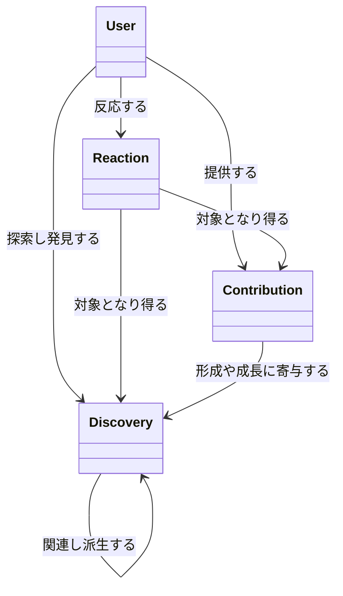
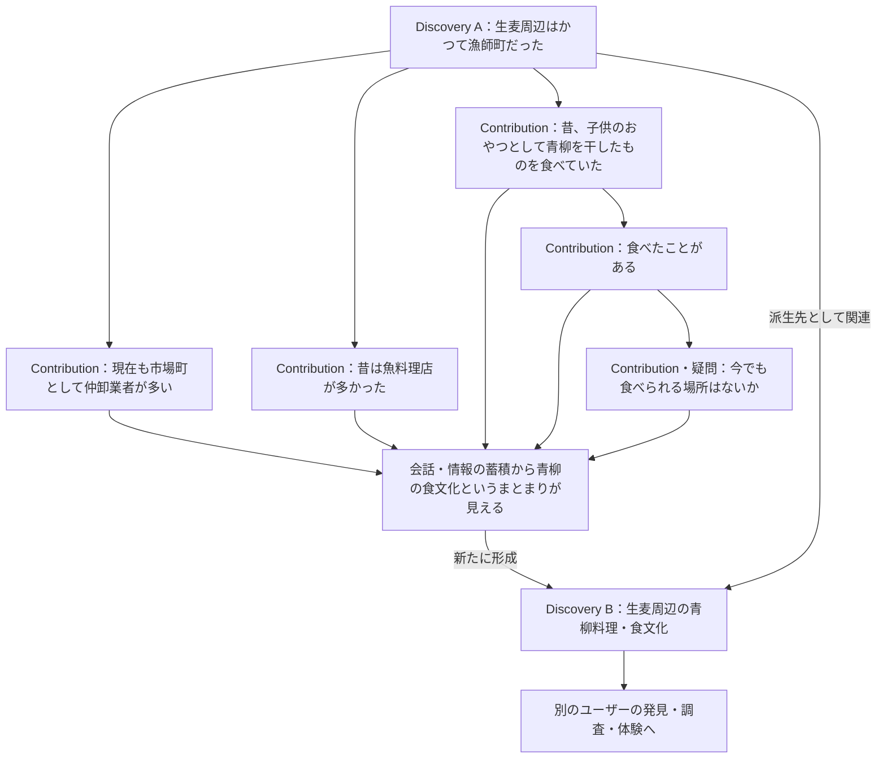
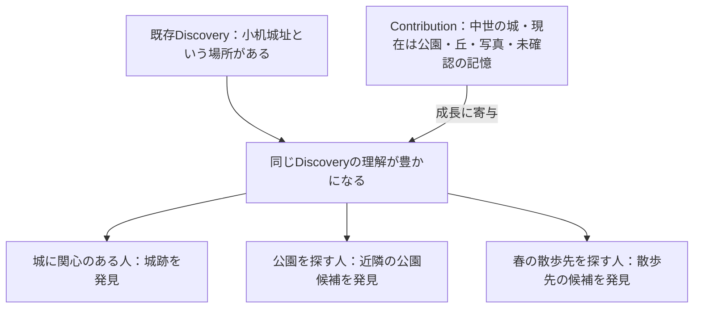

# ex-day ドメイン論理設計書 v0.3

- 作成日：2026-09-13（v0.3改訂：同日）
- 状態：中核概念を確定し、未決定の関係・運用を併記したFIX版。v0.3でContribution／Reactionの品質評価の境界を見直し、主観的な感想を含むこと自体ではなく、品質評価そのものを主目的とした投稿・反応を対象外とする方針でFIX。
- 用途：複数AIおよび設計者が、同じ概念・責務・境界を前提に後続設計を行うための共通インプット
## 1. 根拠と本書の位置付け

### 1.1 根拠資料

**[R] アップロード済み `ex-day_requirements.md`（本文タイトル：ex-day 要求仕様 v0.3）**を要求の一次資料とする。指定された `/mnt/data/ex-day_requirements.md` はこの実行環境には存在しないため、参照会話「設計作業の進め方確認」（会話ID：`6aa5f05f-d308-83e8-9759-a8bbe3a24ca7`）から取得した同名の添付原本を確認した。

**[U] 今回の作成依頼**を、現時点で確定している中核ドメイン、Discoveryの意味、生麦の派生例、Contextの区別に関する設計上の指示とする。

**[C] 参照会話「設計作業の進め方確認」**を、小机城址等の補助例と検討経緯の参照とする。会話内のAI提案は、それだけで確定事項としない。

作業フォルダの同名要求仕様にはScenario 07等の追記があるが、添付原本にはScenario 01〜06が収録されている。本書では「Scenario 07が添付原本の確定要求である」とは扱わない。生麦の具体的な形成・派生は、[R] 第6・7・13・14節を背景に、[U]で明示された内容として採用する。

### 1.2 確定度の読み方

- **確定（要求）**：[R]に明記された要求。ただし、将来目標・検討事項として書かれたものを実装確定へ変更しない。
- **確定（今回の設計方針）**：[U]で明示された概念と関係。
- **仮定義**：共通理解のために置く暫定的な言葉・境界。後続設計で変更し得る。
- **検討中**：要求・今回の指示だけでは結論が出ない事項。
  本書の確定事項はサービスの概念に関するものであり、すべてをMVPで実装するという意味ではない。DB物理設計、項目一覧、データ型、キー、API、画面配置、アルゴリズムは対象外とする。

## 2. ドメイン全体の考え方

ex-dayは、場所・時間・興味・状況から、ユーザーが存在を知らず検索しようとも思っていなかったものと出会い、興味や行動につながるサービスである。[R: 第1〜3・8・9節]

全体の価値の流れは **Context → Discovery → Action** である。これはサービス体験の概念モデルであり、同名の保存対象を三つ作るという指示ではない。

本書では **User / Discovery / Contribution / Reaction** を中核ドメインとする。[U]

Discoveryは発見・体験できる意味の単位、Contributionはその意味を形成・成長させる材料、Reactionはそれらに対するUserの反応である。発見後の調査や体験からContributionが戻り、既存Discoveryの成長や別Discoveryの形成へつながる。

要求仕様の「Discovery」はユーザーが発見する体験も表す。本書のドメイン名Discoveryは、その体験の対象となる意味のあるまとまりを指す。個々のユーザーの発見履歴を表す概念とは区別する。発見履歴を独立して扱うかは検討中である。

## 3. 中核ドメインの定義と責務

### 3.1 User

**定義：確定（今回の設計方針）**。発見し、情報・疑問・資料・証言を持ち寄り、反応する参加者。

**責務**：Discoveryを探索・閲覧し、Contributionを提供し、DiscoveryまたはContributionへReactionを行う。同じ人が質問、回答、資料提供、体験共有などへ参加できる。[R: 第10節]

質問者・回答者・投稿者を固定された別種のUserに分けない。関心地域やテーマ等は任意で表現でき、既知の興味がないことを探索不能の理由にしない。[R: 第9〜11節]

**検討中**：未登録閲覧者と登録Userの関係、個人以外の主体とUserの関係、代理投稿や編集権限。ログイン前にも価値を理解できることは要求だが、匿名投稿まで確定しているわけではない。[R: 第12・26節]

### 3.2 Discovery

**定義：確定（今回の設計方針）**。ユーザーが発見・体験できる「意味のある話題・事象」の単位。場所、歴史、食文化、疑問から見えてきた知識などを、発見対象として捉えられるまとまり。

**責務**：発見対象の意味を表し、Contributionによって内容を豊かにし、場所・時間・テーマ等との関係を通じて探索可能にする。また、別のDiscoveryへ関連・派生し、次の発見につながる。[R: 第6〜8・13・14節、U]

場所そのものや完成記事に限定しない。「小机城址という場所がある」という小さな発見から始まってよく、情報が不完全でも成立し得る。Contributionの集合や表示ページと完全に同義にはしない。画面上の要約や見せ方もDiscoveryの定義そのものではない。

同じ対象地域でも「漁師町だったこと」と「青柳料理・食文化」は異なる意味を持つDiscoveryとして扱える。一方、見る人の興味が違うだけで必ず別Discoveryを作るわけではない。

**検討中**：Discoveryの成立条件、重複・統合・分割の基準、作成・編集主体、公開や推薦の判断、ContributionがまだないDiscoveryの表現、形成後の要約方法。

### 3.3 Contribution

**定義：確定（今回の設計方針）**。Discoveryを形成・成長させる情報、疑問、資料、証言、体験等の貢献。

**責務**：完成した知識だけでなく、分からないこと、記憶、写真、伝聞、調査結果などを持ち寄れるようにし、既存の話題に情報を加える、疑問を深める、または新しい話題を形成する材料となる。[R: 第13〜16節、U]

疑問もContributionに含む。質問への回答だけでなく、情報追加、資料追加、一緒に調べることにつながる情報の提供を扱う。会話では複数のContributionが互いの内容を受けて展開する。

**仮定義**：知識・疑問・写真・資料・証言・体験はContributionの内容を説明する分類例であり、確定した排他的な種別や継承クラスではない。一つの投稿に写真と疑問が含まれる場合の単位は検討中である。

出所や不確実性を認識できることを重視する。伝聞や曖昧な記憶が集まったことをもって、確定した史実や現在の営業情報とみなさない。[R: 第24節]

**確定（今回の設計方針）**：品質評価そのものを主目的とした投稿（星評価、ランキング、店舗比較、優劣判定、口コミサイト的な評価機能）はContributionの対象としない。ただし、「美味しい／まずい」等の主観的な感想が内容に含まれること自体は妨げない。体験、記憶、資料、証言、疑問、関心等を対象とし、例えば「昔食べた青柳は美味しかった」のように、体験・証言・記憶の一部として主観的な感想が含まれる内容はContributionとして許容する。単純な同意・共感の表現とContributionの境界については3.4節を参照。[U]

**検討中**：返信関係の表現、Discovery未形成時のContributionの置き場所、一つのContributionを複数Discoveryに関連付ける方法、編集・訂正・出典の管理。外部情報をすべてUser投稿のContributionへ変換するかも未確定である。[R: 第18〜21節]

### 3.4 Reaction

**定義：確定（今回の設計方針）**。UserからDiscoveryまたはContributionへの反応。[U]

**責務**：対象へのユーザーの反応を表す。反応は、次の発見や地域側への価値につながり得るが、推薦への利用方法や集計方法は未確定である。[R: 第23節・Scenario 06]

**仮定義**：新しい説明内容を提供するContributionに対し、Reactionは対象への関心・感想等を簡潔に示す概念として区別する。具体的な反応種別は確定しない。

**確定（今回の設計方針）**：Reactionも品質評価そのものを主目的とした反応（星評価、ランキング、店舗比較、優劣判定、口コミサイト的な評価機能）を対象としない。主観的な感想が含まれること自体は妨げないが、関心・共感・次の行動意欲を示す反応を中心とし、単純な好悪の表明や品質ランキングを目的としない。[U]

**仮定義**：反応の方向性を示す例として「興味がある」「行ってみたい」等が挙げられるが、これらは方向性を示す仮の例であり、反応種別の確定した一覧やUI表現ではない。

「食べたことがある」は、本書の生麦例では体験証言を加えるContributionとして扱う。単純な同意・共感の反応と同じような表現を使う可能性はあるが、文言だけでReactionと判定しない。「今でも食べられる場所はないか」は疑問のContributionである。

**検討中**：反応種別、取消・変更・重複の扱い、保存や訪問をReactionに含めるか、自由文とContributionの境界。Reaction数による信頼性判定やDiscoveryの自動形成は確定しない。

## 4. 中核概念の関係

### 4.1 Mermaid classDiagram

次の図は概念間の関係を表す。属性・操作・物理的な保持方法を表さず、多重度も未確定のため指定しない。矢印は関係の読み方向であり、処理順序や所有関係ではない。

Reactionの二本の対象線は、DiscoveryとContributionの両方への同時反応を必須とするものではない。いずれも対象になり得ることを示す。一回の反応の対象単位は後続設計で明確にする。

UserとContributionの関係はユーザー参加を示す。外部データ由来の情報に、架空の投稿Userを必須とする意味ではない。

### 4.2 形成・成長の関係

**確定（今回の設計方針）**：Contributionは既存Discoveryを豊かにし得る。また、Contribution・疑問・会話の蓄積から新しいDiscoveryが形成され得る。[U]

「形成に寄与する」は材料と発見の意味的な関係であり、Contribution自体が消えてDiscoveryへ置換される、という意味ではない。形成後に材料をどう参照・表示・保持するかは検討中である。

### 4.3 Discovery同士の関係

**確定（今回の設計方針）**：Discovery同士は関連・派生し得る。[R: 第7節、U]

**仮定義**：「関連」は共通する場所・時間・テーマ等から別の発見へつながること。「派生」はあるDiscoveryを起点に蓄積した情報・会話等から、別の意味のまとまりが形成されること。

関連があるだけでは生成元・生成先の関係とは限らない。派生例ではAを起点にBが形成される方向を説明できるが、単一の親を必須とする木構造は確定しない。

**検討中**：関係の種類、方向・対称性、多重度、複数起点からの形成、関係を付与する主体。関連・派生を独立した中核ドメインとして追加するかは未決定である。

## 5. Contextと対象側の説明概念

### 5.1 ユーザー検索時のContext

**区別は確定（今回の設計方針）、名称SearchContextは仮定義**。

ユーザーが「今、何を発見したい／できるか」を考えるための場所・時間・興味・状況。ここでの検索には、明確な検索語のない探索も含む。

- 場所：現在地、訪問予定地、周辺、移動経路など。
- 時間：現在、予定日時、空き時間、帰宅期限、関心のある過去年代など。
- 興味：歴史や食等。未指定・本人も不明な状態を許容する。
- 状況：出張帰り、散歩先を探しているなどの利用文脈。
  通常は「今・ここ」から開始でき、条件を変更できることが要求である。[R: 第3・9節] 永続的なUserの関心と、一回の探索で使う条件を同一視しない。両者の組み合わせ方や優先度は検討中である。

### 5.2 Discovery／Contribution側のPlace・Time・Theme等

**区別は確定（今回の設計方針）、各概念の構造は仮定義・検討中**。

これらは「その話題や情報が何についてのものか」を説明し、探索や関連付けを可能にする概念である。

- **Place（仮定義）**：話題や資料が関わる場所・範囲。地点だけでなく地域、複数地点、経路等を想定する。[R: 第4節]
- **Time（仮定義）**：話題や資料が関わる時期・期間・季節・年代等。推定や不明も含める。[R: 第5・16節]
- **Theme（仮定義）**：歴史・産業・食・地域文化などの意味的なつながり。排他的なサービス区分として扱わない。[R: 第6節]
  人物・出来事・資料・活動等の関連も要求にあるが、この段階で独立した中核ドメインへ昇格させない。[R: 第7節]

例えば、小机城址の「中世」は対象側の歴史的なTimeであり、ユーザーの「今日、2時間空いている」という検索条件とは異なる。歴史的な時代と現在の訪問可能時間も別の意味であり、年代情報だけでは今日訪問できると判断できない。

写真そのものはContributionの材料、写真の撮影場所や推定年代はその材料を説明するPlace・Timeに相当する。投稿したユーザーの現在地を、その写真の撮影場所とみなしてはならない。

### 5.3 両者の接続と未決定事項

検索時のContextと、対象側の説明を照らし合わせ、Discoveryとの出会いにつなげる。ただし一致だけを必須とせず、未知の興味へ広がる余地を残す。[R: 第9節]

以下は**検討中**である。

- Place・Time・Themeを独立したドメインにするか、説明の構造として扱うか。
- 対象側をDiscoveryContextと総称するか。現段階ではContext一語へ統合しない。
- DiscoveryとContributionそれぞれへの関連付け方、および情報の集約・矛盾・推定の表現。
- 検索条件と対象側で共通利用できる概念の範囲、適合性の判断方法。
- 場所・年代不明の資料を探索へ接続する方法。すべての情報が揃うことを受け入れ条件にはしない。[R: 第16節]
## 6. 代表シナリオA：生麦の青柳料理・食文化への派生型

**位置付け**：[R] 第6節の「鶴見→漁師町→青柳→干して食べる文化→現在の体験」と、第13・14節の知識形成の循環を、[U]の具体例でドメインへ対応付ける。

以下の地域情報や証言は設計シナリオの入力例であり、本書が史実や現在の提供状況を確認したことを意味しない。

### ① ユーザー

生麦周辺の暮らしを知る人、食文化に関心を持つ人、食べた経験を持つ人、現在の体験を探す人。同じUserが情報提供者にも質問者にもなる。

### ② きっかけ

Discovery A **「生麦周辺はかつて漁師町だった」**を発見し、地域の暮らしや食に関する会話が始まる。

### ③ Context

ユーザー検索時は、生麦周辺、現在の探索、地域史や食への興味など。対象側は、生麦周辺というPlace、過去の暮らしから現在というTime、漁業・市場・食文化というTheme等で説明できる。これらは同一のContextではない。

### ④ Input

Aを起点として、次のContributionが蓄積する。

1. 「現在も市場町として仲卸業者が多い」――地域の現在に関する情報。
2. 「昔は魚料理店が多かった」――過去の暮らしに関する情報・記憶。
3. 「昔、子供のおやつとして青柳を干したものを食べていた」――食文化に関する証言・伝聞。
4. 「食べたことがある」――体験の証言（優劣の評価を伴わない）。
5. 「今でも食べられる場所はないか」――現在の体験につながる疑問。
### ⑤ ex-dayでの体験

Contributionが会話としてつながり、「青柳をどう食べていたか」「今も体験できるか」という独立して探索できる話題が見えてくる。

### ⑥ Discovery

Discovery B **「生麦周辺の青柳料理・食文化」**が新たに形成され、Aから派生したDiscoveryとして関連する。Aの漁師町・市場という意味を残しつつ、Bは青柳の食文化という別の発見の入口になる。

この例ではBの形成を扱うことが確定している。一方、誰がいつ形成を判断するか、元のContributionをBへ移動・複製・参照するか、自動提案を行うかは検討中である。

### ⑦ Action

食べ方や当時の暮らしを調べる、資料・証言を追加する、現在提供する場所を探す。場所が見つかり実際に体験できた場合は、その体験がさらにContributionとして戻る。

### ⑧ 派生する発見

Bは、ほかのユーザーが生麦周辺の食や歴史を探索するときの発見候補になる。「現在、青柳料理を体験できる場所」という別Discoveryへの展開も考えられるが、存在・提供状況の確認が前提であり、疑問があるだけで現在体験可能と断定しない。

この図のContribution間の矢印は会話の展開例であり、返信階層の仕様ではない。形成は情報の単純な件数増加や自動変換を意味しない。

## 7. 代表シナリオB：小机城址の成長型

**位置付け**：[R] 第1・5・7節の小机城の例と、[C]のユーザー提示例を、[U]の指定に従って成長型として整理する。個々の情報は検証済みの史実・現況として扱わない。

### ① ユーザー

城や中世に興味のあるAさん、近所の公園を探すBさん、春先の散歩先を探すCさん、および情報を持ち寄る人。

### ② きっかけ

「小机城址という場所がある」というDiscoveryの種に出会う。

### ③ Context

Aさんは歴史・城への興味、Bさんは近隣で過ごす場所、Cさんは春の散歩という検索時のContextを持つ。対象側の地域・年代・地形・現在の用途等とは区別する。

### ④ Input

「中世の城だった」「現在は公園」「丘の上にある」「横浜線のトンネルと関係があるかもしれない」といった情報・疑問、過去や現在の写真等がContributionとして加わる。曖昧な記憶はその不確かさを残す。

### ⑤ ex-dayでの体験

Contributionによって既存Discoveryの歴史、現在の姿、地形等の理解が豊かになる。

### ⑥ Discovery

同じDiscoveryが、Aさんには城跡の発見、Bさんには公園の候補、Cさんには散歩先の候補として意味を持つ。この補助例では、関心の違いだけを理由に三つのDiscoveryへ分割しない。

### ⑦ Action

調べる、写真や資料を追加する、現地を訪れるなどにつながる。現在の利用可否や散歩への適性は、それを裏付ける情報に基づいて判断する。

### ⑧ 派生する発見

周辺の城郭や「都市に残る城跡」等へ関心が広がり得る。[R: 第7節] ただし、この例の中心は新規Discoveryの形成ではなく、既存Discoveryの成長である。

## 8. 後続設計で維持する確定事項

1. 中核はUser / Discovery / Contribution / Reactionであり、追加概念は確定度を示す。[U]
2. Discoveryを場所や完成記事だけに限定しない。発見・体験できる意味のある話題・事象を単位とする。[U]
3. Contributionには疑問、資料、伝聞、体験等を含め、既存Discoveryの成長と新規Discoveryの形成を説明できるようにする。[R: 第13〜16節、U]
4. Reactionの対象はDiscoveryまたはContributionである。[U]
5. Discovery同士の関連・派生を扱い、記事やスポットの孤立で終わらせない。[R: 第7節、U]
6. 検索時のContextと、対象側のPlace・Time・Theme等を区別する。[U]
7. 不明・推定・異説・調査中等を確定情報と混同しない。[R: 第16・24節]
8. 固定された質問者・回答者ロールや、既知の興味を必須とする前提を置かない。[R: 第9・10節]
9. 投稿可能であることと積極的な推薦対象であることを同一視しない。[R: 第25節]
10. 品質評価そのものを主目的とした投稿・反応（星評価、ランキング、店舗比較、優劣判定、口コミサイト的な評価機能）は、Contribution・Reactionいずれの対象ともしない。主観的な感想が含まれること自体は妨げず、Contributionでは体験・証言・記憶の一部として許容する。Reactionは関心・共感・行動意欲等を中心とし、単純な好悪や品質ランキングを目的としない。[U]
## 9. 優先して検討する事項

### 9.1 意味の単位と形成の判断

何をもってDiscoveryが成立するか。既存Discoveryの成長と、新規Discoveryへの派生をどのように見分けるか。判断・提案・確定をUser、運営、AI等の誰が担うか。自動生成や承認工程は現時点では確定しない。

### 9.2 Contributionと会話の構造

Discoveryがまだない疑問や資料をどこから受け入れるか。一つのContributionの単位をどう区切るか。返信・引用・根拠の関係をどう扱うか。形成前後の材料とDiscoveryのつながりをどう保つか。

### 9.3 関連と文脈

Discovery間の関係をどの範囲まで分類するか。Place・Time・Theme等をどのようにモデル化するか。対象側の不明情報や相反する説明を、検索条件と照合するときにどう扱うか。

### 9.4 Reactionと情報の信頼性

反応種別とContributionの境界をどう決めるか。出所・推定・異説の認識をどう実現するか。人気や反応を事実の正しさと混同しないための具体的な表現は検討中である。

### 9.5 中核外の概念とMVP範囲

Actionは現地訪問・食事に加えて調査や疑問投稿等も含むサービス上の概念であるが、独立した中核ドメインとするかは未決定。[R: 第2節]

団体・事業者、イベント、外部情報源、公式情報提供者等は要求上の関係者・対象であるが、中核四概念への対応は検討中である。Community、Question、Discussion、Experience等を独立したドメインとして追加することも確定していない。

本書だけで自動推薦、通知、外部情報収集、事業者管理等をMVP実装へ追加しない。要求仕様の将来目標と今回の中核整理を踏まえ、別途スコープを決定する。

## 10. 複数AIへの引き継ぎと整合性確認

本書と要求仕様を共通インプットとし、後続の提案では「確定事項に基づく設計」と「新たな提案」を明示して分ける。仮定義や検討中事項を、無断で確定済みの項目・機能・制約に変換しない。

後続成果物は次を説明できること。

- 生麦のAにContributionが蓄積し、別の意味を持つBが形成・派生する流れ。
- 小机城址の同じDiscoveryが成長し、異なるContextの人へ異なる発見の意味を持つ流れ。
- 疑問や体験証言をContributionとして扱い、Reactionとの違いを説明できること。
- 検索する人の場所・時間と、資料や話題が示す場所・時代を混同しないこと。
- 未確認の伝聞や「今食べられるか」という疑問を、史実や提供中の体験へ自動的に読み替えないこと。
- 図の関連線から、未決定の所有関係、多重度、削除連鎖、返信構造、AIによる自動形成を推測して確定しないこと。
- 品質評価そのものを主目的とした投稿・反応や機能（星評価、ランキング、店舗比較、優劣判定、口コミサイト的な評価機能）を、Contribution・Reactionいずれの提案にも含めないこと。ただし、「昔食べた青柳は美味しかった」等、体験・証言・記憶の一部として主観的な感想を含むContributionを排除しないこと。Reactionは関心・共感・行動意欲等を中心とし、単純な好悪や品質ランキングを目的としないこと。
  設計上の判断が必要になった場合は、対象となる検討事項と根拠を併記して提案し、本書の確定事項との差分を追えるようにする。