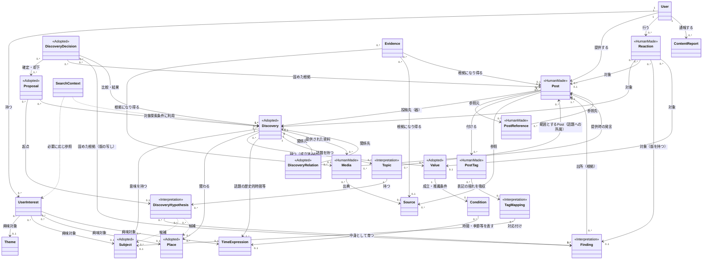

# ex-day 論理エンティティ設計書 v0.1

- 作成日：2026-09-15
- 最終追補日：2026-09-25
- 状態：現時点の論理ドメイン設計をEntity・関連・Value Objectへ写像した初版（現在性・Season・Freshness、Discovery Value・Condition、Postから複数DiscoveryへのValue提供関係、Postの独立性とDiscovery成立判断、DEC-0006によるDiscoveryの成立状態・公開状態と周辺状態の責務分離、DEC-0005による発言としての位置付けと構造化情報・資料のDiscoveryへの帰属、DEC-0008によるContributionからPostへの改称、DEC-0007・DEC-0009による会話の理解の3つの層・話題・発見の仮説・わかってきたこと・提案・タグ・Post間の参照の追補反映）
- 対象：論理属性、責務、関係、多重度、代表シナリオによる整合性確認
- 対象外：物理DB、UUID、FK、index、PostGIS、pgvector、API、画面、具体的な推定アルゴリズム

## 1. 目的と根拠

本書は、`ex-day_domain_model_v0.5.md`（追補を含む）を論理Entity設計へ落とし込み、後続の画面・API・物理設計が同じ概念境界から始められるようにする。

根拠の優先順位は次のとおりとする。

1. プロジェクト内の会話で合意され、今回の依頼で明示された設計内容
2. `ex-day_domain_model_v0.5.md`
3. `ex-day_requirements.md` および参照資料 `sources/ex-day_requirements_v0.3(2).md`
4. `ex-day_mvp_scope.md` および参照資料 `sources/ex-day_mvp_scope_v0.1(1).md`

今回の追補は[DEC-0004](decisions/DEC-0004-contribution-as-first-class-content.md)と2026-09-22の改訂依頼に基づく。Post単独での成立・保持はDEC-0004、Discoveryの成立原則および自動判定を基本に必要時に人が判断する方針は今回の設計判断を根拠とする。後者により、従来のMVPで人間を必須判断者とする記述を更新する。Discoveryを成立前から会話の器とすること、成立状態（`UNESTABLISHED`／`ESTABLISHED`）と公開状態、確認・安全性・知識状態・推薦等の責務分担は[DEC-0006](decisions/DEC-0006-discovery-state-responsibilities.md)を根拠とする。Postを発言として扱い固定的な型を定めないこと、場所・時期・分類・Valueといった構造化されうる情報と写真・資料の提供をDiscoveryに帰属させること、発言からの語句・手がかりの抽出を投稿後に複数の発言にまたがって行うことは[DEC-0005](decisions/DEC-0005-contribution-thread-and-comment.md)を根拠とする。

[DEC-0008](decisions/DEC-0008-rename-contribution-to-post.md)により、ドメイン上のContributionをPost（日本語の説明では「発言」）へ改称した。DEC-0001〜DEC-0007の本文中の「Contribution」は書き換えず、Postと読み替える。Contributionを含んでいたEntity・関連名は、DEC-0009に基づき、旧Contribution Subject（PostとSubjectの直接の関係）を削除し、旧ContributionDiscoveryをPostの投稿先（器としての所属）と参照（話題への所属、わかってきたことの出所）に整理し直し、旧ContributionOriginをPost間の参照（PostReference）に統合した（4.3・6.2節）。

[DEC-0007](decisions/DEC-0007-discovery-growth-and-derivation-by-context.md)により、補完・派生をPost単体ではなく会話の話題（DEC-0007の「文脈のまとまり」。DEC-0009で「話題」と呼び替えた）を単位として判断し、Post間の参照を話題の推定の優先的な入力とし、Subjectの対象と観点を区別し、PlaceのSpatial Type（`Point`／`Area`／`Route`）を扱う。[DEC-0009](decisions/DEC-0009-conversation-understanding-and-tags.md)により、会話に関わる概念を「人間が作ったもの」「ex-dayが会話から理解しているもの（見立て）」「ex-dayとして採用した構造」の3つの層に分け、話題（Topic）・発見の仮説（DiscoveryHypothesis）・わかってきたこと（Finding）・提案（Proposal）・表示するタグ（PostTag）・内部で持つタグ（TagMapping）を追加し、Reactionの対象を広げる。本書のEntity名はDEC-0009 Decision 11の仮称と、本書で提案した名前であり、最終的な名前は[Issue #65](https://github.com/ex-day/platform/issues/65)のPRで人間が確認する。ドメイン上の定義は[ドメイン設計](ex-day_domain_model.md)2.1・3.5節を正とする。

「確定」は論理モデル上の採用を意味し、MVPでの実装確定を意味しない。「要検討」は、今回の設計で勝手に確定しない境界・属性・運用である。

## 2. 設計原則

1. 中核は User / Discovery / Post / Reaction とする。
2. Discoveryは発見・参加できる意味のある話題、Postは会話の中の発言であり、単独でも成立し価値を持つコンテンツとして、Discoveryを形成・成長させる材料にもなり得る。Reactionは簡潔な反応である。
3. Themeはユーザーが扱いやすい粗い興味の入口、Subjectは対象を横断して共通利用する統制された意味概念とする。
4. Subjectは内部タグに閉じず、Discoveryの意味、関連する別Discovery、UserInterestとその推定理由をユーザーへ説明するためにも使う。
5. UserInterestは自己申告とシステム推定を区別し、本人の明示意思を優先する。明示的な興味なしは再推定を抑止できる。
6. 個々の行動履歴を長期保存することを前提とせず、継続利用する推定結果をUserInterestとして保持する。
7. SearchContextは一回の探索のValue Object／一時モデルであり、永続Entityではない。
8. 情報の出所、根拠、意味の確信度、事実の信頼度、人気を混同しない。
9. Subjectが増えただけでDiscoveryを分割しない。Discoveryの成立は、場所とValue（必要に応じて時間・季節等の条件）を認識でき、独立した体験・発見価値として第三者へ提示できるかを判断する。自動判定を基本とし、必要時に運営による判断を組み合わせる。
10. 不明、推定、異説、反証、保留を表現できる余地を残す。
11. 時間経過によって現在性（Freshness）が変化する情報は、Postの属性としてではなく、発言から抽出された手がかりとしてDiscovery側（現在状態の導出材料、ValueのCondition等）で扱う（DEC-0005 決定8）。Postは投稿・公開時点と原文を保持し、現在性が低下しても削除せず、過去の記録として保持する。
12. 開始または告知開始を伝えるPostがDiscoveryに属する場合は、公開後速やかにその発言から抽出した手がかりをDiscoveryの現在状態へ反映できるようにする。一方、終了期限・数量・残量等は投稿時点の申告であり、実際の状況と異なる可能性を明示する。
13. Reactionは関心だけでなく、「今日行ってきた」「買えた」等、PostやDiscoveryの現在性を補強するシグナルとして利用できる。ただし、Reactionだけで事実や営業・在庫状況を保証しない。
14. Seasonは例年の旬・反復時期等から該当Valueを通じてDiscoveryを「今見る価値がありそうな対象」として浮上させるトリガーであり、今年・今日の実状を示すリアルタイム情報そのものではない。
15. Discoveryの現在状態は固定属性として断定的に保持するのではなく、該当ValueのSeason等の反復時間と、直近のPost・Reactionから動的に形成する。
16. Discoveryは複数のValueを持ち、Time／Season等は原則として各Valueが成立・推薦されるConditionとして扱う。Conditionを持たない軸はその軸に依存しない。

17. Postの投稿成立はDiscoveryの成立・更新・既存Discoveryへの関連付けから独立する。ユーザーが関連先を指定しなくても正常に投稿・保持でき、その場合はシステムが成立前のDiscoveryを器として用意する。投稿後に既存Discoveryとの関係を追加できる。
18. Postが単独で価値を持つことと、Discoveryに属するValueであることを区別する。
19. Discoveryは成立前から会話の器として存在できる。Discovery自身が永続状態として持つのは成立状態（`UNESTABLISHED`／`ESTABLISHED`）と公開状態に限り、確認・安全性・知識状態・Value候補・推薦・活発度・新しさを単一のDiscovery Statusへ集約しない（DEC-0006）。
20. Postは発言としての参加であり、「疑問／知識」等の固定的な型や内容分類の属性を持たない。場所・時期・分類・Valueといった構造化されうる情報と、写真・資料（Media）の提供はDiscovery（成立前を含む）に帰属させる。資料の出典・提供者は資料自体に保持し、どのPostとともに提供されたかを辿れるようにする（DEC-0005）。
21. 各Entityを「人間が作ったもの」「ex-dayが会話から理解しているもの（見立て）」「ex-dayとして採用した構造」のいずれかの層に置く（3節の表）。見立ての層のEntityは更新・分割・統合・失効してよく、組み直しの記録は要らない。人間が作ったものをAIの解釈で書き換えない（DEC-0009）。
22. 判断（提案の確定・却下、派生等）の時点で、根拠となったPostと、それを支えたわかってきたこと（その版の内容）を判断記録の側に写し取って固める。見立ての層のIDを参照するだけにはしない（DEC-0009）。
23. Postが属する器（投稿先Discovery）は1つとする。他のDiscoveryとは参照（話題への所属、わかってきたことの出所、判断記録に固めた根拠）でつながり、Postを複製・移動しない（DEC-0009）。
24. PostにSubjectを直接持たせない。Subjectの候補は発見の仮説が持ち、採用されたらDiscoveryのSubjectになる。Postとわかってきたことの関係は「寄与」ではなく「出所（根拠）」とする（DEC-0009）。
25. Reactionの数、タグの数、言及の多さを事実の正しさに置き換えない。Reaction・タグ・Post間の参照は判断ではなく、重み付けされた入力とする（DEC-0007・DEC-0009）。

## 3. 全体関係図

注記は、DEC-0009 Decision 1の3つの層を表す。`<<HumanMade>>`は人間が作ったもの、`<<Interpretation>>`はex-dayが会話から理解しているもの（見立て）、`<<Adopted>>`はex-dayとして採用した構造である（Mermaidの注記に日本語を使えないため英語で表記する）。層の注記がないEntity（User、UserInterest、Theme、Condition、TimeExpression、Source、Evidence、ContentReport、SearchContext）の層の位置付けはDEC-0009の対象外であり、本書では定めない。

| 層 | Entity | 性質 |
|---|---|---|
| 人間が作ったもの | Post、PostReference、PostTag、Reaction、Media | AIの解釈で書き換えない |
| ex-dayが会話から理解しているもの（見立て） | Topic、DiscoveryHypothesis、Finding、TagMapping | 新しいPostや再解析で更新・分割・統合・失効してよい |
| ex-dayとして採用した構造 | Discovery、Subject、Place、Value、DiscoveryRelation、DiscoveryDecision、Proposal | 「確定」は真実の保証ではなく、ドメインモデルとしての採用 |

点線（`..>`）は、発見の仮説が候補として持つだけで、採用した構造としての関係ではないことを表す。

図中で複数の `0..1` を持つ対象は「いずれか一種類を参照する」という論理制約を表す。ただし、Mediaの「提供時の発言」と「出典」は独立した関係であり、両方を持ち得る。汎用参照、継承、種別別関連のどれで実装するかは要検討である。

DiscoveryとValueの`0..*`は成立前（`UNESTABLISHED`）のDiscoveryを含むためであり、成立済み（`ESTABLISHED`）のDiscoveryはValueを1件以上持つ（4.2節）。PostからDiscoveryへの投稿先は`1`であり、関連先を指定しない投稿ではシステムが用意した成立前Discoveryが投稿先となる（6.2節）。Post・Discovery・Valueの対応は、Findingの出所とDiscoveryDecisionに固めた根拠から辿る（6.2節）。

DEC-0005により、Postから場所（Place）・時間（TimeExpression）・資料（Media）への直接の関係は持たない。場所・時期はDiscoveryのPlace・TimeExpression、ValueのConditionとして扱い、発言から抽出された語句・手がかりはその形成材料となる（4.2・4.3節）。資料はDiscoveryへ提供されるMediaとして扱い、提供時のPostを任意で辿れるようにする（8.1節）。統合等により資料を別のDiscoveryから参照する方法は、Issue #37・#46と連携して定める。

## 4. 中核Entity

### 4.1 User

**種別**：永続Entity（確定）

**責務**：発見し、Postを提供し、Reactionを行い、自身のUserInterestを確認・訂正する主体を表す。質問者、回答者、投稿者等の固定ロールは持たせない。

**主要論理属性**：識別子（内部の連番。画面・URLに出さない）、状態（有効／退会）、作成・更新時点。ログイン方法ごとの識別子はUserIdentity、ニックネーム・興味はUserProfileに分けて持つ（下記。[Issue #76](https://github.com/ex-day/platform/issues/76)「判断：ユーザーのEntityの名前と、判断待ち1〜3への回答」）。

- ユーザー名（重複不可の識別用の名前）は持たない。公開用のIDはMVPでは持たず、他人のプロフィールページ等が必要になった時点で、推測できないランダムなIDを連番とは別に足す（Issue #74）。
- Postの表示名は、表示のたびにUserの今のニックネーム（UserProfile）を引いて求め、Postに投稿時の名前を保存しない（Issue #74）。
- 認証プロバイダから受け取る名前・顔写真は属性として持たない（Issue #75）。
- 住んでいる地域・生活圏（旧「よく知っている地域」）、年代、性別、プロフィール説明は持たない（Issue #76。使い道のない情報は持たない）。

**User・UserIdentity・UserProfile**（Issue #76で決定）：

Userは「発見し、Postを提供し、Reactionを行う主体」の根っことして残し、Post・Reaction・UserInterest・ContentReport等との関係はこれまでどおりUserに対して持つ（付け替えない）。ログイン方法のつながりとプロフィールを、別のEntityとして分ける。

| Entity | 持つもの | 多重度 | 画面との対応 |
|---|---|---|---|
| User | 識別子（内部の連番。画面・URLに出さない）、状態（有効／退会）、作成・更新時点 | ― | S08（ユーザー情報更新）の「アカウント」セクションの退会 |
| UserIdentity | 認証プロバイダ（Google・Apple等）の種類と、プロバイダ上の利用者の識別子、つないだ時点。プロバイダの名前・顔写真は保持しない。詳細はIssue #75 | User 1 : UserIdentity 1..* | S08の「アカウント」セクションのログイン方法 |
| UserProfile | ニックネーム（必須・重複可）、興味のある地域、興味。興味のある地域・興味は、既存のUserInterest（由来：自己申告）として保持し、UserProfileの項目として扱う（下記）。ニックネーム以外は他の人に表示しない | User 1 : UserProfile 1 | S08の「プロフィール」セクション |
| ニックネームの変更履歴（監査） | 変更前後のニックネームと変更日時。本人・他の利用者には見せず、運営だけが閲覧できる（Issue #74・#35） | User 1 : 0..*（User単位で保持） | 画面なし（運営のみ） |

- 興味のある地域は、UserInterest（興味対象がPlace、由来が自己申告）として持ち、他の人には表示しない。興味のある〇〇（旧「興味のあるジャンル」）もUserInterestとして持ち、興味対象の単位はIssue #73で決める。自己申告のUserInterestとシステム推定のUserInterestを同じEntityで区別する既存の設計（5.4節）を保つため、UserProfileに別の列として重複して持たない。
- 地域の問いを届ける先は、興味のある地域（UserInterest）と、行動からの推定を材料にする。推定の結果を永続化する場合はUserInterest（由来：システム推定）として持ち、他の人には表示しない（5.4・5.5節）。
- 「Account」という名前は使わない。多くの認証ライブラリが「Account」を「ログイン方法ごとのつながり」の意味で使っており（Auth.jsのAccount、Auth0のidentities）、Issue #75で認証サービスを入れたときに同じ言葉が別の意味で現れて混乱するため。画面の見出し「プロフィール」「アカウント」とドメインの名前は分けてよい（DEC-0008 決定3と同じ考え方）。
- ニックネームの変更履歴のEntity名は未定とする。

**主な関係**：User 1 : UserInterest 0..*、Post 0..*、Reaction 0..*、ContentReport 0..*。

**要検討**：未登録閲覧者、個人以外の活動主体、代理投稿、編集・運営権限、退会時の表示と出所保持（退会時の投稿済みPostの扱いはIssue #76の判断待ち）、ニックネームの変更履歴の保持期間とEntity名。

### 4.2 Discovery

**種別**：永続Entity（確定）

**責務**：ユーザーが発見・参加できる意味のある話題・事象を表す。成立前から、Postを蓄積する会話の器として存在できる（Thread等の別Entityは設けない）。会話やPostから場所とValue（必要に応じて時間・季節等の条件）を認識でき、独立した体験・発見価値として第三者へ提示できると判断された時に成立状態が`ESTABLISHED`へ遷移する。成立は事実の確定を意味せず、答えが未確定で情報が不足していても疑問起点のValueにより成立できる。成立後もPostにより成長し、別Discoveryへ派生・関連し得る。[DEC-0006]

場所・時期・分類・Valueといった構造化されうる情報と、写真・資料（Media）の提供はDiscoveryに帰属する。発言から抽出された語句・手がかりは複数の発言にまたがって蓄積され、その組み合わせによってDiscoveryのPlace・TimeExpression・Subject・Value（Condition）を形成していく。矛盾する語句や複数の解釈は候補として共存してよく、単一の発言の解析結果をそのまま確定情報にしない。抽出された語句・候補の構造と、いつ・誰が（あるいはどの基準で）確定した情報として扱うかは要検討とする（11節）。[DEC-0005 決定8・9]

**主要論理属性**：識別子、ユーザー向け表題、現在の要約、成立状態（`UNESTABLISHED`／`ESTABLISHED`）、公開状態（少なくとも`PUBLIC`／`HIDDEN`を区別）、成立時点、作成・更新時点。成立前のDiscoveryで表題・要約をどう扱うかは画面・要約設計で定める。知識の状況（答えが出ていない・調査が続いている・情報不足・複数説がある等）、推薦、活発度・新しさは属性として固定せず、Post・Value・Evidence・Reaction等から解析・要約・算出する情報とする。表示上の「開催予定／開催中らしい／今シーズンの情報あり」等の現在状態も導出情報であり、固定的な事実属性とは区別する。[DEC-0006]

**主な関係**：Value 0..*（成立済みは1..*）、投稿先とするPost 0..*（Postの器）、話題（Topic）0..*、Subject・Place・TimeExpressionと多対多、提供された資料Media 0..*、DiscoveryRelationを介してDiscoveryと多対多、Proposalの対象 0..*、Reaction 0..*、DiscoveryDecision 0..*。他のDiscoveryに投稿されたPostは、話題への所属やFindingの出所として参照する（6.2節）。運営が登録するDiscovery（Issue #57）には、運営が付けたタグを直接持たせてよい（6A.4節）。DiscoveryとTimeExpressionの直接の関係は、話題の歴史的時間等を説明するものであり、Valueの成立・推薦条件とは区別する。

**論理制約**：Subjectの追加、見る人の興味の違い、複数地域でのSubject共有だけでは分割・派生させない。成立と事実確定、公開、推薦を分ける。成立状態の遷移は`UNESTABLISHED`から`ESTABLISHED`への方向とし、新しい議論の発生を理由に`UNESTABLISHED`へ戻さない。成立の取消・統合・再審等で状態を変更する場合は判断記録を伴う操作とし、その表し方はIssue #37・#46で定める。成立済みDiscoveryはValueを1件以上持つ。公開状態は成立状態から独立し、両方の成立状態に適用する。成立前Discoveryの暫定公開（Issue #36の案D）は`UNESTABLISHED`かつ`PUBLIC`で表し、専用の状態を設けない。施設の閉園・閉店、季節外等は公開状態で表さない。Time／Seasonは原則としてDiscovery全体の一律の推薦条件ではなく、各Valueの成立・推薦条件である。Discoveryの現在状態は、直近のPostとReaction、対象期間、該当ValueのSeason等から形成し、古い現在性情報が失効してもDiscovery自体は存続する。Season一致だけを「今年も開始した」「現在開催中」等の実状として表示しない。

**成立判断の原則**：投稿者は新しい話題であることを示せるが、その指定だけで成立を保証しない。成立はシステムの自動判定または運営が判断し、ユーザーに判断の責任を負わせない。既存Discoveryとの類似性、必要な情報の充足度等を判断材料とし、既存への統合、成立（`ESTABLISHED`への遷移）、派生としての成立、現時点では成立させない（`UNESTABLISHED`のまま保持）等を判断する。既存候補が0件という理由だけでは成立させず、既存との関連があっても独立した価値があれば成立し得る。派生Discoveryも同じDiscovery Entityであり、派生元と関連付けた別のDiscoveryとして成立前の段階から扱い、形成経緯をDiscoveryRelation等で表す（派生の判定条件はIssue #46）。これは将来の投稿ガイドライン・利用規約にも関係し得るサービス上の原則である。具体的な成立・類似判定基準や情報充足度の評価は後続設計とし、Postへの不明な場所・時間等の入力要求へ転用しない。

**状態の利用**：表示とValueのCondition評価では、成立状態・公開状態と、次の導出・算出結果を組み合わせて参照する。これらを単一のDiscovery Statusへ集約せず、ドメイン状態と画面上のカテゴリ・表示文言を一対一に対応させない。[DEC-0006]

- 確認：Discovery共通の確認状態は持たず、Value・Evidence・DiscoveryRelation・Media等の判断対象側で管理する。要レビューは未解決の判断対象の存在から導出する。
- 安全性：Post・Media等の側で管理し（Issue #35）、Discovery全体を表示すべきでない判断は公開状態へ反映する。
- 知識の状況：Post・Value・Evidence等からの解析・要約。永続化する場合も成立状態と分離する。
- Value候補・解析処理の実行状態：Discoveryとは別の解析結果・候補、解析の実行記録として扱い、Discoveryの状態に含めない。
- 推薦：ValueとCondition、Context等から都度算出する結果（4.2.3節）。成立前Discoveryの露出は推薦と区別する。
- 活発度・新しさ・現在性：Post・Reaction・投稿日時、該当ValueのSeason等から算出・導出する。

**要検討**：公開状態の具体的な状態名・追加状態・遷移と運用フロー、成立の取消・統合・再審時の状態の表し方（Issue #37・#46）、要約履歴、作成・編集権限、統合・分割後の扱い、形成の起点となったPostが非公開・削除・関連取消となった場合の扱い、現在状態の導出・保存・再計算方法、表示文言と更新頻度、現在性が不足する場合の表現。

#### 4.2.1 Value

**種別**：Discoveryに属する論理Entity（概念と多重度は確定、永続形は要検討）。本書の「Value Object」とは異なり、Discoveryごとの発見価値・魅力を指す。

**責務**：同じDiscoveryにおいて再利用可能な個々の魅力・体験価値として成立した情報を表し、その価値に固有のConditionを持てるようにする。関連するPostを根拠として成立・更新され得る。疑問起点でも場所・Subject・内容等から、気付きや一緒に考える価値を定義し、未確定の答えを事実として扱わない。各ValueのSubjectは「何についての価値か」を意味付けする。

**主要論理属性候補**：価値の説明、確認・根拠に関する判断の状態、作成・更新時点。Valueの確認・根拠はValue・Evidence等の責務としてValue側で管理する。推薦は状態として持たず、Condition・Context等から算出する（4.2.3節、DEC-0006）。確認の状態の具体的な種類は後続設計で定める。

**主な関係**：一つのDiscoveryにValue 0..*（成立済みのDiscoveryは1..*）。会話の途中で検出されるValue候補はValueとして保持せず、Discoveryとは別の解析結果・候補として扱う（構造はDEC-0006の対象外）。各ValueはCondition 0..*を持つ。Valueは、種類が価値のFindingがProposalとDiscoveryDecisionを経て採用されたものであり、採用時の根拠のPostはDiscoveryDecisionに固める。一つのValueに複数Postが根拠として関係し、一つのPostが複数DiscoveryのValueの根拠になり得る（6.2節）。Reaction 0..*の対象となる（「わかる」「行ってみたい」等。4.4節）。

**論理制約**：ValueはPostそのものではなく、Post登録時に新しいValueが必ず成立するわけではない。Value候補（採用前の価値のFinding）はValueとして保持しない。異なるValueがあるだけでDiscoveryを分割しない。ConditionなしのValueも検索・推薦候補となり得る。Valueに付くSeasonは例年の旬等を表し、今年・今日の実状を保証しない。

**要検討**：ValueとSubjectの対応の保持方法およびDiscovery Subjectとの導出・更新関係、Valueの識別・編集単位、表示用要約との関係、永続化の形。Valueの信頼性の評価方法と具体的な属性・算出方式は確定しない。

#### 4.2.2 Condition

**種別**：Valueに属する論理的な条件（概念と多重度は確定、物理表現は要検討）。

**責務**：Valueの成立条件を表す。場所・時間・季節・Subject・Discovery状態等が条件になり得る。既存の推薦適合度・順位への利用も維持するが、成立条件と推薦順位上の条件の詳細な区分は未確定とする。

**主要論理属性候補**：条件の軸、条件の内容、適用期間、例外、説明。Time／Seasonの表現には必要に応じてTimeExpressionを利用する。

**主な関係**：一つのValueにCondition 0..*。

**論理制約**：ある軸のConditionがないことは、そのValueがその軸に依存しないことを意味し、検索対象から除外しない。Discovery Subjectの「中世」のような話題の意味属性と、現在の訪問・推薦条件を混同しない。

「通年」はValueの種別ではなく、時間的な成立条件が常時成立することを表す。他の条件の成立や今年・今日の実状まで保証しない。条件なし・不明・通年を意味上区別し、物理表現は確定しない。

**要検討**：条件軸の範囲、同一軸に複数条件がある場合の解釈、条件間の組み合わせ、適用期間・例外・不明の表現。条件なしの物理表現はNULL、Conditionレコードを持たない方式、ANY／ALL等の明示値を候補とし、実装設計で確定する。

#### 4.2.3 Recommendation

**種別**：非永続の評価結果（一時モデル）。Domain 5.1節の既存定義を論理Entity設計にも明記する。

**責務**：Valueの成立条件と現在のDiscovery Contextを、必要なDiscovery状態（成立状態・公開状態と現在性等の導出情報）も参照して評価した結果を表す。成立済みDiscoveryの、現在成立するValueを対象とし、対象Valueとおすすめ理由を辿れるようにする。Value自体やDiscoveryの状態と同一視せず、永続Entityにしない。Discoveryに固定的な推薦可否の状態は設けず、推薦の強さは算出される重みとして扱う（DEC-0006）。成立前Discoveryの露出はRecommendationと区別する。

**論理制約**：成立条件の評価と適合度・順位付けを区別する。条件のない軸だけを理由に候補から除外しない。現在成立しないValueも保持する。情報不足による評価不能を成立・不成立と推測しない。Season一致だけで営業・在庫等を保証しない。

**要検討**：結果の具体的な属性・多重度、Context未指定時の基準、評価不能の表現、再評価の契機、順位付けと推薦の重みの構成、Discoveryの公開状態との優先関係（`HIDDEN`のDiscoveryを対象から除く等の具体的な適用）。ValueのCondition評価とDiscoveryの現在状態の導出が相互参照する場合の評価順序も未確定とする。

### 4.3 Post

**種別**：永続Entity（確定）

**責務**：ユーザーが会話の中で行う発言（Post）を、原文性と出所を保って表す。新しい話題を始める発言も返信も、同じPostとして対等に扱う（DEC-0008）。問い・情報・体験・記憶・証言等を持ち寄る単位であり、単独でも成立し価値を持つ。既存Discoveryの補完・更新や新しいDiscoveryの成立、Valueの形成・成長の材料・根拠となり得る。「疑問／知識」等の固定的・排他的な型を持たせず、同じ発言が問いと情報を含むことや、やり取りの中で役割や関連先が変わることを妨げない。従来の論理名「知識・疑問」は廃止する（DEC-0008）。[DEC-0005 決定1・8]

**主要論理属性**：識別子、提供User、投稿先Discovery（器）、本文（原文）、公開状態、投稿・公開時点、更新時点、推定・不確実性に関する表示情報。

DEC-0005 決定8により、次の属性はPostに持たせず、Discovery側で扱う。

- **内容分類候補**：廃止する。発言を「疑問／知識」等の型に分類しない。PostにSubjectを直接持たせない（DEC-0009 決定5）。何について話しているかは話題（Topic）と発見の仮説（6A節）として見立ての層で扱い、分類として構造化されうる情報はDiscoveryのSubject等として採用する。Post単位の埋め込み・語の抽出は、解析の内部データ（キャッシュ）として扱ってよい。
- **時間関連属性**（情報が対象とする時点／期間、告知開始、事象の開始・終了、反復時間、終了未定、数量・残量等の投稿時点値、現在性評価に必要な基準時点・根拠）：発言から抽出された手がかりとして、Discoveryの話題の時間（TimeExpression）、ValueのCondition（4.2.2節）、およびDiscoveryの現在状態の導出材料（4.2節）で扱う。発言の投稿・公開時点はPostの属性として保持し、手がかりの基準時点として参照できるようにする。
- **場所・写真・資料**：場所はDiscoveryのPlace（7.1節）、写真・資料はDiscoveryへ提供されるMedia（8.1節）として扱う。

**主な関係**：User 1、投稿先Discovery 1（器）、PostReference（参照元・参照先として0..*）、PostTag 0..*、話題（Topic）から0..*（話題への所属）、Findingの出所として0..*、DiscoveryDecisionの固めた根拠として0..*、提供時の発言としてMediaから0..*、Source 0..*、Reaction 0..*、Evidenceの対象または根拠になり得る。Subjectとの直接の関係は持たない。

**投稿・保持の論理制約**：Discoveryの成立・更新・既存Discoveryへの関連付けを投稿成立条件にしない。ユーザーは関連先となる既存Discoveryを指定せずに投稿・保持でき、その場合はシステムが成立前（`UNESTABLISHED`）のDiscoveryを会話の器として用意する（DEC-0006）。類似候補は`0..n`件であり、0件でも、候補があっても関連付けない場合でも投稿できる。投稿後に既存Discoveryとの関係（話題への所属等の参照）を追加し、還元を再検討できる。成立前Discoveryを器とすることは下書き・投稿不成立・承認待ちを意味しない。投稿先Discoveryは1つであり、派生・統合等でも変更・複製しない（6.2節）。

場所・時間・関連先等の不明な情報の入力や候補選択を投稿成立条件にせず、Discoveryを成立させるために強制しない。場所・時期等はPostの属性ではないため、投稿画面でこれらをどう扱うか（入力欄を設けないか、Discoveryへの手がかりの提供として受け付けるか）は画面設計で定める。語句・手がかりの抽出は投稿後に行い、解析の未完了・失敗や候補がないことを理由に成立済みのPostを失わせない（DEC-0005 決定7）。AIが不足情報を推測・創作して成立へ寄せず、提供情報と推定候補を区別する。

ユーザーが関連先を指定しなかったPost（成立前Discoveryを器とするもの）も原文と現在状態を保持し（ともに提供された資料は器のDiscoveryに属するMediaとして保持する）、S05・S09等で確認できる対象とする。第三者への公開は器となるDiscoveryの公開状態に従い、成立前でも`HIDDEN`とされない限り閲覧・参加できる。露出方法・探索・検索範囲や状態の保存・導出方法を一律に確定するものではない。

**その他の論理制約**：Postが単独で価値を持つことと、Discoveryに属するValueであることを区別する。PostをそのままValueへ置き換えず、登録時点でValueの成立を必須としない。投稿原文とシステムによるSubject推定を分ける。品質評価やランキング目的のレビューにはしない。相反するPostを一方の上書きで消さない。時間経過で現在性が変わる内容を伝えるPostは、そこから抽出した手がかりのFreshnessが低下・失効しても削除せず、現在のDiscoveryを形成する材料から過去の記録へ位置づけを変える。開始または告知開始の手がかりは、Postが属するDiscoveryの現在状態へ公開後速やかに反映できるようにする。後から既存Discoveryへ関連付けた際の反映方法は後続設計とする。終了期限・数量・残量は投稿時点の申告・観測であり、実際の終了、営業、在庫等を保証せず、実状と異なる可能性をユーザーへ明示する。

**要検討**：自然文PostからのValueの抽出・生成・更新方法（複数の発言にまたがる語句・手がかりの抽出・蓄積・確定。DEC-0005 決定9・Deferred）、単独での成立・保持を前提としたDiscovery／Valueへの還元方法、成立前Discoveryを器とするPostの露出方法・探索・検索範囲（公開の可否はDiscoveryの公開状態に従う）、投稿後に既存Discoveryへ関連付ける主体・権限・手順・通知方法、一投稿の単位、PostReferenceの種類と物理モデル、編集・訂正履歴、外部情報のPost化、自由文とReactionの境界、発言から抽出した対象期間・Freshness等の手がかりをDiscovery側で保持する具体属性、現在性の減衰・失効規則、開始情報を速やかに反映する処理、終了・訂正情報、投稿者への再確認、数量表現の扱い。

#### 4.3.1 PostReference（Post間の参照）

**種別**：永続関連Entity（確定。人間が作ったもの）。旧ContributionOriginを統合した。

**責務**：返信・メンション・引用等、Postが別のPostを受けて書かれたこと（Postが何を起点に生じたか）を表す。ユーザーが自然に与える強い文脈情報として、話題（Topic）の推定で優先して利用する（DEC-0007 決定8、DEC-0009 決定2）。

**主要論理属性**：参照元Post、参照先Post、参照の種類（返信・メンション・引用等。起点の種類）、作成時点。

**多重度**：Post 1 : PostReference 0..*（参照元・参照先の両側）。一つのPostが複数のPostを参照することも将来あり得る。

**論理制約**：参照の存在を話題の推定・判断の前提にせず、参照機能を使わないPostも扱えるようにする。AIの解釈で参照を追加・変更しない（話題への所属は見立てとしてTopic側で扱う）。旧ContributionOriginが扱っていた起点のうち、外部Sourceの参照はPostとSourceの関係（8.2節）で、Discovery上の問いから生じたことは投稿先Discovery（器）で表す。「出所」は広義に使わず、情報源Source、Findingの出所（根拠）、投稿の起点（PostReference）を区別する。

**要検討**：参照の種類の一覧、複数参照、参照先が非公開・削除された場合の扱い、Viewでの返信・メンション等の見せ方（画面設計）、物理モデル（DEC-0007 Deferred）。

#### 4.3.2 PostTag（表示するタグ）

**種別**：永続Entityまたは値（確定。人間が作ったもの）。

**責務**：ユーザーがPostに付けたタグを、ユーザーが書いたまま表す（DEC-0009 決定10）。探すためのキーワード、価値がまだない段階のDiscoveryの露出、話題の解析の手がかり、Subjectの候補の入口として用いる。

**主要論理属性**：Post、表記（ユーザーが書いたまま）、作成時点。

**多重度**：Post 1 : PostTag 0..*。PostTag 0..* : TagMapping 0..1（6A.4節）。

**論理制約**：必須にしない。判断ではなく、重み付けされた入力として扱う。入力はPostと同じ欄で行い、専用の入力欄を設けない。Discoveryのタグは属するPostのタグを集めて求める。タグで見せる単位はPostではなくDiscoveryとする（DEC-0008 決定4）。タグの数を事実の正しさや品質評価に置き換えない。

**要検討**：本文中の表記から抽出する規則、編集・削除、スパム・不適切なタグへの対策（Issue #35）、MVPでの扱い（入力UIの範囲。DEC-0009 Deferred）。

### 4.4 Reaction

**種別**：永続Entity（確定）

**責務**：UserによるDiscovery・Post・Finding（価値・裏付けのない説）・Valueへの簡潔な関心・共感・行動意欲等を表す。対象ごとの意味はドメイン設計3.4節に従う（Postへの共感、価値への「わかる」「行ってみたい」、裏付けのない説への「そうかも」）。反応種別と対象時点によっては、対象が最近も現実と一致している可能性を示す現在性補強シグナルとして利用できる。

**主要論理属性**：識別子、User、対象、対象の版（対象がFindingの場合）、反応種別、状態、作成・変更時点。

**主な関係**：User 1、対象はDiscovery・Post・Finding・Valueのいずれか1、各対象からReaction 0..*。

**論理制約**：一つのReactionが同時に複数の対象を持たない。Reaction数を事実の信頼度としない。裏付けのない説へのReactionを正しさの証拠にせず、票の多い説を正解のように扱わない。裏付けのある知識の説、Subject・Condition単独にはReactionを付けない。問いへの「自分も気になる」は問いを投げたPost（またはDiscovery）に付ける。FindingへのReactionは、Findingの同一性のルールに従って更新時に引き継ぎ、統合時は合算して同じUserの重複を1つにまとめ、分割時は元の方に残す（6A.3節）。品質ランキングや星評価を目的にしない。「行ってきた」「買えた」等をFreshness補強に利用する場合も、営業中・開催中・在庫あり等の保証へ置き換えず、反応の発生時点と意味を区別する。

**要検討**：反応種別、取消・変更、同一Userの重複、保存・訪問を含めるか、Proposalへのユーザーのフィードバック（「関連ない」「一緒では？」。DEC-0007 決定10）をReactionの対象拡張で表すか別Entityとするか、ReactionからUserInterestを更新する規則、どの反応をFreshness補強に利用するか、対象時点、重み、減衰、不正・重複対策、Postとの境界。

## 5. 興味・意味概念

### 5.1 Theme

**種別**：永続参照Entity／管理された分類マスタ（確定）

**責務**：ユーザーが初期に理解・自己申告しやすい粗い興味の入口を表す。

**主要論理属性**：識別子、表示名、説明、表示状態、表示順等のユーザー向け管理情報。

**主な関係**：UserInterest 0..*。Subjectとの関連は多対多になり得る。

**論理制約**：Subjectの上位に固定された一対多ツリーとはしない。精密な意味記述やDiscovery分割の基準にしない。

**要検討**：Discoveryへの直接付与、Subjectとの対応Entity、運営主体、Themeの追加・統合・廃止。

### 5.2 Subject

**種別**：永続参照Entity（確定）

**責務**：User、Discovery、探索を横断し、同じ／近い意味を突合する統制された共通意味概念を表す。Discoveryの意味形成、関連Discovery探索、UserInterestの具体化と本人への可視化に使う。

**主要論理属性**：識別子、代表表記、説明、同義表現、区分（対象／観点）、管理状態（ex-day独自のSubject候補／採用済み等）、作成・更新時点。

**主な関係**：Discovery・UserInterestと多対多相当。発見の仮説（6A.2節）から候補として参照され、内部で持つタグ（TagMapping）から対応付けられる。Postとの直接の関係は持たない（DEC-0009 決定5）。Subject同士に同義・上位下位・近似等の関係を持ち得る。Themeとも多対多になり得る。

**論理制約**：ユーザー自由入力をそのまま新Subjectにしない。入力は既存Subjectへ対応付け、または候補として扱う。UserInterestを否定してもSubject自体は削除しない。Subject（対象：氷川丸、汽車道等の固有のもの）とSubject（観点：景観、鉄道史等の何についての話か）を区別する。場所・対象の種別（船、公園等）は独立したEntity（Category等）とせず、Subject（対象）の性質として扱う。既存Subjectに対応しないものはex-day独自のSubject候補として保持し、投稿の蓄積（言及の増加、言い換えの束ね、出所付きの情報の蓄積）を通じて育てる。対象の中身（地域・時期・内容等）をAIが推測・創作して確定させない（DEC-0007 決定9）。

**要検討**：SubjectRelationの独立Entity化、同一性判定、表記揺れ、上位下位・近似の種別、候補の承認主体、版管理、多言語、Subject（観点）の集合の規模・初期内容・管理方法。外部の知識ベース（Wikidata等）のID等への対応付けを持たせるかは、PoC（Issue #61）での採否の判断後に決める（DEC-0007 決定9）。

### 5.3 対象とSubjectの関連

Discovery Subjectは、別種類のSubjectではなく「対象と共通Subjectの関係」として扱う。PostとSubjectの直接の関係（旧Contribution Subject）は削除した（DEC-0009 決定5）。発見の仮説が持つSubject候補は見立ての層の候補であり、採用された時点でDiscovery Subjectとなる。

**種別**：永続関連（確定）。独立関連Entityにするかは要検討。

**主要論理属性候補**：対象、Subject、関連上の役割、Subjectである確信度、付与元（本人・運営・システム推定等）、確認状態、説明可能な根拠、作成・更新時点。

**論理制約**：Subjectである確信度と内容が事実である信頼度を分ける。個々のPostの語やタグの単純集計をDiscovery Subjectとしない。

**要検討**：役割分類、確信度尺度、推定履歴、ユーザー訂正。従来のSubject Clusterによる意味形成の説明は、話題（Topic）と発見の仮説（6A節）に置き換えた。

### 5.4 UserInterest

**種別**：永続Entity（確定）

**責務**：UserとTheme・Subject・Place・TimeExpression等の興味対象との関係を表し、自己申告、システム推定、本人の確認・訂正・否定を区別する。

**主要論理属性**：識別子、User、興味対象種別と対象、由来（自己申告／システム推定）、意思（興味あり／興味なし等）、推定確信度、強さ、状態（候補／提示済み／本人確認済み等）、推定理由の説明、初回・最終更新時点。

**主な関係**：User 1、興味対象はTheme・Subject・Place・TimeExpression等のいずれか1。

**論理制約**：自己申告と推定を失わない。本人の明示意思を推定より優先する。明示的な興味なしは再推定抑止に利用できる。ユーザーへ興味対象と由来・理由を可視化し、訂正・否定可能にする。

**要検討**：同一対象に複数レコードを持つか履歴化するか、尺度、減衰、抑止期限、近似Subjectへの影響、説明文生成、Theme以外の自己申告、匿名利用時の扱い。

### 5.5 行動入力と保持境界

検索、閲覧、滞在、Reaction、Post等はUserInterest推定の入力になり得る。しかし、これらをすべて長期のドメインEntityとして保存することは前提にしない。

一時的な行動イベントを保持する場合の目的・期間・同意・匿名化・削除は要検討とする。長期的に利用する推定結果はUserInterestへ反映し、ユーザーへ説明可能にする。監査や不正対策等、嗜好推定以外の法的・運用上の保持要件は別途定める。

## 6. 判断・形成・関連

### 6.1 DiscoveryDecision

**種別**：永続Entity（確定）

**責務**：成立前Discovery（器）やPostについて、既存へ統合、成立（派生を含む）、関連付け、現時点では成立させない・保留等の判断結果と根拠を保持する。成立判断は、Discoveryの成立状態を`UNESTABLISHED`から`ESTABLISHED`へ遷移させる判断として記録し、判断主体・理由・根拠・結果を辿れるようにする。自動判定と人による判断の双方を追跡可能にする。AI・類似検索等の解析結果は提案であり、確定した判断結果と分けて記録する前提とする（DEC-0003・DEC-0006）。見立ての層から出された提案はProposal（6.4節）として保持し、その確定・却下を本Entityに記録する。

**主要論理属性**：識別子、判断対象、判断結果、理由・根拠、固めた根拠（判断時点の根拠のPostと、それを支えたFindingの版の内容の写し）、判断方式（自動／人による判断）、判断主体、判断時点、状態、比較観点の説明。

**主な関係**：確定・却下したProposal 0..*、固めた根拠のPost 0..*、固めた根拠のFinding（版の写し）0..*、比較対象Discovery 0..*、結果Discovery 0..*（成立判断では成立状態が遷移したDiscovery）。

**根拠を固めるルール（DEC-0009 決定1）**：判断の時点で、根拠となったPostと、それを支えたFindingを判断記録の側に写し取って固める。Topic・DiscoveryHypothesis・Finding等の見立ての層のIDを参照するだけにはしない。見立てが後で組み直されても、判断の理由を失わない。Postは人間が作ったものであり参照で固めてよいが、Findingは版の内容を写す。自動判定ではシステムを判断主体として識別し、人による判断ではUserまたは運営主体を追跡する。自動判定に架空のUserや運営承認者を必須としない。判断主体・方式の具体的なモデルと人の関与の多重度は後続設計とする。

**論理制約**：判断は事実認定ではなく話題の単位・関係の判断である。運用コストの過度な増大を避けるため、自動判定を基本とし、必要時に人による判断を組み合わせられる設計とする。運営による全件手動承認や投稿前のDiscoveryDecision作成をPostの成立条件にしない。類似候補が0件でも正常に判断でき、投稿者の新規指定のみで成立を保証しない。判定ルールに基づく自動成立と、登録や器の用意だけを契機とする無条件の成立を区別する。成立の判断主体はシステムまたは運営とし、ユーザーの投稿・コメント・Reactionは判断材料として扱い判断主体としない。

**要検討**：結果種別・状態遷移、成立・統合・派生条件、類似判定基準、各種閾値、投稿者の権限・信頼性を利用する条件、自動判定方式、人の確認が必要な条件、判断主体モデル、適用したルールの識別・版の保持方法、再審・取消、採用（確定）の判断と運用（運営による確定、自動の確定、その条件。DEC-0009 Deferred）。ドメイン設計9.1節の判断ルール設計と連携する。

### 6.2 PostとDiscoveryの関係（投稿先と参照。旧ContributionDiscovery）

従来のContributionDiscovery（PostとDiscoveryの多対多の関係に、形成材料・寄与・根拠等の関係種別と任意の対象Valueを持たせた関連Entity）は、DEC-0009により次のとおり整理し直した。「寄与」の意味では残さず、独立した関連Entityとしては置かない。

| 旧ContributionDiscoveryの役割 | 整理後 | 層 |
|---|---|---|
| 成立前Discovery（器）への所属 | Postの投稿先Discovery（Postの論理属性。1つ） | 人間が作ったもの（Postの一部） |
| 形成材料・成長への寄与・関連情報 | 話題への所属（TopicがPostを範囲とする参照。6A.1節） | 見立て |
| 根拠・対象Value | Findingの出所（6A.3節）と、DiscoveryDecisionに固めた根拠（6.1節） | 見立て／採用した構造 |

**投稿先（器としての所属）**

**種別**：Postの論理属性（確定）。

**責務**：Postが投稿された場所のDiscoveryを表す。Postが属する器は1つだけとする（DEC-0009 決定8）。

**多重度**：Post 0..* : 投稿先Discovery 1。

**論理制約**：ユーザーが関連先となる既存Discoveryを指定しなかったことは正常な投稿状態であり、この場合はシステムが用意した成立前（`UNESTABLISHED`）のDiscoveryが投稿先となる。成立前Discoveryは「仮のDiscovery」や承認待ちの暫定データではなく、成立状態が`UNESTABLISHED`である正規のDiscoveryである（DEC-0006）。派生・統合等があっても、Postを複製・移動せず、投稿先を他のDiscoveryとつなぐには参照を用いる。これにより、DEC-0006の反映時に要検討としていた「器への所属の表し方とPost側の多重度」を解消した。

**参照（話題への所属、Findingの出所）**

**責務**：他のDiscoveryの話題やFindingが、そのPostを範囲・根拠として参照することを表す。一つのPostは複数の話題に属し、複数DiscoveryのFinding・Valueの根拠になり得る。

**論理制約**：参照は見立ての層にあり、再解析で変わってよい。判断に用いた根拠はDiscoveryDecisionに固める。「どのPostが、どのDiscoveryの、どのValueの根拠になったか」は、Valueを採用したDiscoveryDecisionの固めた根拠と、Findingの出所から辿れるようにする。Valueとして採用される前の出所を、そのDiscoveryの全Valueの根拠とは解釈しない。個々のPostの「寄与」を割り振る属性は持たない（DEC-0009 決定6）。

**成立時の論理制約**：Discoveryの成立（`ESTABLISHED`への遷移）には、一つ以上の根拠のPostが必要であり、成立を判断したDiscoveryDecisionに固める。派生Discoveryにも同じ制約を適用する。派生Discoveryの成立の経緯は、派生先の最初の話題（元の話題のコピー）が元のPostを参照することで辿れる（6A.1節）。成立後の削除・非公開時の保持方法は未確定とする。

**要検討**：成立前Discoveryが既存Discoveryへ統合された場合の投稿先の扱い（投稿先を変更せず参照で表すことを基本とし、Issue #37・#46と連携する）、参照・根拠の表示方法（S05／C17等の画面設計）、削除・非公開時の保持。

### 6.3 DiscoveryRelation

**種別**：永続関連Entity（確定）

**責務**：派生元／派生先等、Discovery間で明示的に保持する確定した関係と形成経緯を表す。関係の候補段階（提案中／確定／却下／失効。DEC-0007 決定10）はProposal（6.4節）で扱い、確定したものを本関連として保持する。関連は確定の影響が小さいため自動で確定してよく、同一は統合・補完に進むため判断を経て確定する。

**主要論理属性**：関係元Discovery、関係先Discovery、関係種別、方向、説明、成立根拠となるDecision（関係形成のきっかけとなった話題の根拠のPostを固めたもの）、付与主体、作成・更新時点。

**多重度**：Discovery 1 : DiscoveryRelation 0..*（関係元・関係先の両側）。Discovery同士は多対多。

**論理制約**：派生Discoveryは、派生元と関連付けた別のDiscoveryとして成立前の段階から扱われ、成立判断を経て成立する。本関連で派生元との関係・形成経緯を表す。本関連の追加だけでDiscoveryを成立させない。派生によって派生元を`UNESTABLISHED`へ戻さない（DEC-0006）。共通・近似Subjectから導出できるすべての関連を保存しない。共通Subjectだけから派生関係を推定しない。

**派生元の運用方針**：派生元は基本的に一つを主たる起点として扱うが、モデルとUIは0..*件に対応する。複数の既存Discoveryが新しいDiscoveryの成立に関与しても、すべてを派生元とはせず、主たる起点以外は意味上適切なら関連として扱う。複数の派生元を実際に設定すべき条件は、将来の実例を見て判断する。

**要検討**：関係種別、対称性、循環、複数起点を設定する条件、強さ、削除・取消、Subject由来の関連候補をキャッシュするか。

### 6.4 Proposal（提案）

**種別**：永続Entity（確定。採用した構造）。旧版の6.4節で扱っていたContributionOriginは、PostReference（4.3.1節）に統合した。

**責務**：発見の仮説（6A.2節）の判定（補完・類似・同一・派生）が基準を超えたときに、採用した構造の層に出される提案を表す（DEC-0009 決定7）。突き合わせの結果に応じて、元のDiscoveryへの補完、統合、新しいValueの追加、関連、派生等の提案になる。DiscoveryRelationの候補段階（DEC-0007 決定10）を含む。

| 突き合わせの結果 | 提案 |
|---|---|
| 元のDiscoveryと類似 | 元のDiscoveryへの補完 |
| 別の既存Discoveryと同一（価値の一致まで見る） | 統合、または新しいValueの追加 |
| 別の既存Discoveryと類似 | 関連 |
| どれとも一致しない | 派生 |

**主要論理属性**：識別子、提案の種類、対象（Discovery、Discoveryの組等）、起点の発見の仮説、状態（提案中／確定／却下／失効）、提案時点、判断した記録（DiscoveryDecision）、失効時点。

**多重度**：Proposal 0..* : 対象Discovery 1..*（関係の提案では組）、起点DiscoveryHypothesis 0..1、DiscoveryDecision 0..*。

**論理制約**：提案は対象の側が状態を持つ（例：関係の提案はDiscovery AとBの組が持つ）。仮説が組み直されても、提案と却下の記録は採用した構造の層に残す。却下は組についての事実として残り、同じ提案を繰り返さない関門になる。失効した提案は、条件が再び満たされれば再提案できる（DEC-0007 決定10）。候補にする判断材料（2つの段階、中身の成熟・人の支え・時間の安定の3つの軸、候補にしない条件）に従い、1人の参加者の1つの発言だけからは確定候補・派生候補の提案にしない。現時点での例外は運営が登録するDiscovery（Issue #57）のみとし、例外は登録主体の種類と信頼性によって広げられる形にする（Issue #46）。派生の提案の前に既存Discoveryを探し、新しいValueの追加・関連を優先する（DEC-0007 決定4）。確定・却下はDiscoveryDecisionに記録し、そのとき根拠を固める。

**派生が確定したとき**：新しいDiscoveryを`UNESTABLISHED`で生み（中身は発見の仮説から候補のまま引き継ぐ）、元のDiscoveryとの間にDiscoveryRelation（派生）を作り、DiscoveryDecisionに根拠のPostを固め、話題を派生先へコピーして派生先の最初の話題にする。Postはコピーしない（6A.1節、DEC-0009 決定8）。

**要検討**：提案の種類の確定一覧、失効の条件、判断材料の数値の閾値（Issue #61）、採用（確定）の判断と運用（DEC-0009 Deferred）、ユーザーのフィードバックの表し方（4.4節）。

## 6A. 会話の理解（見立ての層）

本節のEntityは、DEC-0009の「ex-dayが会話から理解しているもの」の層に属する。新しいPostや再解析で更新・分割・統合・失効してよく、組み直しの記録は要らない。判断に用いる場合は、DiscoveryDecisionに根拠を固める（6.1節）。中核Entityや採用した構造とは区別する。ドメイン上の定義はドメイン設計3.5節を正とする。

### 6A.1 Topic（話題）

**種別**：永続Entity（確定。見立て）。DEC-0007の「文脈のまとまり」を、DEC-0009で「話題」と呼び替えた。

**責務**：「どのPostの範囲で、何について話しているか」を表す。ex-dayが話題とその要約を保存し、新しいPostの解析は「既存の話題の要約＋新しいPost」を主な入力とする（DEC-0009 決定2）。

**主要論理属性**：識別子、属するDiscovery（器）、要約、範囲とするPost、コピー元の話題（派生でコピーされた場合）、作成・更新時点。

**多重度**：Discovery 1 : Topic 0..*。Topic 0..* : Post 0..*（1つのPostは複数の話題に属してよく、話題は複数のDiscoveryのPostを参照できる）。Topic 1 : DiscoveryHypothesis 0..*。

**論理制約**：Postそのものではない。連続したPostの範囲である必要はなく、会話を排他的に区切らない。Post一件ごとに補完・派生を判定しない。PostReference・PostTagを話題の推定で優先して使うが、前提にはしない。派生が確定したら、話題を派生先へコピーし、派生先の最初の話題にする。コピー後、元の話題と派生先の話題は別々に育つ。元の場所で同じ話の続きが投稿された場合、Postは元のDiscoveryに属したまま、派生先の話題にも参照として加える（DEC-0009 決定8）。

**要検討**：要約の形式、範囲とするPostの保持方法、解析のタイミング（全文再解析か差分解析か）、物理モデル（DEC-0007 Deferred・Issue #61）。

### 6A.2 DiscoveryHypothesis（発見の仮説）

**種別**：永続Entityまたは話題に属する値（確定。見立て）。単独の中核Entityとはしない（DEC-0009 決定3）。

**責務**：話題が持つ、Discoveryと同じ形（場所・Subject・価値）を持つ擬似的なDiscoveryを表す。補完・派生等の突き合わせの単位とし、「仮説とDiscovery」「仮説どうし」を同じ物差しで比べる（DEC-0009 決定7）。

**主要論理属性候補**：話題、Place候補とSpatial Type（`Point`／`Area`／`Route`）、Subject候補（対象・観点）、Time（話題が指す時期）、確からしさ、状態（有効／失効）、作成・更新時点。価値の候補は中身として育つFinding（価値）で表す。

**多重度**：Topic 1 : DiscoveryHypothesis 0..*。DiscoveryHypothesis 0..* : Finding 0..*。DiscoveryHypothesisからSubject・Placeへの関係は候補であり、採用した構造としての関係ではない。

**論理制約**：1つの話題に解釈の異なる複数の仮説があってよい（DEC-0005 決定9）。確からしさの高いものから数個までに絞り、支えを失った仮説は失効する。場所の種別は独立した属性とせずSubject（対象）の性質とする。単一の観点の変化だけで派生と判定しない（DEC-0007 決定3）。

**要検討**：1つの話題に出る仮説の数、判定（補完・類似・同一・派生）の保持方法、突き合わせの頻度とコスト（Issue #61）。

### 6A.3 Finding（わかってきたこと）

**種別**：永続Entity（確定。見立て）。

**責務**：会話から「何がわかってきたか」を表す。ユーザーに見せる（S03のC25「わかってきたこと」）。種類は説と価値の2つとし、1つのEntityの属性として持つ（DEC-0009 決定4）。

**主要論理属性**：識別子、種類（説／価値）、内容（表現）、裏付けの有無（説の場合。資料・出典の裏付けがあるものを知識として扱う）、状態（有効／統合済み／分割済み／失効）、版の履歴、出所のPost、作成・更新時点。

**多重度**：DiscoveryHypothesis 0..* : Finding 0..*（1つのFindingが複数の話題にまたがり得る）。Finding 0..* : 出所のPost 1..*。Finding 1 : Reaction 0..*（Reactionは対象の版を持つ）。DiscoveryDecisionから根拠として版の写しで参照される。

**論理制約**：問いはFindingに含めない（問いはPostであり、問いを起点とした成立前Discoveryの話題になる）。種類どうしの関係（この説はこの問いに答える等）は、最初は持たない。Postとの関係は出所（根拠）であり、個人の寄与として割り振らない。Source・Evidenceと混同しない（Findingの出所は会話のどこから分かったかを表し、Evidenceは主張を資料等で支持・反証する関係である）。再解析で表現が変わったときは、「すでに反応した人が、変わった後の文を見ても同じ反応をするか」で同一性を判断する。

| 変化 | 扱い |
|---|---|
| 言い換え、詳しくなる、条件が絞られる | 更新（新しい版。Reactionを引き継ぐ） |
| 主張が変わる、対立する説が出る | 別の新しいFinding。元の説も残して並べる |
| 同じものだと分かる | 統合（Reactionを合算し、同じUserの重複は1つにまとめる） |
| 2つの主張が混ざっていた | 分割（元の方にReactionを残す） |
| 支えがなくなった | 失効（消さずに残す） |

**要検討**：版の保持方法、種類どうしの関係を持つか（Issue #61の結果による）、観察の扱い（説の一種とするか、Place・Subjectの候補に直接回すか）、説を採用した構造の側でどう表すか（DEC-0009 Deferred）。

### 6A.4 TagMapping（内部で持つタグ）

**種別**：永続Entity（確定。見立て）。

**責務**：表示するタグ（PostTag）の表記の揺れを吸収し、Subjectに対応付けたものを表す（DEC-0009 決定10）。話題の解析とSubject候補の入口に用いる。

**主要論理属性**：識別子、正規化した表記、対応するSubject（任意。対応しない場合はex-day独自のSubject候補の入口とし得る）、作成・更新時点。

**多重度**：PostTag 0..* : TagMapping 0..1。TagMapping 0..* : Subject 0..1。

**論理制約**：ユーザーが書いたままの表示するタグを書き換えない。対応付けは見立てであり、更新してよい。運営が登録するDiscovery（Issue #57）に運営が付けたタグを直接持たせる場合の保持方法は要検討とする。

**要検討**：正規化の規則、Subjectへの対応付けの確からしさ、運営が付けるタグの保持方法、スパムや表記の揺れが露出・解析の品質を下げる場合の対策（DEC-0009 Revisit Conditions）。

## 7. Place・Time・探索

### 7.1 Place

**種別**：永続参照Entityまたは値を持つEntity（基本概念は確定）

**責務**：Discovery・UserInterestが関わる場所を共通に参照できるようにする。場所はPostの属性として持たず、発言・資料から得られた手がかりの蓄積を通じてDiscoveryのPlaceとして形成する（DEC-0005）。

**主要論理属性**：識別子、名称、説明、場所区分、確からしさ、適用期間または名称の時代性に関する情報。

**基本区分**：Spatial Typeとして、少なくともPointは特定地点、Areaは地域・範囲、Routeは経路を表す（DEC-0007 決定2）。PointがAreaに含まれ、Area同士が包含・重複し得る。Routeは構成要素（経路上のPoint等）を持ち得る。

**主な関係**：Discovery・UserInterestと多対多相当。Place同士に包含等の関係を持ち得る。

**要検討**：Point／Area／Routeを継承で分けるか、複数地点、Routeの具体的な表現と構成要素の関係、曖昧範囲、旧地名、境界の時間変化、PlaceRelationの独立Entity化、対象との関係上の役割、Mediaの撮影場所等の資料を説明する場所情報の持ち方。

### 7.2 TimeExpression

**種別**：Value Objectを基本とする論理概念（区分は確定、永続形は要検討）

**責務**：Discovery・ValueのCondition・UserInterestが関わる時間を表す。時間はPostの属性として持たず、発言から抽出された手がかりの蓄積を通じてDiscovery側で形成する（DEC-0005）。

**歴史的時間の主要属性候補**：時点／期間／年代／時代、開始・終了の表現、精度、推定・不明、表示文。

**季節・反復時間の主要属性候補**：季節、旬、曜日、月日範囲、時間帯、繰り返し規則、適用期間、例外、表示文。

本書ではSeasonを独立した中核Entityとして確定せず、TimeExpressionが表す季節・旬・反復時間の役割名として扱う。ValueのConditionとしてのSeasonは、現在時刻との一致により該当Valueを通じてDiscoveryを再浮上させ、今年のPostを集めたり確認したりする契機を作る。Season一致だけでは、今年の開始、当日の開催、営業、在庫等のリアルタイムな実状を意味しない。

発言の投稿・公開時点（Postの属性）と、発言が伝える事象の対象期間（Discovery側で扱う手がかり）を分ける。事前告知は公開時点から参照可能で、対象開始前は「開催予定」等、開始後は期間と直近シグナルに基づくDiscoveryの現在状態として扱える。終了日時や「なくなり次第終了」、数量・残量等は投稿時点の申告として扱い、現実との一致を継続保証しない。

**主な関係**：Discovery・UserInterestから0..*。ValueのConditionからもTime／Seasonの表現として参照し得る。一対象に歴史的時間と反復時間が併存できる。

**論理制約**：中世であることから現在訪問可能とは判断しない。反復時間は現在有効である根拠や適用期間を必要とし得る。Season一致と、今年・今日のPostによる現在性を区別する。投稿・公開時点、対象開始、対象終了、Freshnessの失効を同一の日時にまとめない。

**要検討**：時代マスタ、曖昧・複数説、暦、タイムゾーン、反復規則、現在性の確認、共通Entityとして識別する範囲、Seasonを独立Entity／関連Entity／TimeExpressionの区分のどれで実装するか、告知・対象期間・Freshnessの値表現とDiscovery側での保持方法、終了未定と例外日の扱い。

### 7.3 SearchContext

**種別**：非永続のValue Object／一時モデル（確定）

**責務**：一回の検索・探索における場所、時間、空き時間、帰宅期限、明示条件、状況、必要に応じたUserInterest参照をまとめる。

**主要論理属性候補**：探索地点・範囲、探索日時・期間、移動・時間制約、明示的な興味条件、状況、並び替え等の要求。

**論理制約**：永続的なUserInterestと同一視しない。「今・ここ」と未指定の興味からも構成できる。

**Value／Conditionの検索上の扱い**：SearchContextと各ValueのConditionを照らし合わせる。成立条件の評価と順位付けを区別し、現在成立するValueについてRecommendationを生成する。Contextとの一致は推薦順位にも利用できる。評価不能は不成立と同一視しない（4.2.3節）。ConditionがないValueはその軸に依存せず、検索・推薦候補から除外しない。明示的に指定された条件は、推薦の順位付けとは別に絞り込みとして扱う場合がある。その際も、Conditionがないことだけを理由にValueを除外しない。明示条件の具体的な意味と、他の条件による絞り込み範囲は後続設計で定める。

条件なしをNULLで表す場合の概念例は `season = :season OR season IS NULL` である。これは検索上の意味を示す例であり、NULLの採用を確定しない。具体SQL、インデックス、候補抽出、スコアリング、性能担保は詳細設計事項とする。

**要検討**：UserInterestとの重み付け、未知の興味を残す探索戦略、イベントログを別途残す場合の保持方針。

## 8. 資産・出所・根拠・安全

### 8.1 Media

**種別**：永続Entity（仮定義）

**責務**：画像、文書、音声等のデジタル資産を、Discovery（成立前を含む）に対して直接提供される資料として管理し、提供・出典・権利・説明を辿れるようにする。Postの添付物としては扱わない（DEC-0005 決定8）。

**主要論理属性候補**：識別子、提供先Discovery、提供時の発言（任意）、媒体種別、説明、提供者、出典、権利・利用条件、作成／撮影時点、取得時点、管理状態。

**主な関係**：提供先Discovery 1、提供時のPost 0..1、Evidence 0..*、必要に応じSource 0..1。

**論理制約**：出典・提供者・権利情報は資料自体に紐づけて保持し、統合等で帰属先が変わっても失われないようにする。資料がどのPostとともに提供されたかを辿れるようにするが、Postを伴わない資料の提供も妨げない。資料の撮影・作成時点を、話題の対象年代や体験時期と混同しない。

**要検討**：外部URL、同一ファイル重複、派生物、代表画像、メタデータ、削除時の参照保持、統合時に資料を統合先Discoveryから参照する方法（Issue #37・#46）、撮影場所等の資料を説明する場所情報の持ち方。

### 8.2 Source

**種別**：永続Entity（仮定義）

**責務**：書籍、Web、公文書、聞き取り、所蔵資料等、情報の参照元を識別・説明する。

**主要論理属性候補**：識別子、種別、名称・書誌、作成者・発行者、公開／作成時点、参照先、取得時点、説明、管理状態。

**主な関係**：Postと多対多、Evidence 0..*、Media 0..*（資料の出典）になり得る。

**要検討**：原資料と複製、版、Web更新、聞き取り対象者、外部情報のPost化、権利・引用情報の責務分担。

### 8.3 Evidence

**種別**：永続関連Entityの候補（仮定義）

**責務**：Post内の主張またはDiscovery上の説明を、Media・Source・別Post等が支持・反証する関係として表す。

**主要論理属性候補**：対象、根拠対象、方向（支持／反証／関連等）、説明、評価主体、確認状態、作成・更新時点。

**多重度候補**：一つの主張・説明にEvidence 0..*、一つのMedia・Source・PostがEvidence 0..*に利用され得る。

**論理制約**：Evidenceの存在、Reaction数、Subject確信度を、自動的な事実認定へ置き換えない。

**要検討**：主張単位のEntity化、Discovery要約のどの部分を対象にするか、支持・反証以外の区分、信頼度評価、異説表示。

### 8.4 ContentReport

**種別**：永続Entity（確定。ただし対象範囲は要検討）

**責務**：Userがコンテンツの安全・権利・誤情報・不適切性等の問題を運営へ伝え、対応状況を追跡する。

**主要論理属性候補**：識別子、通報User、対象、理由分類、説明、状態、受付・更新・解決時点、対応記録。

**主な関係**：User 1、対象はDiscovery・Post・Reaction・Media等のいずれか1、対応主体 0..1。

**要検討**：対象範囲、匿名通報、理由分類、状態遷移、異議申立て、対応履歴の分離、非公開・削除との連携。

## 9. 関係・多重度の補足

- Userは0件以上のUserInterestを持つ。興味未指定でも探索できる。
- UserInterestは一つの興味対象を指す。対象はTheme・Subject・Place・TimeExpression等のいずれかであり、実装方式は要検討。
- Postは投稿先Discovery（器）を1つ持つ。ユーザーが関連先を指定しなかったPostは、システムが用意した成立前Discoveryを投稿先とし、投稿後に既存Discoveryとの関係を参照として追加できる（6.2節）。一つのPostは複数の話題（Topic）に属し、複数DiscoveryのFinding・Valueの根拠になり得る。Post・Discovery・Valueの対応は、Findingの出所とDiscoveryDecisionに固めた根拠から辿る。
- DiscoveryとSubjectは多対多。関連固有の確信度・付与元を持ち得る。PostとSubjectの直接の関係は持たない。DiscoveryHypothesisはSubject候補を持ち、TagMappingはSubjectに対応付け得る。
- Discoveryは話題（Topic）を0件以上持つ。Topicは複数のDiscoveryのPostを参照でき、DiscoveryHypothesisを0件以上持つ。DiscoveryHypothesisとFindingは多対多。Findingは出所のPostを1件以上持つ。
- PostReferenceはPost間の参照（返信等）、PostTagはPostに付くタグを表す。PostTagはTagMappingを通じてSubjectに対応付け得る。
- Proposalは対象Discovery（関係の提案では組）を持ち、確定・却下をDiscoveryDecisionに記録する。DiscoveryRelationは確定した関係のみを表す。
- 成立済みのDiscoveryはValueを1件以上持ち、成立前のDiscoveryはValueを持たなくてよい。各ValueはTime／Season等のConditionを0件以上持てる。Conditionがない軸には依存しない。
- DiscoveryとPlace／TimeExpressionは多対多相当。一件に複数の場所・時代・反復時間を持てる。PostはPlace／TimeExpressionを直接持たず、発言から抽出された手がかりがDiscovery側の形成材料となる（DEC-0005）。ただし、Discoveryの話題を説明する歴史的時間と、Valueの成立・推薦条件としてのTime／Seasonを区別する。
- Reactionは一つのDiscovery、Post、Finding（対象の版を持つ）、Valueのいずれかを対象とする。
- Discoveryの現在状態は、該当ValueのSeason等の反復時間と、直近のPost・Reactionから導出する。これはDiscoveryの恒常的な意味や存在期間とは別である。
- Postの投稿・公開時点と、発言から抽出された対象期間、Freshnessは別概念である。後二者はDiscovery側で扱う。現在性が失効してもPostとの関連は保持する。
- MediaはDiscoveryへ提供される資料であり、提供時のPostを0..1で辿れる。出典・提供者は資料自体に保持する（DEC-0005）。
- DiscoveryRelationは二つのDiscovery間の明示的関係を表す。Subject由来の関連候補とは別である。
- DiscoveryDecisionは自動判定または人による判断の結果・根拠を保持し、判断時点の根拠のPostとFindingの版を固める。比較対象Discoveryが0件でも正常であり、結果Discoveryも0件以上となる。現時点では成立させない・保留等では成立状態が遷移したDiscoveryがなく、対象の成立前Discoveryは`UNESTABLISHED`のまま保持される。
- Discoveryの成立状態・公開状態はDiscoveryの論理属性であり、確認・安全性・知識の状況・推薦・活発度等は判断対象側の状態または導出・算出結果として扱う（4.2節）。判断記録自体をPostの投稿の必須条件にはしない。
- Media／Source／PostはEvidenceの根拠になり得るが、Evidence対象となる「主張」の粒度は要検討。

## 10. 代表シナリオによるモデル検証

### 10.1 小机城址：同一Discoveryの成長

1. 小机城址の存在を伝えるPostを器として受けた成立前Discoveryが、成立判断を経て`ESTABLISHED`となり、Discovery「小机城址」としてPlaceのPoint「小机城址」とArea「小机周辺」、Subject「城址」「城郭」「中世」等に関連する。「中世」は歴史的な話題を示すSubject側の属性であり、現在の訪問・推薦条件ではない。
2. User Aの「現在は公園として歩ける」というPostが同じDiscoveryを投稿先として加わり、User Bの写真Mediaが同じDiscoveryへ資料として提供される（提供時のPostと提供者を辿れる）。
3. 話題（Topic）「城址の歴史と現在の姿」が更新され、その発見の仮説がSubject候補「公園」「丘」「散歩」を持つ。「公園として歩ける」は出所のPostを持つFinding（価値）として示される。歴史的な時間や現在の観察に関する手がかりも仮説側に蓄積される。
4. 仮説は元のDiscoveryの話題の中心と一致し、単一の観点（Timeの過去と現在）の変化だけでは派生としないため、元のDiscoveryへの補完のProposalとなり、DiscoveryDecisionは既存への補完／成長と判断して根拠のPostを固める。
5. 城に関心のあるUserにも散歩に関心のあるUserにも異なる入口を提供するが、興味の違いだけではDiscoveryを分割しない。
6. Valueとして「城址の歴史を知る」「公園を歩く」等を持てる。この例ではいずれにもTime／SeasonのConditionを付けないため、季節・時間帯の指定だけを理由に候補から除外しない。

**検証結果**：一つのDiscoveryが複数Subject・Valueを持って成長でき、条件なしのValueも探索できる。Post原文、Mediaの提供者と提供時のPost、判断理由と固めた根拠を保持できる。ThemeをDiscoveryへ必須付与しなくてもSubjectから探索できる。

### 10.2 浜松町：疑問から成立し、根拠で成長

1. User Aが「この建物の入口が道路より低いのはなぜ？」という疑問のPostを投稿し、写真Mediaを提供する。
2. 投稿時点で、システムがこのPostを器として受ける成立前Discovery（`UNESTABLISHED`、公開状態は`PUBLIC`であれば閲覧・参加可能）を用意し、写真Mediaはこの器のDiscoveryへ提供された資料として保持される。候補があっても関連付けずに投稿でき、投稿後にも成立・関連付けを検討できる。
3. 投稿後の解析で、発言と写真から建物Point・周辺Areaの手がかりが器のDiscoveryのPlace候補として、この問いを起点とした話題の発見の仮説がSubject候補「建物」「入口」「道路」「高低差」を持つ。投稿時点では「道路嵩上げ」を事実として付与しない。
4. 既存候補との類似性や情報充足度等を踏まえ、場所と、例えば「身近な高低差に気付き、その理由を一緒に考える」という疑問起点のValueを認識でき、独立した体験・発見価値として第三者へ提示できると判断した場合に、成立状態を`ESTABLISHED`へ遷移させ、判断主体・理由・根拠・結果をDiscoveryDecisionに記録する。既存候補が0件であることや投稿者の新規指定だけでは成立を保証しない。答えが出ておらず情報が不足していても成立でき、原因の確定を待たない。
5. 後続のPostで「水害に備えた街のつくりでは」「昔あった〇〇の名残では」という説が出ると、1つの話題に解釈の異なる複数のDiscoveryHypothesisが並び、それぞれの説は出所のPostを持つFinding（説）となる。説への「そうかも」というReactionは対象の版とともに保持するが、正しさの証拠にはしない。後続のPostとともに古地図Sourceや写真Mediaが提供され、Evidenceとして道路面変化の説明を支持または反証する。
6. Discovery Subjectと要約は根拠に応じて成長するが、Subject確信度と原因の事実信頼度を分ける。原因が未確定・複数説ありといった知識の状況は、Discoveryの属性ではなくPost・Value・Evidence等から解析・要約される。

**検証結果**：疑問だけでDiscoveryが成立でき、成立前から会話を受け付け、成立を状態の遷移として記録できる。Media・Source・Evidenceの責務と、Findingの出所を分離し、異説を複数の仮説・Findingとして上書きせず保持できる。場所の近接や語句一致だけによる重複成立をDiscoveryDecisionで抑制できる。

### 10.3 生麦・青柳：Post群から別Discoveryが派生

1. Discovery A「生麦周辺はかつて漁師町だった」に、漁・市場・昔の暮らしに関するPostが集まる。
2. 「青柳を干して食べた」「子供のおやつだった」「料理屋で扱った」等の発言から、Aの中に話題（Topic）「食文化」が形成され、その発見の仮説がSubject候補「青柳」「干物」「郷土食」を持つ。「子供のおやつとして青柳を干して食べていた」は出所のPostを持つFinding（説）として示される。
3. 仮説をAの話題の中心と既存Discoveryに突き合わせ、どれとも一致しない場合に派生のProposalを出す。複数の参加者の発言に支えられている等、候補にする判断材料を満たしたうえで、自動判定を基本に必要時に人が判断し、確定した結果と根拠のPostをDiscoveryDecisionに固める。
4. Discovery B「生麦の食文化」が`UNESTABLISHED`で生まれ（中身は仮説から候補のまま引き継ぐ）、AとBのDiscoveryRelation（派生）が作られ、話題「食文化」がBの最初の話題としてコピーされる。PostはAを投稿先としたまま、Bの話題から参照される。Bは別の成立判断により`ESTABLISHED`となる。Aは`ESTABLISHED`のまま変わらない。Bを成立前Discoveryとして扱い始める時点・条件はIssue #46で定める。
   同じPostがAでは「地域の暮らしを知る」Valueの、Bでは「青柳の食文化を知る」Valueの根拠になった場合、それぞれのValueを採用したDiscoveryDecisionに固めた根拠として辿れる。Postを複製しない。
5. BはSubject「青柳」「干して食べる」「郷土食」「子供のおやつ」等を持つが、各Subjectを別Discoveryに分割しない。
6. Subject「青柳を干して食べる」を介して別地域の近似Discoveryを探索できる。これは派生関係でなければDiscoveryRelationとして保存する必要はない。

**検証結果**：成長と派生、形成の根拠と発生経緯、明示的派生とSubject由来の意味的関連を分けて表現できる。一つのPostを複製せずに複数Discoveryの話題・根拠から参照できる。見立て（話題・仮説）が後で組み直されても、DiscoveryDecisionに固めた根拠で派生の理由を辿れる。

### 10.4 知らなかった興味の発見

1. User AはTheme「歴史」「鉄道・交通」を自己申告UserInterestとして登録する。興味未指定から開始してもよい。
2. 小机城址、廃線跡、旧街道等のDiscoveryを閲覧・Reactionする。一時的な行動入力からSubject「城跡」「地形」「地域交通」等への興味候補を推定する。
3. 個々の閲覧履歴を長期保存するのではなく、継続利用する結果を由来「システム推定」のUserInterestとして保持する。
4. ユーザーへ「利用から見つかった興味」と推定理由を示す。Subject自体も閲覧でき、そのSubjectから別Discoveryへ移動できる。
5. User Aが「地形は興味がある」と確認すれば明示意思へ反映する。「土木構造物は興味がない」と否定すれば、その明示的な否定を推定より優先し、安易な再推定を抑止する。

**検証結果**：ThemeからSubjectへの具体化、UserInterestの由来、Subjectの可視化、本人による訂正、行動履歴と推定結果の保持境界を表現できる。

### 10.5 船橋の梨：Seasonと現在性のあるPost

1. Discovery「船橋の梨」は、Place「船橋」、Subject「梨」「直売」等に関連する。Value「旬の梨を楽しむ」にSeasonのCondition「例年8〜10月頃」を付ける。別のValueを追加する場合は、そのValueごとにConditionの有無を決める。
2. 9月になると該当ValueのSeason一致をトリガーにDiscoveryが浮上する。この時点で示せるのは「例年なら今が関係する時期」であり、今年の販売開始や在庫を保証しない。
3. 梨園等から「本日から直売開始」、または事前に「9月20日から直売開始予定」というPostが公開された場合、発言から抽出した告知・開始の手がかりを速やかにDiscoveryの現在状態へ反映する。
4. 「なくなり次第終了」「本日100箱」等は、発言の原文と投稿時点を保持したうえで、Discovery側では投稿時点の申告として扱い、実際の終了・残量と異なる可能性を明示する。
5. Userの「今日買えた」「行ってきた」等のReactionはFreshnessを補強できるが、販売・在庫の保証には使わない。新しいPost、Reaction、明示的終了情報、時間経過により現在状態を更新する。
6. Freshnessが低下・失効した手がかりとその出所のPostは現在状態の材料から外れ得るが、過去の記録としてDiscoveryとの関係を保持する。翌年は同じDiscoveryがValueのSeason条件により再浮上し、その年のPostから新しい現在状態を形成する。

**検証結果**：ValueごとのSeasonによる反復的な浮上と、今年・今日の実状を示す直近シグナルを分離できる。Discoveryを作り直さず、時間経過で変わる現在状態、事前告知、開始の即時反映、終了・数量の非保証、履歴保持を同じモデルで説明できる。

### 10.6 関連先を指定しないPostと投稿後の還元

1. 場所・年代が分からない古写真についての説明をPostとして投稿し、古写真は器となるDiscoveryへ資料（Media）として提供する。不明な場所・年代をDiscovery成立のために補わせない。
2. 類似Discovery候補が0件の場合も、候補が存在しても関連付けない場合も投稿が成立する。ユーザーが関連先を指定しないため、システムが成立前（`UNESTABLISHED`）のDiscoveryを器として用意する。Discoveryの成立、Value・DiscoveryDecisionの作成を投稿成立の条件にしない。
3. S05・S09等で原文・資料・疑問と現在状態を確認できる。第三者への公開は器となるDiscoveryの公開状態に従い、`PUBLIC`であれば成立前でも会話として閲覧・参加できる。露出方法・探索範囲は表示・推薦設計の対象とする。
4. 投稿後の情報追加・会話・調査により還元を再検討する。話題の発見の仮説が既存Discoveryと同一・類似なら、新しいValueの追加・統合・関連のProposalとなり（統合後の器の状態の表し方はIssue #37・#46）、場所とValueを認識でき独立した価値があると判断した場合は器のDiscoveryを`ESTABLISHED`へ遷移させ、根拠のPostをDiscoveryDecisionに固める。既存Discoveryからの派生の場合はDiscoveryRelationで経緯を表す。
5. 現時点ではDiscoveryとして成立させない判断では、器のDiscoveryは`UNESTABLISHED`のまま会話を受け付け、Postの原文・出所・単独での価値も保持する。自動判定と必要時の人の判断は結果・根拠をDiscoveryDecisionで追跡する。

**検証結果**：単独での投稿成立、候補検索、Discovery成立判断、投稿後の関連追加を分離できる。関連先未指定のPostを表すための新規Entity（Thread等）は不要であり、器は成立状態が`UNESTABLISHED`の正規のDiscoveryとして表現できる。器への所属はPostの投稿先Discovery（1つ）として表す（6.2節）。

## 11. 現時点の要検討事項

優先度が高い論点は次のとおりである。

1. Discovery成立・統合・派生判断ルール（具体条件、類似判定、各種閾値、自動成立／保留／人の確認、投稿者の権限・信頼性、運用コスト、投稿ガイドライン・利用規約との関係）。[Issue #46](https://github.com/ex-day/platform/issues/46)・ドメイン設計9.1節の後続課題と連携する。DiscoveryDecisionの候補・結果モデル、判断種別・主体、再審・取消も具体化する。
2. PostReferenceの参照の種類の一覧・複数参照・物理モデル（旧ContributionOriginの統合後の詳細。4.3.1節）。
3. ThemeをDiscoveryへ直接関連付けるか、ThemeとSubjectの対応から探索時に導出するか。
4. Subject候補の確定運用、SubjectRelation、同義・上位下位・近似、訂正履歴。
5. UserInterestの尺度・履歴・減衰・明示的興味なしの期限と近似概念への波及。
6. 興味推定に使う一時行動の種類、保持期間、ユーザーへの説明、同意・削除・監査。
7. Placeの複数地点・Routeの表現と構成要素・曖昧範囲・旧地名・時間変化。
8. Timeの歴史的時間と反復時間の具体構造、Seasonの実装形、曖昧さ、現在性、例外。
9. Evidenceの対象となる主張の粒度、支持・反証・異説、事実信頼度の表現。
10. Media／Sourceの版、権利、原資料・複製、外部URL、削除時の出所保持。Mediaと提供時のPostの対応、統合時に資料を統合先Discoveryから参照する方法（8.1節）。
11. ContentReportの対象、状態、モデレーション権限、異議申立て。
12. Reaction種別、Postとの境界、UserInterest推定への利用規則、Freshness補強へ利用する反応・対象時点・減衰・不正対策。Proposalへのユーザーのフィードバックの表し方（4.4節）。
13. 個人以外の活動主体、未登録利用者、退会User、代理投稿。特にProvider（団体・事業者・施設等）をUserの一種、別Entity、役割のいずれで扱うか。
14. Topic・DiscoveryHypothesis・Findingの具体的な保持方法、1つの話題に出る仮説の数、候補にする判断材料の数値の閾値、突き合わせの頻度とコスト、解析方式（毎回全文／要約＋新しいPost／参照と既存分類を使いLLMは難しい場合のみ）（Issue #61。DEC-0007・DEC-0009）。
15. 発言から抽出される対象期間、Freshness、告知・開始・終了・終了未定・数量等の手がかりを、Discovery側（現在状態の導出材料、ValueのCondition、TimeExpression）でどう保持・更新するか。開始／告知開始を速やかに反映する処理と、終了・数量の非保証表示（DEC-0005 決定8）。
16. SourceとPostの境界、外部情報をPost化する主体・方法、Source自身の更新・取得時点を現在性へどう利用するか。
17. Provider、Post提供者、Sourceの作成者・発行者・管理者の関係。公式情報またはofficial relationを独立関連として持つか、誰が何に対して公式であるか、認証・代理投稿・取消・履歴をどう表現するか。
18. Value／Conditionの永続化、条件なしの物理表現（NULL、Conditionレコードなし、ANY／ALL等）、条件間の組み合わせ、明示条件による絞り込みの意味。
19. 成立前Discoveryを器とするPostの露出方法・探索・検索範囲、投稿後に既存Discoveryへ関連付ける主体・権限・手順・通知方法、Discoveryへの還元方法（4.3節）。公開の可否は器となるDiscoveryの公開状態に従う（DEC-0006）。
20. 採用（確定）の判断と運用（運営による確定、自動の確定、その条件）、Proposalの種類の確定一覧と失効の条件、例外とする登録主体の種類と信頼性のルール（Issue #46。DEC-0009 Deferred）。
21. 公開状態の具体的な状態名・追加状態・遷移と運用フロー、成立の取消・統合・再審時の成立状態の表し方（Issue #37・#46）、Value候補・解析結果の構造（4.2節）。
22. 発言から抽出された語句・手がかり（解析の内部データ）と、発見の仮説・Findingとの関係、それらをいつ・誰が（あるいはどの基準で）Discoveryの確定した場所・時期・分類・Valueとして扱うか、Discoveryの構造化情報を直接編集する手段を設けるか（DEC-0005 決定9・Deferred）。会話から読み取られた結果を独立したドメインとするか（DEC-0008 Deferred）は、DEC-0009によりFinding等を見立ての層として置くことで回答した。
23. 並行する成立前Discoveryの統合を確定させる判断主体・権限・手順・記録（DEC-0005 決定4とDEC-0006 Decision 3。Issue #37・#46）。
24. Findingの種類どうしの関係（説と問い、観察と説等）を持つか、観察の扱い、説を採用した構造の側でどう表すか（DEC-0009 Deferred）。
25. タグのMVPでの扱い（入力UIの範囲）、運営が登録するDiscoveryにタグを直接持たせる保持方法、タグのスパム・表記の揺れ対策（DEC-0009）。

## 12. 後続設計への引き継ぎ条件

- 物理設計では、論理上の多態的対象を安易な汎用IDへ確定せず、整合性・参照制約を比較する。
- ベクトル類似度や地理空間検索は実現手段であり、Subject、Place、DiscoveryDecisionを置き換えない。
- Subjectの推定理由、UserInterestの由来、Discoveryの形成の根拠、Postが根拠になったDiscoveryとValueの対応、Findingの出所、判断理由と固めた根拠をユーザーまたは運営が辿れる状態を維持する。
- 物理設計では、見立ての層（Topic・DiscoveryHypothesis・Finding・TagMapping）の組み直しが、人間が作ったもの（Post等）と採用した構造（DiscoveryDecision等）を書き換えないようにする。
- S05・S09等では、ユーザーが関連先を指定しなかったPost（成立前Discoveryを器とするもの）も内容と現在状態を確認できる。S05／C17では、関連先がある場合に、一つのPostが属する話題と、各DiscoveryでどのFinding・Valueの根拠になったかを対応付けて確認できるようにする。Valueとして採用される前の出所を、Valueなしまたは全Valueの根拠と誤認させない。S09は「自分が参加した会話から、わかってきたこと」として再構成する（DEC-0009）。具体的なカード等のUI形式は本書では定めない。
- 自動判定を基本とし必要時に人が判断する原則を維持し、DiscoveryDecisionで判断結果・根拠・方式・主体を追跡できるようにする。具体的な判定条件・実装範囲は後続設計で明示し、投稿時の候補選択を無条件のDiscovery成立としない。
- 要検討事項を物理都合だけで確定した場合は、論理設計へのフィードバックと決定記録を残す。
- ValueのConditionなしを検索候補から落とさず、Context一致による推薦順位の向上と明示条件による絞り込みを区別する。具体SQL、インデックス、候補抽出、スコアリング、性能担保は詳細設計で定める。
- MVPスコープと同じ判断原則を適用する。具体的な判定条件・自動化の適用範囲はIssue #46で明文化する。成立・公開・確認・推薦の状態境界はIssue #36で検討し、DEC-0006として決定した内容を4.2・6.1・6.2節等へ反映した。本書だけでMVPの具体的な自動判定実装範囲を確定しない。

## 13. 今回の追補変更点

### DEC-0007・DEC-0009の反映：会話の理解の層、話題による補完・派生、タグ（2026-09-25）

- 各Entityを3つの層（人間が作ったもの／見立て／採用した構造）に置き、判断時点で根拠を固める原則、Postの器を1つとする原則、PostにSubjectを持たせない原則等を追加した（1・2節の原則21〜25）。Entity名はDEC-0009 Decision 11の仮称と本書で提案した名前であり、Issue #65のPRで人間が確認する。
- 全体関係図から`Post --> Subject`、ContributionDiscovery、ContributionOriginを削除し、Postの投稿先、PostReference、PostTag、Topic、DiscoveryHypothesis、Finding、TagMapping、Proposalと、Reactionの対象（Finding・Value）、DiscoveryDecisionの固めた根拠を追加した。層を注記と表で区別した（3節）。
- ContributionDiscoveryを、Postの投稿先（器としての所属。1つ）と参照（話題への所属、Findingの出所）に整理し直した。これにより器への所属の表し方とPost側の多重度の要検討を解消した（4.3・6.2・9・10.6・11節）。「名称は判断待ち（Issue #58）」の注記を外した。
- ContributionOriginをPost間の参照（PostReference）に統合し、PostTagとともに4.3.1・4.3.2節に置いた。
- Reactionの対象をFinding（版を持つ）・Valueへ広げ、対象ごとの意味と事実の正しさに置き換えない制約を追加した（4.4節）。
- Subjectに区分（対象／観点）と管理状態（ex-day独自のSubject候補等）を追加し、Postとの直接の関係（旧Contribution Subject）を削除した。外部の知識ベースへの対応付けはPoC後に決める（5.2・5.3節）。
- DiscoveryDecisionに固めた根拠（PostとFindingの版の写し）とProposalとの関係を追加し、Proposal（6.4節）と会話の理解の見立ての層（Topic・DiscoveryHypothesis・Finding・TagMapping。6A節）を追加した。DiscoveryRelationの候補段階をProposalに含めた（6.1・6.3節）。
- PlaceのSpatial TypeにRouteを加えた（7.1節）。
- 多重度の補足、代表シナリオ、要検討事項、引き継ぎ条件を整合した（9〜12節）。

### DEC-0008の反映：ContributionからPostへの改称（2026-09-24）

- 本文・全体関係図のドメイン名ContributionをPost（日本語の説明では「発言」）へ改称した（1・2〜12節）。
- ContributionDiscovery、Contribution Subject、ContributionOriginは新しい名前が判断待ちのため現行名のままとし、「名称は判断待ち（Issue #58）」と注記した（1・3・5.3・6.2・6.4節）。
- 本節の過去の追補変更点に記載された変更内容は、履歴として「Contribution」のまま残した。

### DEC-0005の反映：Contributionの発言としての位置付け（2026-09-24）

- Contributionを発言（コメント）としての参加に位置づけ、「疑問／知識」等の固定的な型を持たせないこととした。論理名「知識・疑問」を廃止した（DEC-0008）。原則20を追加した（2・4.3節）。
- Contributionの主要論理属性から「内容分類候補」と時間関連属性（対象時点／期間、告知開始、事象の開始・終了、反復時間、終了未定、数量・残量等）を外し、それぞれDiscovery側（Subject、TimeExpression、ValueのCondition、現在状態の導出材料）で扱うことを明記した。投稿・公開時点はContributionの属性として残した（2・4.3・7.2・9節）。
- 全体関係図から`Contribution --> Place`、`Contribution --> TimeExpression`、`Contribution --> Media`を削除し、`Discovery --> Media`（提供された資料）、`Media --> Contribution`（提供時の発言、0..1）、`Media --> Source`（出典）を追加した（3・7.1・8.1節）。
- Discoveryの責務に、構造化されうる情報と資料の帰属、発言からの語句・手がかりの蓄積による形成を追記した（4.2節）。
- 小机城址・浜松町・船橋の梨・関連先未指定のシナリオを整合し、要検討事項に語句・手がかりの構造と確定の扱い、統合の判断主体を追加した（10・11節）。

### DEC-0006の反映：Discoveryの成立状態と周辺状態の責務分離（2026-09-24）

- Discoveryを成立前から会話の器とし、主要論理属性を成立状態（`UNESTABLISHED`／`ESTABLISHED`）と公開状態（少なくとも`PUBLIC`／`HIDDEN`）に改めた。知識状態、公開・推薦上の状態を属性から外し、確認・安全性は判断対象側、知識の状況・推薦・活発度・新しさは導出・算出結果とした（2・4.2・4.2.1・4.2.3・9節）。
- 成立済みDiscoveryはValue 1..*、成立前はValueを持たなくてよいとし、全体関係図の多重度を`0..*`（成立済みは1..*）へ改めた（3・4.2・4.2.1・9節）。
- ContributionDiscoveryの「未紐付けの場合は仮のDiscoveryを要求しない」制約を、DEC-0006と矛盾するため改めた。関連先未指定のContributionはシステムが用意した成立前Discoveryを器として持ち、器は仮のDiscoveryではなく正規のDiscoveryとした。器への所属の表現とContribution側の多重度は要検討とした（4.3・6.2・9・10.6・11節）。
- DiscoveryDecisionで成立判断（成立状態の遷移）を記録し、AI提案を確定情報と分ける前提を追記した。候補Entityの構造は定めていない（6.1節）。
- 派生Discoveryを派生元と関連付けた別のDiscoveryとして成立前の段階から扱うこととし、浜松町・生麦・未紐付けのシナリオを整合した（6.3・10節）。派生の判定条件・時点はIssue #46に残した。

### Contributionの独立性とDiscovery成立判断（2026-09-22）

- DEC-0004と今回の設計方針を反映し、Contribution単独での投稿・保持、関連0件の正常性、投稿後の関連追加、Valueとの区別を明記した。
- Discovery成立・派生の原則を追加し、DiscoveryDecisionを自動判定と人による判断の結果・根拠を保持する概念へ整合した。人の判断者を全件必須としない。
- 原則・制約・多重度の補足・シナリオ・後続課題を整合した。場所・時間等の詳細な入力条件、具体的な判定基準・閾値、公開・探索範囲は今回確定していない。

### 2026-09-20までの追補

- 一つのContributionが複数Discoveryに対し、それぞれ異なるValueの形成・向上に利用され得ることを明記した。
- 新規Entityは追加せず、既存のContributionDiscoveryに任意の対象Valueを持たせ、Contribution・Discovery・Valueの対応を表現した。
- Value未成立・未特定またはDiscovery全体への寄与を維持できるよう対象Valueを任意とし、対象Valueなしを全Valueへの寄与とは解釈しない制約を追加した。
- 後続のS05／C17でDiscoveryごとのValue利用を確認可能にする引き継ぎ条件を追加した。
- 時間経過で現在性が変わるContributionと、投稿・公開時点／対象期間／Freshnessの分離を追記した。
- 開始・告知開始は速やかにDiscoveryへ反映し、終了期限・数量・残量は投稿時点情報として実状との差を明示する方針を追記した。
- ReactionをFreshness補強シグナルとして利用できる一方、事実・営業・在庫等の保証には使わない制約を追記した。
- SeasonをDiscovery浮上のトリガーとし、リアルタイム情報そのものとは区別した。
- Discoveryの現在状態を、Seasonと直近Contribution／Reactionから形成される導出情報として明記した。
- Contribution／Source／Provider／official relation等の未決事項を確定せず、「要検討」として明示的に保持した。
- Discoveryの複数ValueとValueごとの0件以上のConditionを追加し、Time／Seasonの適用先、条件なしの検索上の意味、物理表現の未確定事項を明記した。小机城址と船橋の梨のシナリオをこの関係に合わせて更新した。

### S03 Heroレビュー反映（2026-09-19）

- Contribution起点の成立制約と疑問起点のValueを追記し、既存のValue 1..*、Condition 0..*を維持した。
- Discovery状態の表示・評価での利用、Conditionの軸の例、通年の意味、非永続Recommendationを補足した。
- Statusの種類・遷移、Condition構造、状態導出と条件評価の順序、評価不能の扱いは未確定のまま残した。
