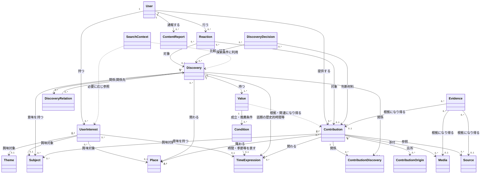

# ex-day 論理エンティティ設計書 v0.1

- 作成日：2026-09-15
- 状態：現時点の論理ドメイン設計をEntity・関連・Value Objectへ写像した初版（現在性・Season・Freshness、Discovery Value・Condition追補反映）
- 対象：論理属性、責務、関係、多重度、代表シナリオによる整合性確認
- 対象外：物理DB、UUID、FK、index、PostGIS、pgvector、API、画面、具体的な推定アルゴリズム

## 1. 目的と根拠

本書は、`ex-day_domain_model_v0.5.md`（追補を含む）を論理Entity設計へ落とし込み、後続の画面・API・物理設計が同じ概念境界から始められるようにする。

根拠の優先順位は次のとおりとする。

1. プロジェクト内の会話で合意され、今回の依頼で明示された設計内容
2. `ex-day_domain_model_v0.5.md`
3. `ex-day_requirements.md` および参照資料 `sources/ex-day_requirements_v0.3(2).md`
4. `ex-day_mvp_scope.md` および参照資料 `sources/ex-day_mvp_scope_v0.1(1).md`

「確定」は論理モデル上の採用を意味し、MVPでの実装確定を意味しない。「要検討」は、今回の設計で勝手に確定しない境界・属性・運用である。

## 2. 設計原則

1. 中核は User / Discovery / Contribution / Reaction とする。
2. Discoveryは発見・参加できる意味のある話題、Contributionはそれを形成・成長させる材料、Reactionは簡潔な反応である。
3. Themeはユーザーが扱いやすい粗い興味の入口、Subjectは対象を横断して共通利用する統制された意味概念とする。
4. Subjectは内部タグに閉じず、Discoveryの意味、関連する別Discovery、UserInterestとその推定理由をユーザーへ説明するためにも使う。
5. UserInterestは自己申告とシステム推定を区別し、本人の明示意思を優先する。明示的な興味なしは再推定を抑止できる。
6. 個々の行動履歴を長期保存することを前提とせず、継続利用する推定結果をUserInterestとして保持する。
7. SearchContextは一回の探索のValue Object／一時モデルであり、永続Entityではない。
8. 情報の出所、根拠、意味の確信度、事実の信頼度、人気を混同しない。
9. Subjectが増えただけでDiscoveryを分割しない。新しいDiscoveryは独立した発見・参加対象として成立するかを人が判断する。
10. 不明、推定、異説、反証、保留を表現できる余地を残す。
11. Contributionには、時間経過によって現在性（Freshness）が変化する情報を表現できる。現在性が低下してもContribution自体は削除せず、過去の記録として保持する。
12. 開始または告知開始を伝えるContributionは、公開後速やかにDiscoveryの現在状態へ反映できるようにする。一方、終了期限・数量・残量等は投稿時点の情報であり、実際の状況と異なる可能性を明示する。
13. Reactionは関心だけでなく、「今日行ってきた」「買えた」等、ContributionやDiscoveryの現在性を補強するシグナルとして利用できる。ただし、Reactionだけで事実や営業・在庫状況を保証しない。
14. Seasonは例年の旬・反復時期等から該当Valueを通じてDiscoveryを「今見る価値がありそうな対象」として浮上させるトリガーであり、今年・今日の実状を示すリアルタイム情報そのものではない。
15. Discoveryの現在状態は固定属性として断定的に保持するのではなく、該当ValueのSeason等の反復時間と、直近のContribution・Reactionから動的に形成する。
16. Discoveryは複数のValueを持ち、Time／Season等は原則として各Valueが成立・推薦されるConditionとして扱う。Conditionを持たない軸はその軸に依存しない。

## 3. 全体関係図

図中で複数の `0..1` を持つ対象は「いずれか一種類を参照する」という論理制約を表す。汎用参照、継承、種別別関連のどれで実装するかは要検討である。

## 4. 中核Entity

### 4.1 User

**種別**：永続Entity（確定）

**責務**：発見し、Contributionを提供し、Reactionを行い、自身のUserInterestを確認・訂正する主体を表す。質問者、回答者、投稿者等の固定ロールは持たせない。

**主要論理属性**：識別子、表示名、プロフィール説明、利用状態、作成・更新時点。

**主な関係**：User 1 : UserInterest 0..*、Contribution 0..*、Reaction 0..*、ContentReport 0..*。

**要検討**：未登録閲覧者、個人以外の活動主体、代理投稿、編集・運営権限、退会時の表示と出所保持。

### 4.2 Discovery

**種別**：永続Entity（確定）

**責務**：ユーザーが独立して発見・参加できる意味のある話題・事象を表す。問いかけ中や情報不足でも成立でき、Contributionにより成長し、別Discoveryへ派生・関連し得る。

**主要論理属性**：識別子、ユーザー向け表題、現在の要約、知識状態（問いかけ中・調査中・情報不足・複数説等を表現可能）、公開・推薦上の状態、成立時点、作成・更新時点。表示上の「開催予定／開催中らしい／今シーズンの情報あり」等の現在状態は導出情報であり、固定的な事実属性とは区別する。

**主な関係**：Value 1..*、Contributionと多対多、Subject・Place・TimeExpressionと多対多、DiscoveryRelationを介してDiscoveryと多対多、Reaction 0..*、DiscoveryDecision 0..*。DiscoveryとTimeExpressionの直接の関係は、話題の歴史的時間等を説明するものであり、Valueの成立・推薦条件とは区別する。

**論理制約**：Subjectの追加、見る人の興味の違い、複数地域でのSubject共有だけでは分割・派生させない。成立と事実確定、公開、積極推薦を分ける。Time／Seasonは原則としてDiscovery全体の一律の推薦条件ではなく、各Valueの成立・推薦条件である。Discoveryの現在状態は、直近のContributionとReaction、対象期間、該当ValueのSeason等から形成し、古い現在性情報が失効してもDiscovery自体は存続する。Season一致だけを「今年も開始した」「現在開催中」等の実状として表示しない。

**要検討**：状態一覧と遷移、要約履歴、作成・編集権限、統合・分割後の扱い、Contributionがない場合の表現、現在状態の導出・保存・再計算方法、表示文言と更新頻度、現在性が不足する場合の表現。

#### 4.2.1 Value

**種別**：Discoveryに属する論理Entity（概念と多重度は確定、永続形は要検討）。本書の「Value Object」とは異なり、Discoveryごとの発見価値・魅力を指す。

**責務**：同じDiscoveryにおいて再利用可能な個々の魅力・体験価値として成立した情報を表し、その価値に固有のConditionを持てるようにする。関連するContributionを根拠として成立・更新され得る。

**主要論理属性候補**：価値の説明、表示・推薦上の状態、作成・更新時点。

**主な関係**：一つのDiscoveryにValue 1..*。各ValueはCondition 0..*を持つ。関連Contributionと根拠・関連の関係を持ち得るが、対応の保持方法は未確定とする。

**論理制約**：ValueはContributionそのものではなく、Contribution登録時に新しいValueが必ず成立するわけではない。異なるValueがあるだけでDiscoveryを分割しない。ConditionなしのValueも検索・推薦候補となり得る。Valueに付くSeasonは例年の旬等を表し、今年・今日の実状を保証しない。

**要検討**：Valueの識別・編集単位、Contributionとの根拠・関連関係の表現、表示用要約との関係、永続化の形。Valueの信頼性の評価方法と具体的な属性・算出方式は確定しない。

#### 4.2.2 Condition

**種別**：Valueに属する論理的な条件（概念と多重度は確定、物理表現は要検討）。

**責務**：Valueが成立・推薦されるTime／Season等の条件を表す。

**主要論理属性候補**：条件の軸、条件の内容、適用期間、例外、説明。Time／Seasonの表現には必要に応じてTimeExpressionを利用する。

**主な関係**：一つのValueにCondition 0..*。

**論理制約**：ある軸のConditionがないことは、そのValueがその軸に依存しないことを意味し、検索対象から除外しない。Discovery Subjectの「中世」のような話題の意味属性と、現在の訪問・推薦条件を混同しない。

**要検討**：条件軸の範囲、同一軸に複数条件がある場合の解釈、条件間の組み合わせ、適用期間・例外・不明の表現。条件なしの物理表現はNULL、Conditionレコードを持たない方式、ANY／ALL等の明示値を候補とし、実装設計で確定する。

### 4.3 Contribution

**種別**：永続Entity（確定）

**責務**：知識、疑問、資料、証言、体験、記憶、写真等、Discoveryに関連付けられ、Valueを成立・成長させ得る材料を原文性と出所を保って表す。Contributionの論理名は「知識・疑問」とする。

**主要論理属性**：識別子、提供User、本文または説明、内容分類候補、公開状態、作成・更新時点、推定・不確実性に関する表示情報。時間に関わる情報として、投稿・公開時点とは別に、情報が対象とする時点／期間、告知開始、事象の開始・終了、反復時間、終了未定、数量・残量等の投稿時点値、現在性評価に必要な基準時点・根拠を表現できる余地を持つ。

**主な関係**：User 1、ContributionDiscoveryを介してDiscovery 0..*、Subject・Place・TimeExpression 0..*、Media 0..*、Source 0..*、ContributionOrigin 0..*、Reaction 0..*、Evidenceの対象または根拠になり得る。

**論理制約**：ContributionをValueへ自動変換せず、登録時点でValueの成立を必須としない。投稿原文とシステムによるSubject推定を分ける。品質評価やランキング目的のレビューにはしない。相反するContributionを一方の上書きで消さない。時間経過で現在性が変わるContributionは、Freshnessが低下・失効しても削除せず、現在のDiscoveryを形成する材料から過去の記録へ位置づけを変える。開始または告知開始の情報は公開後速やかに現在状態へ反映できるようにする。終了期限・数量・残量は投稿時点の申告・観測であり、実際の終了、営業、在庫等を保証せず、実状と異なる可能性をユーザーへ明示する。

**要検討**：自然文ContributionからのValueの抽出・生成・更新方法、直接Value化できないContributionの扱い、一投稿の単位、返信・引用、編集・訂正履歴、Discovery成立前の保持、外部情報のContribution化、自由文とReactionの境界、対象期間とFreshnessの具体属性、現在性の減衰・失効規則、開始情報を速やかに反映する処理、終了・訂正情報、投稿者への再確認、数量表現の扱い。

### 4.4 Reaction

**種別**：永続Entity（確定）

**責務**：UserによるDiscoveryまたはContributionへの簡潔な関心・共感・行動意欲等を表す。反応種別と対象時点によっては、対象が最近も現実と一致している可能性を示す現在性補強シグナルとして利用できる。

**主要論理属性**：識別子、User、対象、反応種別、状態、作成・変更時点。

**主な関係**：User 1、対象はDiscoveryまたはContributionのいずれか1、各対象からReaction 0..*。

**論理制約**：一つのReactionが同時に両対象を持たない。Reaction数を事実の信頼度としない。品質ランキングや星評価を目的にしない。「行ってきた」「買えた」等をFreshness補強に利用する場合も、営業中・開催中・在庫あり等の保証へ置き換えず、反応の発生時点と意味を区別する。

**要検討**：反応種別、取消・変更、同一Userの重複、保存・訪問を含めるか、ReactionからUserInterestを更新する規則、どの反応をFreshness補強に利用するか、対象時点、重み、減衰、不正・重複対策、Contributionとの境界。

## 5. 興味・意味概念

### 5.1 Theme

**種別**：永続参照Entity／管理された分類マスタ（確定）

**責務**：ユーザーが初期に理解・自己申告しやすい粗い興味の入口を表す。

**主要論理属性**：識別子、表示名、説明、表示状態、表示順等のユーザー向け管理情報。

**主な関係**：UserInterest 0..*。Subjectとの関連は多対多になり得る。

**論理制約**：Subjectの上位に固定された一対多ツリーとはしない。精密な意味記述やDiscovery分割の基準にしない。

**要検討**：Discoveryへの直接付与、Subjectとの対応Entity、運営主体、Themeの追加・統合・廃止。

### 5.2 Subject

**種別**：永続参照Entity（確定）

**責務**：User、Discovery、Contribution、探索を横断し、同じ／近い意味を突合する統制された共通意味概念を表す。Discoveryの意味形成、関連Discovery探索、UserInterestの具体化と本人への可視化に使う。

**主要論理属性**：識別子、代表表記、説明、同義表現、管理状態、作成・更新時点。

**主な関係**：Discovery・Contribution・UserInterestと多対多相当。Subject同士に同義・上位下位・近似等の関係を持ち得る。Themeとも多対多になり得る。

**論理制約**：ユーザー自由入力をそのまま新Subjectにしない。入力は既存Subjectへ対応付け、または候補として扱う。UserInterestを否定してもSubject自体は削除しない。

**要検討**：SubjectRelationの独立Entity化、同一性判定、表記揺れ、上位下位・近似の種別、候補の承認主体、版管理、多言語。

### 5.3 対象とSubjectの関連

Discovery SubjectおよびContribution Subjectは、別種類のSubjectではなく「対象と共通Subjectの関係」として扱う。

**種別**：永続関連（確定）。独立関連Entityにするかは要検討。

**主要論理属性候補**：対象、Subject、関連上の役割、Subjectである確信度、付与元（本人・運営・システム推定等）、確認状態、説明可能な根拠、作成・更新時点。

**論理制約**：Subjectである確信度と内容が事実である信頼度を分ける。Contribution Subjectの単純集計をDiscovery Subjectとしない。

**要検討**：役割分類、確信度尺度、推定履歴、ユーザー訂正、Subject Clusterの保存要否。Subject Clusterは現時点では意味形成を説明する一時的・導出モデルであり、永続Entityとは確定しない。

### 5.4 UserInterest

**種別**：永続Entity（確定）

**責務**：UserとTheme・Subject・Place・TimeExpression等の興味対象との関係を表し、自己申告、システム推定、本人の確認・訂正・否定を区別する。

**主要論理属性**：識別子、User、興味対象種別と対象、由来（自己申告／システム推定）、意思（興味あり／興味なし等）、推定確信度、強さ、状態（候補／提示済み／本人確認済み等）、推定理由の説明、初回・最終更新時点。

**主な関係**：User 1、興味対象はTheme・Subject・Place・TimeExpression等のいずれか1。

**論理制約**：自己申告と推定を失わない。本人の明示意思を推定より優先する。明示的な興味なしは再推定抑止に利用できる。ユーザーへ興味対象と由来・理由を可視化し、訂正・否定可能にする。

**要検討**：同一対象に複数レコードを持つか履歴化するか、尺度、減衰、抑止期限、近似Subjectへの影響、説明文生成、Theme以外の自己申告、匿名利用時の扱い。

### 5.5 行動入力と保持境界

検索、閲覧、滞在、Reaction、Contribution等はUserInterest推定の入力になり得る。しかし、これらをすべて長期のドメインEntityとして保存することは前提にしない。

一時的な行動イベントを保持する場合の目的・期間・同意・匿名化・削除は要検討とする。長期的に利用する推定結果はUserInterestへ反映し、ユーザーへ説明可能にする。監査や不正対策等、嗜好推定以外の法的・運用上の保持要件は別途定める。

## 6. 判断・形成・関連

### 6.1 DiscoveryDecision

**種別**：永続Entity（確定）

**責務**：ContributionまたはDiscovery候補を、既存へ統合、新規成立、関連する新規、保留等と判断した記録と理由を残す。

**主要論理属性**：識別子、判断対象、判断結果、理由、判断者、判断時点、状態、比較観点の説明。

**主な関係**：判断材料Contribution 0..*、比較対象Discovery 0..*、結果Discovery 0..*、判断者Userまたは運営主体 1。

**論理制約**：判断は事実認定ではなく話題の単位・関係の判断である。MVPでは最終判断を人が行う。

**要検討**：結果種別の完全な一覧、判断者モデル、再審・取消、候補Entityの要否、複数人承認、AI提案の記録。

### 6.2 ContributionDiscovery

**種別**：永続関連Entity（確定）

**責務**：一つのContributionが一つ以上のDiscoveryへ、どのように形成・成長・説明・反証等で寄与したかを表す。

**主要論理属性**：Contribution、Discovery、関係種別、関係の説明、付与主体、作成・更新時点。

**多重度**：Contribution 1 : ContributionDiscovery 0..*、Discovery 1 : ContributionDiscovery 0..*。結果としてContributionとDiscoveryは多対多。

**要検討**：関係種別、同じContributionの複数Discovery利用時の表示、関係の取消、Discovery形成前候補との関連。

### 6.3 DiscoveryRelation

**種別**：永続関連Entity（確定）

**責務**：派生元／派生先等、Discovery間で明示的に保持する意味のある関係と形成経緯を表す。

**主要論理属性**：関係元Discovery、関係先Discovery、関係種別、方向、説明、成立根拠となるDecision、付与主体、作成・更新時点。

**多重度**：Discovery 1 : DiscoveryRelation 0..*（関係元・関係先の両側）。Discovery同士は多対多。

**論理制約**：共通・近似Subjectから導出できるすべての関連を保存しない。共通Subjectだけから派生関係を推定しない。

**要検討**：関係種別、対称性、循環、複数起点、強さ、削除・取消、Subject由来の関連候補をキャッシュするか。

### 6.4 ContributionOrigin

**種別**：永続関連Entityの候補（仮定義）

**責務**：Contributionが、Userの直接投稿、別Contributionへの応答、外部Sourceの参照、Discovery上の不足・疑問等、何を起点に生じたかを説明する。

**主要論理属性候補**：対象Contribution、起点種別、起点対象、説明、作成時点。

**多重度候補**：Contribution 1 : ContributionOrigin 0..*。起点はContribution、Discovery、Source等のいずれか。

**要検討**：独立Entityとする必要性、返信関係との境界、ContributionDiscovery・Source参照との重複、Contribution自身を起点にできる範囲。「出所」は広義に使わず、情報源Sourceと投稿発生の経緯Originを区別する。

## 7. Place・Time・探索

### 7.1 Place

**種別**：永続参照Entityまたは値を持つEntity（基本概念は確定）

**責務**：Discovery・Contribution・UserInterestが関わる場所を共通に参照できるようにする。

**主要論理属性**：識別子、名称、説明、場所区分、確からしさ、適用期間または名称の時代性に関する情報。

**基本区分**：Pointは特定地点、Areaは地域・範囲。PointがAreaに含まれ、Area同士が包含・重複し得る。

**主な関係**：Discovery・Contribution・UserInterestと多対多相当。Place同士に包含等の関係を持ち得る。

**要検討**：Point／Areaを継承で分けるか、複数地点、経路、曖昧範囲、旧地名、境界の時間変化、PlaceRelationの独立Entity化、対象との関係上の役割。

### 7.2 TimeExpression

**種別**：Value Objectを基本とする論理概念（区分は確定、永続形は要検討）

**責務**：Discovery・Contribution・UserInterestが関わる時間を表す。

**歴史的時間の主要属性候補**：時点／期間／年代／時代、開始・終了の表現、精度、推定・不明、表示文。

**季節・反復時間の主要属性候補**：季節、旬、曜日、月日範囲、時間帯、繰り返し規則、適用期間、例外、表示文。

本書ではSeasonを独立した中核Entityとして確定せず、TimeExpressionが表す季節・旬・反復時間の役割名として扱う。ValueのConditionとしてのSeasonは、現在時刻との一致により該当Valueを通じてDiscoveryを再浮上させ、今年のContributionを集めたり確認したりする契機を作る。Season一致だけでは、今年の開始、当日の開催、営業、在庫等のリアルタイムな実状を意味しない。

Contributionの時間情報では、投稿・公開時点と、そのContributionが表す事象の対象期間を分ける。事前告知は公開時点から参照可能で、対象開始前は「開催予定」等、開始後は期間と直近シグナルに基づく状態として扱える。終了日時や「なくなり次第終了」、数量・残量等は投稿時点情報として保持し、現実との一致を継続保証しない。

**主な関係**：Discovery・Contribution・UserInterestから0..*。ValueのConditionからもTime／Seasonの表現として参照し得る。一対象に歴史的時間と反復時間が併存できる。

**論理制約**：中世であることから現在訪問可能とは判断しない。反復時間は現在有効である根拠や適用期間を必要とし得る。Season一致と、今年・今日のContributionによる現在性を区別する。投稿・公開時点、対象開始、対象終了、Freshnessの失効を同一の日時にまとめない。

**要検討**：時代マスタ、曖昧・複数説、暦、タイムゾーン、反復規則、現在性の確認、共通Entityとして識別する範囲、Seasonを独立Entity／関連Entity／TimeExpressionの区分のどれで実装するか、告知・対象期間・Freshnessの値表現、終了未定と例外日の扱い。

### 7.3 SearchContext

**種別**：非永続のValue Object／一時モデル（確定）

**責務**：一回の検索・探索における場所、時間、空き時間、帰宅期限、明示条件、状況、必要に応じたUserInterest参照をまとめる。

**主要論理属性候補**：探索地点・範囲、探索日時・期間、移動・時間制約、明示的な興味条件、状況、並び替え等の要求。

**論理制約**：永続的なUserInterestと同一視しない。「今・ここ」と未指定の興味からも構成できる。

**Value／Conditionの検索上の扱い**：SearchContextと各ValueのConditionを照らし合わせる。Contextと一致するConditionを持つValueは推薦順位を高める。ConditionがないValueはその軸に依存せず、検索・推薦候補から除外しない。明示的に指定された条件は、推薦の順位付けとは別に絞り込みとして扱う場合がある。その際も、Conditionがないことだけを理由にValueを除外しない。明示条件の具体的な意味と、他の条件による絞り込み範囲は後続設計で定める。

条件なしをNULLで表す場合の概念例は `season = :season OR season IS NULL` である。これは検索上の意味を示す例であり、NULLの採用を確定しない。具体SQL、インデックス、候補抽出、スコアリング、性能担保は詳細設計事項とする。

**要検討**：UserInterestとの重み付け、未知の興味を残す探索戦略、イベントログを別途残す場合の保持方針。

## 8. 資産・出所・根拠・安全

### 8.1 Media

**種別**：永続Entity（仮定義）

**責務**：画像、文書、音声等のデジタル資産をContribution本文と分けて管理し、提供・権利・説明を辿れるようにする。

**主要論理属性候補**：識別子、媒体種別、説明、提供者、権利・利用条件、作成／撮影時点、取得時点、管理状態。

**主な関係**：Contribution 0..*、Evidence 0..*、必要に応じSource 0..1。

**要検討**：外部URL、同一ファイル重複、派生物、代表画像、メタデータ、削除時の参照保持。

### 8.2 Source

**種別**：永続Entity（仮定義）

**責務**：書籍、Web、公文書、聞き取り、所蔵資料等、情報の参照元を識別・説明する。

**主要論理属性候補**：識別子、種別、名称・書誌、作成者・発行者、公開／作成時点、参照先、取得時点、説明、管理状態。

**主な関係**：Contributionと多対多、Evidence 0..*、Media 0..*になり得る。

**要検討**：原資料と複製、版、Web更新、聞き取り対象者、外部情報のContribution化、権利・引用情報の責務分担。

### 8.3 Evidence

**種別**：永続関連Entityの候補（仮定義）

**責務**：Contribution内の主張またはDiscovery上の説明を、Media・Source・別Contribution等が支持・反証する関係として表す。

**主要論理属性候補**：対象、根拠対象、方向（支持／反証／関連等）、説明、評価主体、確認状態、作成・更新時点。

**多重度候補**：一つの主張・説明にEvidence 0..*、一つのMedia・Source・ContributionがEvidence 0..*に利用され得る。

**論理制約**：Evidenceの存在、Reaction数、Subject確信度を、自動的な事実認定へ置き換えない。

**要検討**：主張単位のEntity化、Discovery要約のどの部分を対象にするか、支持・反証以外の区分、信頼度評価、異説表示。

### 8.4 ContentReport

**種別**：永続Entity（確定。ただし対象範囲は要検討）

**責務**：Userがコンテンツの安全・権利・誤情報・不適切性等の問題を運営へ伝え、対応状況を追跡する。

**主要論理属性候補**：識別子、通報User、対象、理由分類、説明、状態、受付・更新・解決時点、対応記録。

**主な関係**：User 1、対象はDiscovery・Contribution・Reaction・Media等のいずれか1、対応主体 0..1。

**要検討**：対象範囲、匿名通報、理由分類、状態遷移、異議申立て、対応履歴の分離、非公開・削除との連携。

## 9. 関係・多重度の補足

- Userは0件以上のUserInterestを持つ。興味未指定でも探索できる。
- UserInterestは一つの興味対象を指す。対象はTheme・Subject・Place・TimeExpression等のいずれかであり、実装方式は要検討。
- DiscoveryとContributionはContributionDiscoveryを介する多対多。一つのContributionが複数Discoveryの材料になり得る。
- DiscoveryとSubject、ContributionとSubjectは多対多。関連固有の確信度・付与元を持ち得る。
- DiscoveryはValueを1件以上持ち、各ValueはTime／Season等のConditionを0件以上持てる。Conditionがない軸には依存しない。
- DiscoveryとPlace／TimeExpression、ContributionとPlace／TimeExpressionは多対多相当。一件に複数の場所・時代・反復時間を持てる。ただし、Discoveryの話題を説明する歴史的時間と、Valueの成立・推薦条件としてのTime／Seasonを区別する。
- Reactionは一つのDiscoveryまたは一つのContributionを対象とする。
- Discoveryの現在状態は、該当ValueのSeason等の反復時間と、直近のContribution・Reactionから導出する。これはDiscoveryの恒常的な意味や存在期間とは別である。
- Contributionの投稿・公開時点、対象期間、Freshnessは別概念である。現在性が失効してもContributionとの関連は保持する。
- DiscoveryRelationは二つのDiscovery間の明示的関係を表す。Subject由来の関連候補とは別である。
- DiscoveryDecisionは複数Contribution・複数既存Discoveryを比較し、0件以上の結果Discoveryへつながり得る。保留なら結果Discoveryがない場合もある。
- Media／Source／ContributionはEvidenceの根拠になり得るが、Evidence対象となる「主張」の粒度は要検討。

## 10. 代表シナリオによるモデル検証

### 10.1 小机城址：同一Discoveryの成長

1. Discovery「小机城址」が成立し、PlaceのPoint「小机城址」とArea「小机周辺」、Subject「城址」「城郭」「中世」等に関連する。「中世」は歴史的な話題を示すSubject側の属性であり、現在の訪問・推薦条件ではない。
2. User Aの「現在は公園として歩ける」というContributionと、User Bの写真MediaがContributionDiscoveryを介して同じDiscoveryへ追加される。
3. Contribution Subject「公園」「丘」「散歩」と歴史的Time／現在の観察が加わる。
4. 既存の話題と意味的に両立し、独立Discoveryにする必要がないため、DiscoveryDecisionは既存への統合／成長と判断する。
5. 城に関心のあるUserにも散歩に関心のあるUserにも異なる入口を提供するが、興味の違いだけではDiscoveryを分割しない。
6. Valueとして「城址の歴史を知る」「公園を歩く」等を持てる。この例ではいずれにもTime／SeasonのConditionを付けないため、季節・時間帯の指定だけを理由に候補から除外しない。

**検証結果**：一つのDiscoveryが複数Subject・Valueを持って成長でき、条件なしのValueも探索できる。Contribution原文・Media提供者・判断理由を保持できる。ThemeをDiscoveryへ必須付与しなくてもSubjectから探索できる。

### 10.2 浜松町：疑問から成立し、根拠で成長

1. User Aが「この建物の入口が道路より低いのはなぜ？」という疑問Contributionと写真Mediaを投稿する。
2. ContributionにはPlaceの建物Pointと周辺Area、Subject「建物」「入口」「道路」「高低差」が関連する。投稿時点では「道路嵩上げ」を事実として付与しない。
3. DiscoveryDecisionが既存候補を比較し、同じ話題がなければ新規Discoveryを成立させる。Discoveryは問いかけ中／情報不足でよい。
4. 後続のContributionが古地図Sourceや写真Mediaを示し、Evidenceとして道路面変化の説明を支持または反証する。
5. Discovery Subjectと要約は根拠に応じて成長するが、Subject確信度と原因の事実信頼度を分ける。

**検証結果**：疑問だけでDiscoveryが成立でき、Media・Source・Evidenceの責務を分離し、異説を上書きせず保持できる。場所の近接や語句一致だけによる重複成立をDiscoveryDecisionで抑制できる。

### 10.3 生麦・青柳：Contribution群から別Discoveryが派生

1. Discovery A「生麦周辺はかつて漁師町だった」に、漁・市場・昔の暮らしに関するContributionが集まる。
2. 「青柳を干して食べた」「子供のおやつだった」「料理屋で扱った」等のContribution Subjectが食文化のSubject Clusterを形成する。Clusterは導出・判断用で、永続Entityとは確定しない。
3. 人が既存Discoveryを比較し、「生麦の食文化」が独立して発見・参加できる話題だとDiscoveryDecisionで判断する。
4. Discovery B「生麦の食文化」が成立し、ContributionDiscoveryにより形成材料をAとBの双方から辿れる。DiscoveryRelationによりAからBへの明示的な派生を表す。
5. BはSubject「青柳」「干して食べる」「郷土食」「子供のおやつ」等を持つが、各Subjectを別Discoveryに分割しない。
6. Subject「青柳を干して食べる」を介して別地域の近似Discoveryを探索できる。これは派生関係でなければDiscoveryRelationとして保存する必要はない。

**検証結果**：成長と派生、形成材料と発生経緯、明示的派生とSubject由来の意味的関連を分けて表現できる。一つのContributionを複数Discoveryへ関連付けられる。

### 10.4 知らなかった興味の発見

1. User AはTheme「歴史」「鉄道・交通」を自己申告UserInterestとして登録する。興味未指定から開始してもよい。
2. 小机城址、廃線跡、旧街道等のDiscoveryを閲覧・Reactionする。一時的な行動入力からSubject「城跡」「地形」「地域交通」等への興味候補を推定する。
3. 個々の閲覧履歴を長期保存するのではなく、継続利用する結果を由来「システム推定」のUserInterestとして保持する。
4. ユーザーへ「利用から見つかった興味」と推定理由を示す。Subject自体も閲覧でき、そのSubjectから別Discoveryへ移動できる。
5. User Aが「地形は興味がある」と確認すれば明示意思へ反映する。「土木構造物は興味がない」と否定すれば、その明示的な否定を推定より優先し、安易な再推定を抑止する。

**検証結果**：ThemeからSubjectへの具体化、UserInterestの由来、Subjectの可視化、本人による訂正、行動履歴と推定結果の保持境界を表現できる。

### 10.5 船橋の梨：Seasonと現在性のあるContribution

1. Discovery「船橋の梨」は、Place「船橋」、Subject「梨」「直売」等に関連する。Value「旬の梨を楽しむ」にSeasonのCondition「例年8〜10月頃」を付ける。別のValueを追加する場合は、そのValueごとにConditionの有無を決める。
2. 9月になると該当ValueのSeason一致をトリガーにDiscoveryが浮上する。この時点で示せるのは「例年なら今が関係する時期」であり、今年の販売開始や在庫を保証しない。
3. 梨園等から「本日から直売開始」、または事前に「9月20日から直売開始予定」というContributionが公開された場合、告知・開始情報として速やかにDiscoveryの現在状態へ反映する。
4. 「なくなり次第終了」「本日100箱」等は投稿時点情報として保持し、実際の終了・残量と異なる可能性を明示する。
5. Userの「今日買えた」「行ってきた」等のReactionはFreshnessを補強できるが、販売・在庫の保証には使わない。新しいContribution、Reaction、明示的終了情報、時間経過により現在状態を更新する。
6. Freshnessが低下・失効したContributionは現在状態の材料から外れ得るが、過去の記録としてDiscoveryとの関係を保持する。翌年は同じDiscoveryがValueのSeason条件により再浮上し、その年のContributionから新しい現在状態を形成する。

**検証結果**：ValueごとのSeasonによる反復的な浮上と、今年・今日の実状を示す直近シグナルを分離できる。Discoveryを作り直さず、時間経過で変わる現在状態、事前告知、開始の即時反映、終了・数量の非保証、履歴保持を同じモデルで説明できる。

## 11. 現時点の要検討事項

優先度が高い論点は次のとおりである。

1. DiscoveryDecisionの候補・結果モデル、判断種別、再審、判断権限。
2. ContributionOriginを独立Entityとする範囲と、返信・Source・ContributionDiscoveryとの重複。
3. ThemeをDiscoveryへ直接関連付けるか、ThemeとSubjectの対応から探索時に導出するか。
4. Subject候補の確定運用、SubjectRelation、同義・上位下位・近似、訂正履歴。
5. UserInterestの尺度・履歴・減衰・明示的興味なしの期限と近似概念への波及。
6. 興味推定に使う一時行動の種類、保持期間、ユーザーへの説明、同意・削除・監査。
7. Placeの複数地点・経路・曖昧範囲・旧地名・時間変化。
8. Timeの歴史的時間と反復時間の具体構造、Seasonの実装形、曖昧さ、現在性、例外。
9. Evidenceの対象となる主張の粒度、支持・反証・異説、事実信頼度の表現。
10. Media／Sourceの版、権利、原資料・複製、外部URL、削除時の出所保持。
11. ContentReportの対象、状態、モデレーション権限、異議申立て。
12. Reaction種別、Contributionとの境界、UserInterest推定への利用規則、Freshness補強へ利用する反応・対象時点・減衰・不正対策。
13. 個人以外の活動主体、未登録利用者、退会User、代理投稿。特にProvider（団体・事業者・施設等）をUserの一種、別Entity、役割のいずれで扱うか。
14. Subject Clusterを保存する必要があるか、都度導出するか。
15. Contributionの対象期間、Freshness、告知・開始・終了・終了未定・数量等の具体属性と更新規則。開始／告知開始を速やかに反映する処理と、終了・数量の非保証表示。
16. SourceとContributionの境界、外部情報をContribution化する主体・方法、Source自身の更新・取得時点を現在性へどう利用するか。
17. Provider、Contribution提供者、Sourceの作成者・発行者・管理者の関係。公式情報またはofficial relationを独立関連として持つか、誰が何に対して公式であるか、認証・代理投稿・取消・履歴をどう表現するか。
18. Value／Conditionの永続化、条件なしの物理表現（NULL、Conditionレコードなし、ANY／ALL等）、条件間の組み合わせ、明示条件による絞り込みの意味。

## 12. 後続設計への引き継ぎ条件

- 物理設計では、論理上の多態的対象を安易な汎用IDへ確定せず、整合性・参照制約を比較する。
- ベクトル類似度や地理空間検索は実現手段であり、Subject、Place、DiscoveryDecisionを置き換えない。
- Subjectの推定理由、UserInterestの由来、Discovery形成材料、出所、判断理由をユーザーまたは運営が辿れる状態を維持する。
- 自動処理を導入しても、MVPの人によるDiscovery成立・統合・関連判断を暗黙に置き換えない。
- 要検討事項を物理都合だけで確定した場合は、論理設計へのフィードバックと決定記録を残す。
- ValueのConditionなしを検索候補から落とさず、Context一致による推薦順位の向上と明示条件による絞り込みを区別する。具体SQL、インデックス、候補抽出、スコアリング、性能担保は詳細設計で定める。

## 13. 今回の追補変更点

- 時間経過で現在性が変わるContributionと、投稿・公開時点／対象期間／Freshnessの分離を追記した。
- 開始・告知開始は速やかにDiscoveryへ反映し、終了期限・数量・残量は投稿時点情報として実状との差を明示する方針を追記した。
- ReactionをFreshness補強シグナルとして利用できる一方、事実・営業・在庫等の保証には使わない制約を追記した。
- SeasonをDiscovery浮上のトリガーとし、リアルタイム情報そのものとは区別した。
- Discoveryの現在状態を、Seasonと直近Contribution／Reactionから形成される導出情報として明記した。
- Contribution／Source／Provider／official relation等の未決事項を確定せず、「要検討」として明示的に保持した。
- Discoveryの複数ValueとValueごとの0件以上のConditionを追加し、Time／Seasonの適用先、条件なしの検索上の意味、物理表現の未確定事項を明記した。小机城址と船橋の梨のシナリオをこの関係に合わせて更新した。
