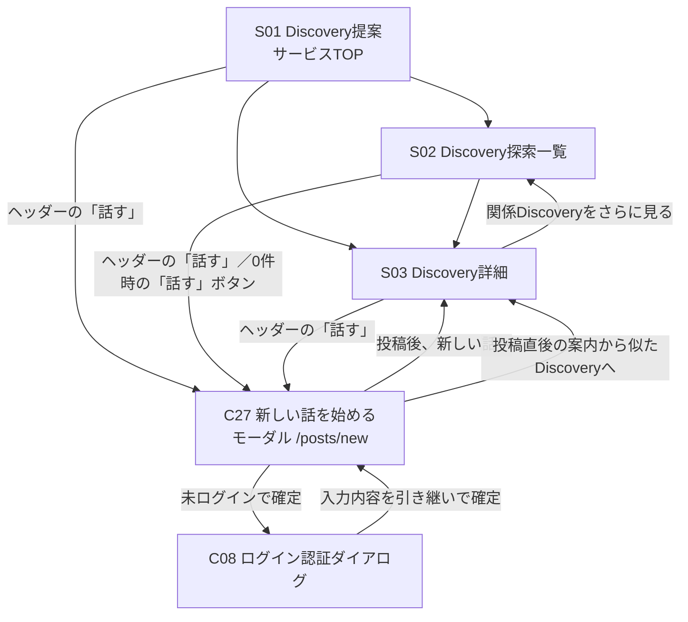

新規投稿（新しい話を始める）は、共通ヘッダー（C01）の「話す」から開くモーダル[C27（新しい話を始める）](ui/components/C27-post-new.md)で行う。モーダルはどの画面からも開け、URL（`/posts/new`）を直接開いた場合も表示できる。S03（Discovery詳細）の中で会話に加わる投稿は、[C26（みんなの声）](ui/components/C26-post-thread.md)の入力欄で行い、画面を遷移しない。

入口は認証状態にかかわらず表示し、未ログインでも入力を始められる。投稿の確定時にC08（ログイン認証ダイアログ）でログインを求め、入力内容はログイン後に引き継ぐ（[DEC-0010](decisions/DEC-0010-duplicate-conversations-and-posting-auth.md) 決定2）。

投稿直後は、C27のモーダルの中で似たDiscoveryとわかってきたことを示し、既存の会話に加わる選択肢を示す（DEC-0010 決定1）。そこから、器として作られた成立前のDiscoveryのS03（自分の新しい話）へ進むか、似たDiscoveryのS03へ進むかをユーザーが選ぶ（投稿後の行き先は本PRの案。Issue #67に判断待ちとして記録）。S04（知識・疑問登録／編集）・S11（知識・疑問登録確認画面）は廃止した（[画面一覧](screen-list.md)の「廃止済み」）。
