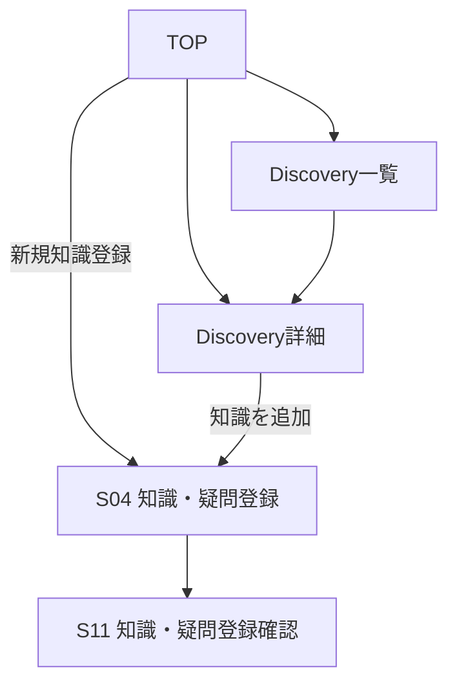

```mermaid
flowchart TD
TOP[TOP]
LIST[Discovery一覧]
DETAIL[Discovery詳細]
ADD[S04 知識・疑問登録]
CONFIRM[S11 知識・疑問登録確認]

    TOP --> LIST
    TOP --> DETAIL
    TOP -->|新規知識登録| ADD
    LIST --> DETAIL

    DETAIL -->|知識を追加| ADD
    ADD --> CONFIRM
```

新規知識・疑問登録への導線は認証状態にかかわらず表示し、未認証でもS04で入力を開始できる。投稿確定時に認証を必須とするか、および認証が必要な場合に入力内容を認証後へ引き継ぐ方法は、S04／認証フロー検討時のNon-blocking事項とする。
